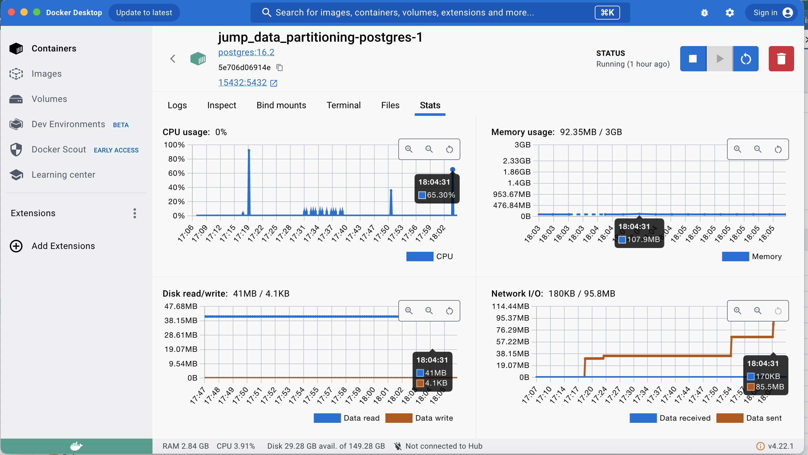

# jump_data_partitioning
Projeto elaborado para implementação e experimentação das estratégias de particionamento de dados aplicadas ao JuMP.

## Ambiente utilizado para os testes

Para o experimento está sendo utilizada uma infraestrutura de containers com Docker.

### Equipamento Host

- Macbook PRO
- 2 GHz Quad-Core Intel Core i5
- 16 GB 3733 MHz LPDDR4X
- SSD 1TB

### Docker Resources

deploy:
  resources:
    limits:
      cpus: "2.0"
      memory: 3G

## Experimento 01 - AS-IS

Neste experimento temos o objetivo de avaliar arquitetura de dados atual sem qualquer intervenção no modelo de dados e coletar métricas de performance.


## Premissas

O JuMP utiliza em sua arquitetura de dados atual uma estratégia de particionamento de dados física, a nível de tabela na mesma instância do banco de dados. As tabelas processo_x, movimentos_x e complementos_x, onde "_x" se refere ao campo orgaoJulgadorID da tabela unidades, e elas são criadas dinâmicamente na medida que a carga de dados é realizada para cada Tribunal.


## Métricas

Ao comparar a eficácia de diferentes estratégias de particionamento de dados, é essencial considerar uma variedade de métricas para avaliar o desempenho, a escalabilidade e a eficiência operacional do sistema. A tabela abaixo destacamos as principais métricas para essa finalidade:


| #        | Métrica                                                         | Descrição |
| -------- | --------------------------------------------------------------- | --------- |
| 1        | Tempo de Resposta de Consulta                                   | Mede o tempo necessário para uma consulta ser executada e retornar resultados. É uma métrica fundamental para avaliar o desempenho geral do sistema. |
| 2        | Taxa de Transferência de Dados                                  | Avalia a quantidade de dados processados pelo sistema em um determinado período de tempo. Uma alta taxa de transferência indica uma boa capacidade de processamento. |
| 3        | Utilização de Recursos do Sistema                               | Monitora a utilização de recursos do sistema, como CPU, memória e disco. É importante garantir que os recursos estejam sendo utilizados de forma eficiente e que não haja gargalos. |
| 4        | Escalabilidade                                                  | Mede a capacidade do sistema de lidar com um aumento na carga de trabalho sem degradar significativamente o desempenho. Pode ser avaliada através de testes de carga e dimensionamento horizontal. |
| 5        | Distribuição de Carga entre Partições/Shards                    | Verifica se a carga de trabalho está distribuída de forma equitativa entre as partições ou shards. Uma distribuição desigual pode resultar em gargalos de desempenho. |
| 6        | Taxa de Transferência de Inserção/Atualização/Exclusão (I/A/E)  | Avalia a velocidade com que novos dados podem ser inseridos, atualizados ou excluídos no sistema. É importante garantir que essas operações sejam eficientes, especialmente em ambientes de alta concorrência. |
| 7        | Latência de Replicação (se aplicável)                           | Se o sistema envolver replicação de dados entre diferentes nós, é importante monitorar a latência de replicação para garantir que os dados estejam sempre atualizados e consistentes entre os shards. |
| 8        | Espaço em Disco Utilizado por Partição/Shard                    | Monitora o consumo de espaço em disco por cada partição ou shard. Isso ajuda a garantir um uso eficiente do armazenamento e a identificar partições que possam estar se aproximando de sua capacidade máxima. |
| 9        | Tamanho Médio de Partição/Shard                                 | Avalia o tamanho médio dos dados em cada partição ou shard. Isso pode influenciar o desempenho das consultas e operações de E/S. |
| 10       | Taxa de Fragmentação de Índices (se aplicável)                  | Em sistemas que utilizam índices, é importante monitorar a taxa de fragmentação dos índices para garantir um desempenho ótimo das consultas. |


## Resultados

1. Tempo de Resposta de Consulta

- Query:

```sql
SELECT
	p."NPU", p."processoID", "dataPrimeiroMovimento",
  c.descricao AS classe, a.descricao AS assunto,
  activity, "dataInicio", "dataFinal", "usuarioID", "movimentoID", duration
  "nomeServidor", "tipoServidor"
FROM
	processos_18006 AS p
INNER JOIN
	movimentos_18006 AS m ON p."processoID" = m."processoID"
INNER JOIN
	classes AS c ON p.classe = c.id
INNER JOIN
	assuntos AS a ON p.assunto = a.id
INNER JOIN
	servidores ON m."usuarioID" = servidores."servidorID"
ORDER BY "processoID", "dataFinal" DESC;
```

- Total de registros: **123777**
- Tempo de execução: **2 segundos e 750 ms**

2. Taxa de Transferência de Dados

```sql
SET track_io_timing = on;

EXPLAIN ANALYZE SELECT
	p."NPU", p."processoID", "dataPrimeiroMovimento",
  c.descricao AS classe, a.descricao AS assunto,
  activity, "dataInicio", "dataFinal", "usuarioID", "movimentoID", duration
  "nomeServidor", "tipoServidor"
FROM
	processos_18006 AS p
INNER JOIN
	movimentos_18006 AS m ON p."processoID" = m."processoID"
INNER JOIN
	classes AS c ON p.classe = c.id
INNER JOIN
	assuntos AS a ON p.assunto = a.id
INNER JOIN
	servidores ON m."usuarioID" = servidores."servidorID"
ORDER BY "processoID", "dataFinal" DESC;
```

- Taxa: **123777** / **2.750** = **45009,81 registros por segundo**

3. Utilização de Recursos do Sistema

```sql
SET track_activities = on; 
SET track_counts = on;

SELECT
	p."NPU", p."processoID", "dataPrimeiroMovimento",
  c.descricao AS classe, a.descricao AS assunto,
  activity, "dataInicio", "dataFinal", "usuarioID", "movimentoID", duration
  "nomeServidor", "tipoServidor"
FROM
	processos_18006 AS p
INNER JOIN
	movimentos_18006 AS m ON p."processoID" = m."processoID"
INNER JOIN
	classes AS c ON p.classe = c.id
INNER JOIN
	assuntos AS a ON p.assunto = a.id
INNER JOIN
	servidores ON m."usuarioID" = servidores."servidorID"
ORDER BY "processoID", "dataFinal" DESC;
```

- CPU Usage: 65.30%
- Memory Usage: 107.9MB
- Disk (read): 41MB
- Disk (write): 4.1KB
- Network (received): 170KB
- Network (sent): 85.5MB




### Reference Documentation
For further reference, please consider the following sections:

* [Official Apache Maven documentation](https://maven.apache.org/guides/index.html)
* [Spring Boot Maven Plugin Reference Guide](https://docs.spring.io/spring-boot/docs/3.2.5/maven-plugin/reference/html/)
* [Create an OCI image](https://docs.spring.io/spring-boot/docs/3.2.5/maven-plugin/reference/html/#build-image)
* [Spring Web](https://docs.spring.io/spring-boot/docs/3.2.5/reference/htmlsingle/index.html#web)
* [Spring Data JDBC](https://docs.spring.io/spring-boot/docs/3.2.5/reference/htmlsingle/index.html#data.sql.jdbc)

### Guides
The following guides illustrate how to use some features concretely:

* [Building a RESTful Web Service](https://spring.io/guides/gs/rest-service/)
* [Serving Web Content with Spring MVC](https://spring.io/guides/gs/serving-web-content/)
* [Building REST services with Spring](https://spring.io/guides/tutorials/rest/)
* [Using Spring Data JDBC](https://github.com/spring-projects/spring-data-examples/tree/master/jdbc/basics)

