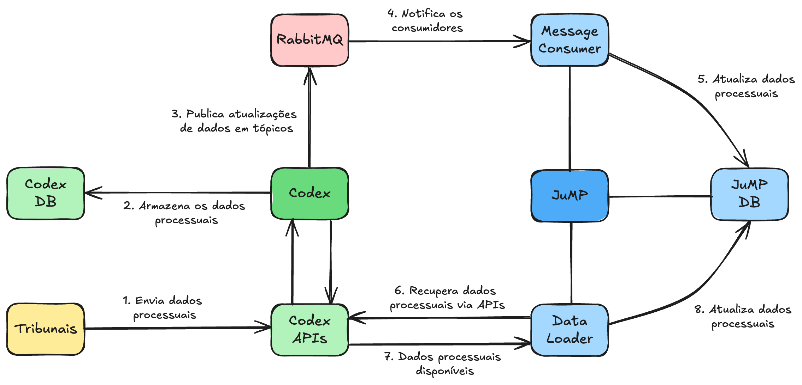
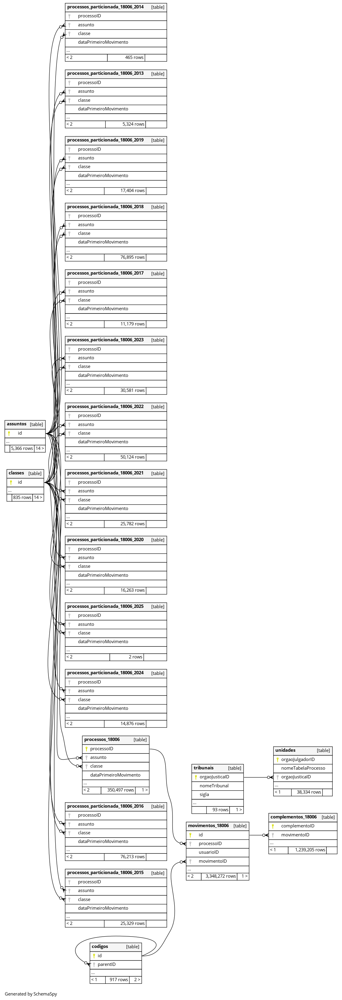

# JuMP: Data Partitioning
Este projeto foi elaborado para experimentação e avaliação das estratégias de particionamento proposta pela pesquisa de mestrado que tem
o objetivo realizar um benchmark das principais estratégias aplicadas a ferramenta JuMP.

* Aluno: `Cleber Tavares de Moura` [ctm@cin.ufpe.br](mailto:ctm@cin.ufpe.br)
* Orientador:  `Ricardo Massa` [rmfl@cin.ufpe.br](mailto:rmfl@cin.ufpe.br)

## Arquitetura da Solução JuMP

A imagem abaixo apresenta uma visão arquitetural de alto nível dos componentes que compõem a solução JuMP, demonstrando o fluxo dos dados.



Abaixo destacamos o fluxo dos dados:

1. Os tribunais, por meio de uma aplicação cliente do CODEX, envia diáriamente os dados processuais para o CODEX servidor;
2. Estes dados processuais são armazenados na base do CODEX;
3. Para cada processo criado e/ou movimentado, o CODEX publica as respectivas mensagens em tópicos RabbitMQ;
4. O JuMP por meio de consumidores que estão subscritos nesses tópicos, é notificado das atualizações;
5. O JuMP então realiza a atualização dos dados processuais em sua base de dados;
6. Além disso, o JuMP executa rotinas de carga de dados, realizando consultas às APIs disponibilizadas pelo CODEX;
7. As APIs do CODEX retornam os dados processuais;
8. O JuMP atualiza os dados processuais em sua base de dados.


### Arquitetura de dados do JuMP

A arquitetura atual do JuMP possui uma única instância de banco de dados, e utiliza a estratégia de particionamento de dados física a nível de tabelas.

Para melhor entendimento, a imagem abaixo apresenta o modelo físico do banco de dados, onde podemos observar que para cada Órgão Julgador, existem respectivas tabelas de: processos, movimentos e complementos, acrescidas do sufixo "_00000", que representa o identificador único de cada Órgão Julgador.

Essas tabelas são criadas dinâmicamente, na carga inicial de dados de um Órgão Julgador, e atualizadas à medida que novas cargas são realizadas para cada Tribunal.

#### Modelo físico do banco de dados




## Ambiente utilizado para os experimentos

Para realização dos experimentos está sendo utilizada uma infraestrutura local baseada em Docker containers.

### Equipamento Host

- MacBook Pro 
- Apple M2 Max
- 32 GB
- SSD 1TB

### Recursos disponíveis

Os recursos de CPU e memória do container do banco de dados foi limitado  a fim de estabelecer um baseline para comparação das estratégias de particionamento.

- [docker-compose.yml](./docker-compose.yml): limites definidos para CPU e memória:

```yaml
services:

  postgres:
    image: postgres:16.2
    deploy:
      resources:
        limits:
          cpus: "4.0"
          memory: 6G
```

## Métricas

Ao comparar a eficácia de diferentes estratégias de particionamento de dados, é essencial considerar uma variedade de métricas para avaliar o desempenho, a escalabilidade e a eficiência operacional do sistema. 

Na tabela abaixo destacamos as principais métricas para essa finalidade. Contudo, é importante destacar que algumas métricas como: Latência de Replicação, não será possível mensurar em todas as estratégias avaliadas, mas apenas naquelas que envolve replicação de dados em diferentes nós.


| #        | Métrica                                                         | Descrição |
| -------- | --------------------------------------------------------------- | --------- |
| 1        | Tempo de Resposta de Consulta                                   | Mede o tempo necessário para uma consulta ser executada e retornar resultados. É uma métrica fundamental para avaliar o desempenho geral do sistema. |
| 2        | Taxa de Transferência de Dados                                  | Avalia a quantidade de dados processados pelo sistema em um determinado período de tempo. Uma alta taxa de transferência indica uma boa capacidade de processamento. |
| 3        | Utilização de Recursos do Sistema                               | Monitora a utilização de recursos do sistema, como CPU, memória e disco. É importante garantir que os recursos estejam sendo utilizados de forma eficiente e que não haja gargalos. |
| 4        | Escalabilidade                                                  | Mede a capacidade do sistema de lidar com um aumento na carga de trabalho sem degradar significativamente o desempenho. Pode ser avaliada através de testes de carga e dimensionamento horizontal. |
| 5        | Distribuição de Carga entre Partições/Shards                    | Verifica se a carga de trabalho está distribuída de forma equitativa entre as partições ou shards. Uma distribuição desigual pode resultar em gargalos de desempenho. |
| 6        | Taxa de Transferência de Inserção/Atualização/Exclusão (I/A/E)  | Avalia a velocidade com que novos dados podem ser inseridos, atualizados ou excluídos no sistema. É importante garantir que essas operações sejam eficientes, especialmente em ambientes de alta concorrência. |
| 7        | Latência de Replicação (se aplicável)                           | Se o sistema envolver replicação de dados entre diferentes nós, é importante monitorar a latência de replicação para garantir que os dados estejam sempre atualizados e consistentes entre os shards. |
| 8        | Espaço em Disco Utilizado por Partição/Shard                    | Monitora o consumo de espaço em disco por cada partição ou shard. Isso ajuda a garantir um uso eficiente do armazenamento e a identificar partições que possam estar se aproximando de sua capacidade máxima. |
| 9        | Tamanho Médio de Partição/Shard                                 | Avalia o tamanho médio dos dados em cada partição ou shard. Isso pode influenciar o desempenho das consultas e operações de E/S. |
| 10       | Taxa de Fragmentação de Índices (se aplicável)                  | Em sistemas que utilizam índices, é importante monitorar a taxa de fragmentação dos índices para garantir um desempenho ótimo das consultas. |


## Resultados dos Experimentos

### Experimento 01 - AS-IS

Neste experimento temos o objetivo de avaliar arquitetura de dados atual sem qualquer intervenção no modelo de dados e coletar métricas de performance.

[Resultados](./experimentos/01-as-is/EXPERIMENTO01.md)