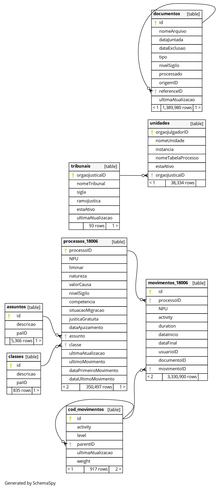

# JuMP: Data Partitioning
Este projeto foi elaborado para experimentação e avaliação das estratégias de particionamento proposta pela pesquisa de mestrado que tem
o objetivo realizar um benchmark das principais estratégias aplicadas a ferramenta JuMP.

* Aluno: `Cleber Tavares de Moura` [ctm@cin.ufpe.br](mailto:ctm@cin.ufpe.br)
* Orientador:  `Ricardo Massa` [rmfl@cin.ufpe.br](mailto:rmfl@cin.ufpe.br)

## 1. Arquitetura da Solução JuMP

A imagem abaixo apresenta uma visão arquitetural de alto nível dos componentes que compõem a solução JuMP, demonstrando o fluxo dos dados.


Abaixo destacamos o fluxo dos dados:

1. Os tribunais, por meio de uma aplicação cliente do CODEX, envia diáriamente os dados processuais para o CODEX servidor;
2. Estes dados processuais são armazenados na base do CODEX;
3. Para cada processo criado e/ou movimentado, o CODEX publica as respectivas mensagens em tópicos RabbitMQ;
4. O JuMP por meio de consumidores que estão subscritos nesses tópicos, é notificado das atualizações;
5. O JuMP então realiza a atualização dos dados processuais em sua base de dados;
6. Além disso, o JuMP executa rotinas de carga de dados, realizando consultas às APIs disponibilizadas pelo CODEX;
7. As APIs do CODEX retornam os dados processuais;
8. O JuMP atualiza os dados processuais em sua base de dados.


### 1.1 Arquitetura de dados do JuMP

A arquitetura atual do JuMP possui uma única instância de banco de dados, e utiliza a estratégia de particionamento de dados física a nível de tabelas.

Para melhor entendimento, a imagem abaixo apresenta o modelo físico do banco de dados, onde podemos observar que para cada Órgão Julgador, existem respectivas tabelas de: processos, movimentos e complementos, acrescidas do sufixo "_00000", que representa o identificador único de cada Órgão Julgador.

Essas tabelas são criadas dinâmicamente, na carga inicial de dados de um Órgão Julgador, e atualizadas à medida que novas cargas são realizadas para cada Tribunal.

### 1.2 Modelo físico do banco de dados




## 2. Métricas de avaliação

Ao comparar a eficácia de diferentes estratégias de particionamento de dados, é essencial considerar uma variedade de métricas para avaliar o desempenho, a escalabilidade e a eficiência operacional do sistema. 

Na tabela abaixo destacamos as principais métricas para essa finalidade. Contudo, é importante destacar que algumas métricas como: Latência de Replicação, não será possível mensurar em todas as estratégias avaliadas, mas apenas naquelas que envolve replicação de dados em diferentes nós.


| #        | Métrica                                                         | Descrição | Relevância | 
| -------- | --------------------------------------------------------------- | --------- | ---------- |
| 1        | Tempo de Processamento                                          | Mede o tempo necessário para executar operações específicas, como consultas, inserções e/ou atualizações no sistema. | Avalia a eficiência das estratégias para lidar com grandes volumes de dados. Estratégias mal implementadas podem aumentar a latência. |
| 2        | Utilização de Recursos                                          | Mede o uso de recursos computacionais, como CPU, memória e disco, durante a execução de operações no sistema. | Identifica gargalos que possam ser introduzidos por estratégias de particionamento. Mostra a eficiência no uso da infraestrutura. |
| 3        | Escalabilidade                                                  | Avalia como a estratégia se comporta ao aumentar o volume de dados ou a quantidade de nós no sistema. | Sistemas com crescimento contínuo de dados exigem estratégias que possam escalar sem comprometer o desempenho. |
| 4        | Equilíbrio de Carga                                             | Mede a uniformidade na distribuição de dados e tarefas entre os nós do sistema. | Os desequilíbrios resultam em nós sobrecarregados e outros subutilizados, reduzindo a eficiência do sistema. |
| 5        | Taxa de Transferência de Dados (Throughput)                     | Mede a quantidade de operações processadas por unidade de tempo (ex.: consultas por segundo ou registros inseridos por segundo). | Avalia o desempenho global do sistema em cenários com alta concorrência. |
| 6        | Custo de Redistribuição                                         | Avalia o impacto de redistribuir dados em tempo real devido a alterações na carga ou na configuração do sistema. | Estratégias dinâmicas, como particionamento adaptativo, podem causar interrupções ou consumir recursos durante redistribuições. |
| 7        | Eficiência de Consultas                                         | Mede a eficácia da estratégia para consultas específicas, como aquelas que atravessam várias partições. | Importante para sistemas como o JuMP, onde dados são frequentemente acessados de diferentes tribunais e regiões. |
| 8        | Consistência de Dados                                           | Mede a capacidade da estratégia de manter a consistência dos dados em diferentes nós. | Garantir que não haja discrepâncias ou conflitos de dados ao lidar com alta concorrência. |
| 9        | Capacidade de Adaptação                                         | Avalia a capacidade da estratégia de ajustar dinamicamente o particionamento para lidar com padrões de acesso variáveis. | Particularmente relevante para cenários onde a carga de trabalho muda com frequência. |
| 10       | Custo Operacional                                               | Mede os custos associados à implementação e manutenção de cada estratégia. | Identifica estratégias que exigem maior esforço de administração ou mais recursos computacionais. |


## 3. Ambiente utilizado para os experimentos

Para realização dos experimentos está sendo utilizada uma infraestrutura local baseada em Docker containers.

### 3.1 Equipamento Host

- MacBook Pro 
- Apple M2 Max
- 32 GB
- SSD 1TB

### 3.2 Recursos disponíveis

Os recursos de CPU e memória do container do banco de dados foi limitado a fim de estabelecer um baseline para comparação das estratégias de particionamento.

- [docker-compose.yml](./docker-compose.yml): limites definidos para CPU e memória:

```yaml
services:

  postgres:
    image: postgres:16.2
    shm_size: "8g" # sets the size of the shared memory 
    sysctls:
      kernel.shmmax: 8589934592
      kernel.shmall: 2097152
    deploy:
      resources:
        limits:
          cpus: "4.0"
          memory: "12g"
        reservations:
          cpus: "4.0"
          memory: "12g"
```

### 3.3 Configurações do Banco de Dados (PostgreSQL)

Utilizamos Postgres: version 16.2, que é o banco de dados utilizado pelo JuMP.

Para realização dos experimentos, foram realizadas alterações nos seguintes parâmetros do Postgres, para permitir a execução de queries paralelas e de longa duração. Os parâmtros abaixo estão configurados no arquivo: [./conf/postgresql/postgresql.conf](./conf/postgresql/postgresql.conf).

```txt
max_connections = 200

shared_buffers = 1GB

work_mem = 32MB
maintenance_work_mem = 128MB

max_worker_processes = 8
max_parallel_workers_per_gather = 2
max_parallel_workers = 4

enable_partitionwise_join = on

effective_cache_size = 4GB

statement_timeout = 30000
lock_timeout = 15000
idle_in_transaction_session_timeout = 60000
idle_session_timeout = 60000
```

### 3.4 Preparação dos dados para os experimentos

Esta seção apresenta as etapas realizadas para preparação da base de dados utilizada para o experimento.

Foi fornecido pela equipe do Centro de Informática da UFPE um backup do banco de dados do JuMP com uma massa de dados representativa, e dados já anonimizados. Os arquivos desse backup estão disponíveis em: [./data/postgresql/split_init.sql.zip](./data/postgresql/split_init.sql.zip).


Para descompactar o arquivo ZIP fornecido, utilizamos o seguinte comando do utilitário ZIP para unificar as partes em um único arquivo ZIP, a partir da pasta: `./data/postgresql`:

> zip -s 0 split_init.sql.zip --out init.sql.zip

Em seguida, pode-se executar o seguinte comando para descompactar o arquivo ZIP, que ira gerar o arquivo: `./data/postgresql/init.sql`

> unzip init.sql.zip

Agora a aplicação será capaz de inicializar o banco de dados a partir deste backup.

### 3.5 Inicialização do ambiente

Primeiramente, para rodar o ambiente simulado do JuMP execute o comando abaixo responsável por iniciar os containers com docker.

> docker-compose up -d


## 4. Aplicação para execução dos experimentos e coleta dos dados

Para realização dos experimentos de uma forma eficiente, implementamos uma aplicação Java, utilizando o framework SpringBoot, que está disponível em repositório GitHub no link, [https://github.com/ctmoura/jump_data_partitioning](https://github.com/ctmoura/jump_data_partitioning).

Nesta aplicação, foram implementadas APIs REST que são responsáveis por disparar a execução de uma query no banco de dados, e realizar a coleta de métricas relevantes para comparação de cada estratégia.

### 4.1 Iniciando a aplicação

Para executar a aplicação, o comando abaixo deve ser executado:

> ./mvnw spring-boot:run

### 4.2 APIs disponíveis

Para cada uma das estratégias utilizadas, foi implementada uma API, responsável por executar a query no banco de dados. Essa API possui os seguintes parâmetros de entrada:

- origemId: representa o identificador da unidade judiciária.
- qtdeUsuarios: representa a quantidade de usuários simultâneos do cenário de testes em execução.

Abaixo estão descritas as APIs de cada uma das estratégias.

#### Experimento 00 - Situação Atual

> GET /load-test-exp00?origemId={origemId}&qtdeUsuarios={qtdeUsuarios}

#### Experimento 01 - Particionamento Por Intervalo

> GET /load-test-exp01?origemId={origemId}&qtdeUsuarios={qtdeUsuarios}

#### Experimento 02 - Particionamento Por Hash

> GET /load-test-exp02?origemId={origemId}&qtdeUsuarios={qtdeUsuarios}

#### Experimento 03 - Particionamento Híbrido (Intervalo + Lista)

> GET /load-test-exp03?origemId={origemId}&qtdeUsuarios={qtdeUsuarios}

#### Experimento 04 - Particionamento Híbrido (Intervalo + Hash)

> GET /load-test-exp03?origemId={origemId}&qtdeUsuarios={qtdeUsuarios}

### 4.2 Simulação da carga

Para realizar a simulação de cargas de execução utilizamos a ferramenta JMeter para criar um plano de testes que possibila simular diferentes cenários de cargas dos usuários utilizando a aplicação.

Os cenários do plano de teste seguem uma sequencia fibonaci para determinar a quantidade de threads (usuários simulâneos) em cada um dos cenários, sendo que cada thread (usuário) executa requisições sequenciais de disparo da query no banco de dados.

- [Apache JMeter: version 5.6.3](https://jmeter.apache.org/index.html)  

#### Cenário 01

01 usuário realiza requisições sequenciais por 10 segundos.

#### Cenário 02

02 usuários realizam requisições sequenciais por 20 segundos;

#### Cenário 03

03 usuários realizam requisições sequenciais por 30 segundos;

#### Cenário 04

05 usuários realizam requisições sequenciais por 30 segundos;

#### Cenário 05

08 usuários realizam requisições sequenciais por 30 segundos;

#### Cenário 06

13 usuários realizam requisições sequenciais por 60 segundos;

#### Cenário 07

21 usuários realizam requisições sequenciais por 60 segundos;

#### Cenário 08

34 usuários realizam requisições sequenciais por 60 segundos;

#### Cenário 09

55 usuários realizam requisições sequenciais por 60 segundos;

#### Cenário 10

89 usuários realizam requisições sequenciais por 60 segundos;


## 5. Estrutura dos experimentos

Para realização dos experimentos será utilizada a seguinte estrutura para documentação da avaliação e resultados de cada uma das estratégias de particionamento.


| #         | Seção                                    | Descrição |
| --------- | ---------------------------------------- | --------- |
| 1         | **Estratégia de particionamento**        | Descreve a estratégia de particionamento a ser avaliada. |
| 2         | **Preparação**                           | Descreve as etapas necessárias para configuração da estratégia. |
| 3         | **Consulta SQL de referência**           | Descreve a consulta SQL de referência utilizada no experimento. |
| 4         | **Métricas avaliadas e resultados**      | Descreve o processo e ferramentas utilizadas para simulação da carga. |
| 5         | **Considerações**                        | Descreve as métricas e resultados obtidos após os testes. |

### 5.1 Experimentos

* [00 - AS-IS](./experimentos/00-as-is/EXPERIMENTO-00.md)
* [01 - Particionamento por Intervalo](./experimentos/01-particionamento-por-intervalo/EXPERIMENTO-01.md)
* [02 - Particionamento por Hash](./experimentos/02-particionamento-por-hash/EXPERIMENTO-02.md)
* [03 - Particionamento Híbrido (Intervalo + Lista)](./experimentos/03-particionamento-hibrido-01/EXPERIMENTO-03.md)
* [04 - Particionamento Híbrido (Intervalo + Hash)](./experimentos/04-particionamento-hibrido-02/EXPERIMENTO-04.md)