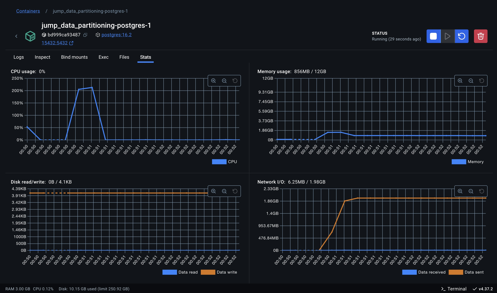
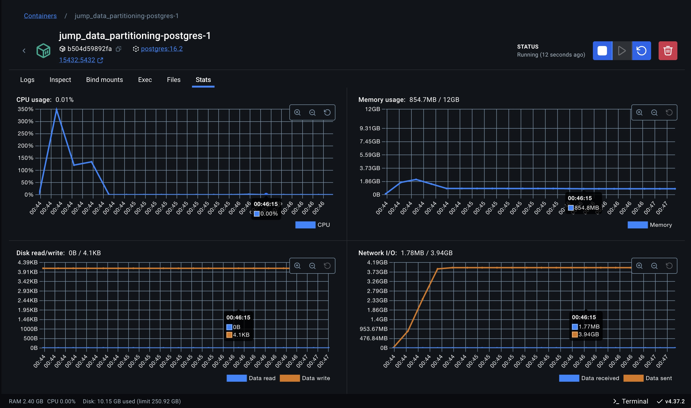
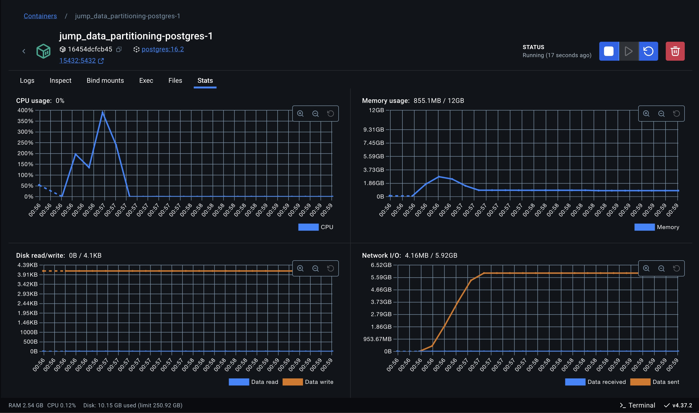
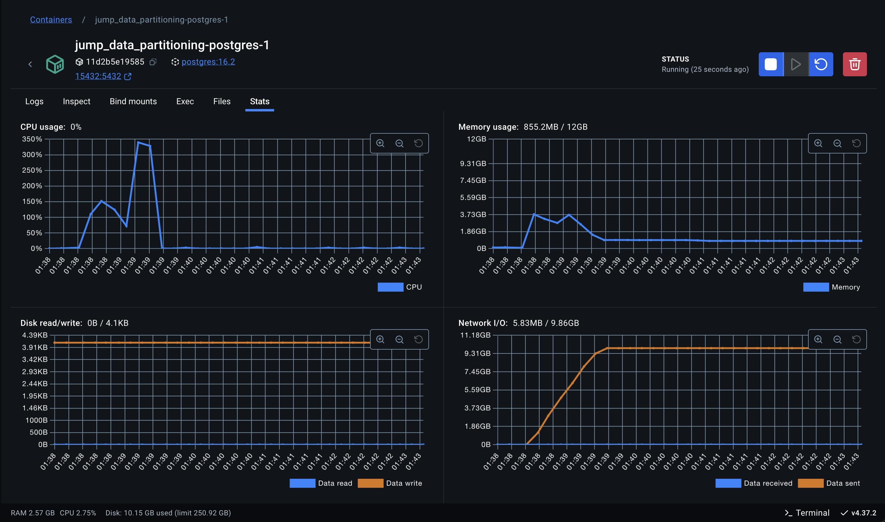
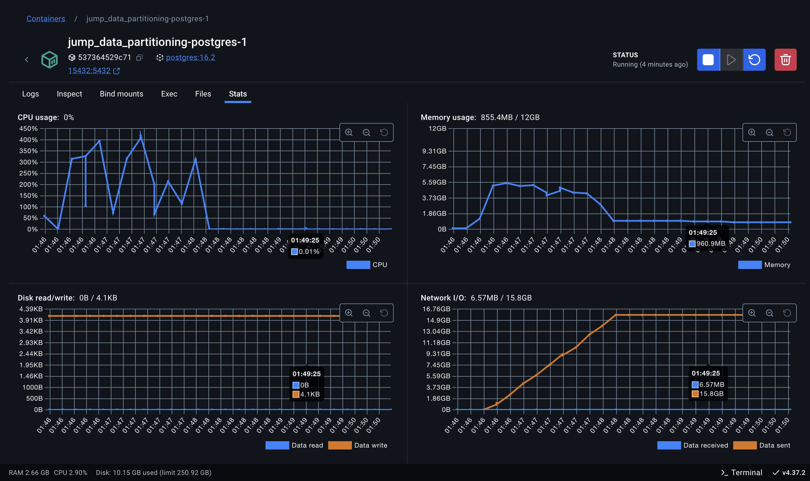

# 1 - Experimento 00 - AS-IS

Este é o nosso ponto de partida para realização dos experimentos.

Nele serão coletados os resultados das métricas estabelecidas para availação comparativa, aplicadas ao cenário atual do JuMP, sem qualquer intervenção na estretégia de particionamento utilizada, modelo de dados, ou arquitetura.

Sobre o ambiente de execução dos experimentos, vale destacar que se trata de um ambiente simulado e distinto do ambiente de produção, uma vez que precisamos ter controle e dos parâmetros de concorrência, disponibilidade de recursos e performance, sem impactar o ambiente real.

Para uma comparação justa das estratégias, os recursos disponíveis de memória, cpu e aramezenamento, serão sempre equivalentes em todos os experimentos.

## 1.1 - Estratégia de particionamento

Neste experimento, que reflete a arquitetura atual do JuMP, a estratégia utilizada é a de particionamento por chave, que para cada Unidade Judiciária, novas tabelas de: processos, movimentos e complementos são criadas e cada uma delas tem um sufixo respectivo que é o identificador da unidade judiciária. Por exemplo, para um dado tribunal que possui uma unidade judiciária com o ID 1000, serão criadas as respectivas tabelas: processos_1000, movimentos_1000 e complementos_1000.

## 1.2 - Cenários de testes

Para avaliar essa estratégia será utilizada a seguinte consulta SQL de referêcia:

```sql
SELECT
    p."NPU", p."processoID", p."ultimaAtualizacao",
  	c.descricao AS classe, a.descricao AS assunto,
  	m.activity, m."dataInicio", m."dataFinal", m."usuarioID",
    m.duration, m."movimentoID", com.descricao AS complemento,
  	s."nomeServidor", s."tipoServidor", d.tipo AS documento
FROM 
	movimentos_18006 AS m
INNER JOIN
    processos_18006 AS p ON p."processoID" = m."processoID"
INNER JOIN
    classes AS c ON p.classe = c.id
LEFT JOIN
    assuntos AS a ON p.assunto = a.id
LEFT JOIN
    complementos_18006 AS com ON com."movimentoID" = m.id
LEFT JOIN
    servidores AS s ON s."servidorID" = m."usuarioID"
LEFT JOIN
	documentos AS d ON d."id" = m."documentoID"
WHERE '2000-01-01' <= p."dataPrimeiroMovimento"
ORDER BY "processoID", "dataFinal";
```

- Total de registros retornando pela query: **3.364.537**

## 1.3 - Ambiente de testes

### 1.3.1 - Equipamento Host

- MacBook Pro 
- Apple M2 Max
- 32 GB
- SSD 1TB

### 1.3.2 - Execução em containers

Será utilizado o Docker como ferramenta de virtualização em containers para execução do servidor de banco de dados Postgres.

- Docker: version 27.4.0, build bde2b89
- Docker Compose: version v2.31.0-desktop.2

### 1.3.3 - Banco de dados

Utilizamos Postgres: version 16.2, que é o banco de dados utilizado pelo JuMP.

#### Configurações

> 01 instância de container

```yaml
services:

  postgres:
    image: postgres:16.2
    shm_size: "4g"
    deploy:
      resources:
        limits:
          cpus: "4.0"
          memory: "12g"
        reservations:
          cpus: "2.0"
          memory: "6g"
```

## 1.4 - Simulação da carga

Para simulação de cargas de execução utilizaremos a ferramenta JMeter para criar um plano de testes que possibile simular diferentes cenários de cargas dos usuários utilizando a aplicação.

Os cenários do plano de teste segue uma sequencia fibonaci para determinar a quantidade de threads (usuários simulâneos) em cada cenário, sendo que cada thread (usuário) executa 10 requisições sequenciais de disparo da query no banco de dados.

- [Apache JMeter: version 5.6.3](https://jmeter.apache.org/index.html)  


## 1.5 - Métricas avaliadas e resultados

| # Threads (Usuários em paralelo) | # Requests / Thread    | # Repetições     | Duração média | Duração mínima | Duração máxima | Duração mediana | 
| -------------------------------- | ---------------------- | ---------------- | ------------- | -------------- | -------------- | --------------- |
| 1                                | 10                     | 10               |     1794,8 ms |      1545,0 ms |      2603,0 ms |       1715,5 ms |
| 2                                | 10                     | 20               |     2682,0 ms |      2336,0 ms |      3328,0 ms |       2667,0 ms |
| 3                                | 10                     | 30               |     3369,8 ms |      1444,0 ms |      5510,0 ms |       3346,0 ms |
| 5                                | 10                     | 50               |     5222,7 ms |      2057,0 ms |     11074,0 ms |       4513,5 ms |
| 8                                | 10                     | 80               |     8836,6 ms |      1779,0 ms |     16170,0 ms |       7960,5 ms |
| 13                               | 10                     | 130              |     --------- |      --------- |     ---------- |       --------- |


### 1.5.2 - Utilização de Recursos  

| # Threads (Usuários em paralelo) | # Requests / Thread  | # Repetições  | Uso máximo de CPU | Uso de RAM  | Disk (read) | Disk (write) | Network I/O (received) | Network I/O (sent) | 
| -------------------------------- | -------------------- | ------------- | ----------------- | ----------- | ----------- | ------------ | ---------------------  | ------------------ |
| 1                                | 10                   | 10            |          213,22 % |     1,49 GB |        0 KB |         0 KB |                6,25 MB |            1,98 GB |
| 2                                | 10                   | 20            |          347,73 % |     2,14 GB |        0 KB |         0 KB |                1,78 MB |            3,94 GB |
| 3                                | 10                   | 30            |          390,09 % |     2,77 GB |        0 KB |         0 KB |                4,16 MB |            5,92 GB |
| 5                                | 10                   | 50            |          401,10 % |     5,56 GB |        0 KB |         0 KB |                6,48 MB |            9,86 GB |
| 8                                | 10                   | 80            |          419,55 % |     5,51 GB |        0 KB |         0 KB |                6,94 MB |           15,80 GB |

Abaixo, estão os screenshots das estatísticas coletadas para cada cenário executado:

#### 1 Thread



#### 2 Threads



#### 3 Threads



#### 5 Threads



#### 8 Threads



#### 13 Threads

Não foi possível executar o cenário uma vez que o servidor não conseguiu responder as solicitações simultâneas.


### 1.5.3 - Escalabilidade

Para essa métrica, implementamos uma aplicação em Java utilizando Spring Boot, que publica um endpoint REST responsável por executar a query de referência, realizar a leitura do ResultSet, capturando o timestamp inicial e final da execução para cálculo da duração.

Utilizamos a ferramenta JMeter para criar um plano de testes que possibilitou simular a carga de usuários simultâneos utilizando a aplicação.

| # Threads (Usuários em paralelo) | # Requests / Thread    | # Repetições     | Duração média | Duração mínima | Duração máxima | Duração mediana | 
| -------------------------------- | ---------------------- | ---------------- | ------------- | -------------- | -------------- | --------------- |
| 1                                | 10                     | 10               |     1794,8 ms |      1545,0 ms |      2603,0 ms |       1715,5 ms |
| 2                                | 10                     | 20               |     2682,0 ms |      2336,0 ms |      3328,0 ms |       2667,0 ms |
| 3                                | 10                     | 30               |     3369,8 ms |      1444,0 ms |      5510,0 ms |       3346,0 ms |
| 5                                | 10                     | 50               |     5222,7 ms |      2057,0 ms |     11074,0 ms |       4513,5 ms |
| 8                                | 10                     | 80               |     8836,6 ms |      1779,0 ms |     16170,0 ms |       7960,5 ms |
| 13                               | 10                     | 130              |     --------- |      --------- |     ---------- |       --------- |

Constatamos que a partir do cenário com 13 threads simultâneas a estratégia utilizada não permitiu escalar o banco de dados para atender o crescimento
da demanda conforme a execução dos testes, uma vez que com o aumento de usuários em paralelo, a execução da query passou a superar o limite máximo de 
180.000 ms (3 minutos).

### 1.5.4 - Equilíbrio de Carga

Não se aplica.

### 1.5.5 - Taxa de Transferência de Dados (Throughput)

- Comando para ativar o rastreamento de tempos de entrada/saída (I/O) em operações realizadas pelo banco de dados.

```sql
SET track_io_timing = on;

EXPLAIN ANALYZE 
    -- CONSULTA SQL DE REFERÊNCIA
    SELECT * FROM ...;
    
```

- Taxa: **3.364.537 registros** / **7,44 segundos** = **451897,94 registros por segundo**

### 1.5.6 - Custo de Redistribuição

Não se aplica.

### 1.5.7 - Eficiência de Consultas

A eficiência pode ser expressa como uma relação entre o tempo de execução e o número de partições acessadas:

#### Fórmula:

```plaintext 
Eficiência (%) = (1 / Tempo de Execução Total) * (Número de Partições Acessadas / Partições Totais) * 100
```

- Tempo de Execução Total: **10 segundos**
- Número de Partições Acessadas: **1**
- Partições Totais: **1**

> Eficiência (%) = (1 / 10) * (1 / 1) * 100 = **10%**

### 1.5.8 - Consistência de Dados

Essa métrica não se aplica a essa estratégia, uma vez que não existe movimentação de dados, seja no próprio host ou em hosts distintos.

### 1.5.9 - Capacidade de Adaptação

Essa métrica não se aplica a essa estratégia, uma vez que ela não realiza mudanças ou ajustes dinâmicamente.

### 1.5.10 - Custo Operacional

Não foi avaliado o custo operacional pois se trata da estratégia atualmente implementada.