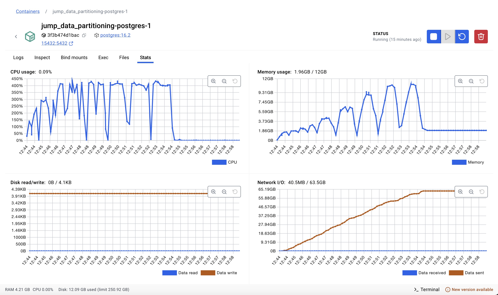
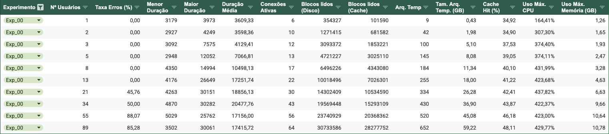
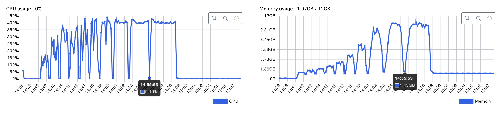

# 1 - Experimento 00 - AS-IS

Este é o nosso ponto de partida para realização dos experimentos.

Nele serão coletados os resultados das métricas estabelecidas para availação comparativa, aplicadas ao cenário atual do JuMP, sem qualquer intervenção na estretégia de particionamento utilizada, modelo de dados, ou arquitetura.

Sobre o ambiente de execução dos experimentos, vale destacar que se trata de um ambiente simulado e distinto do ambiente de produção, uma vez que precisamos ter controle e dos parâmetros de concorrência, disponibilidade de recursos e performance, sem impactar o ambiente real.

Para uma comparação justa das estratégias, os recursos disponíveis de memória, cpu e aramezenamento, serão sempre equivalentes em todos os experimentos.

## 1.1 - Estratégia de particionamento

Neste experimento, que reflete a arquitetura atual do JuMP, a estratégia utilizada é a de particionamento por chave, que para cada Unidade Judiciária, novas tabelas de: processos, movimentos e complementos são criadas e cada uma delas tem um sufixo respectivo que é o identificador da unidade judiciária. Por exemplo, para um dado tribunal que possui uma unidade judiciária com o ID 1000, serão criadas as respectivas tabelas: processos_1000, movimentos_1000 e complementos_1000.

## 1.2 - Preparação

A base de dados que foi fornecida precisou ser enrriquecida com mais dados, portanto, clonamos as tabelas e registros das tabelas **processos_18006**, **movimentos_18006**, e **complementos_18006**, efetuando as devidas correções de referências de chaves estrangeiras, a fim de que pudessemos simular a utilização dos usuários em consultas de dados de diferentes unidades.


1. Criando a coluna **unidadeID** nas tabelas originais de **processos_18006**, **movimentos_18006**, e **complementos_18006**.

```sql
-- Unidade Judiciária: 18006

-- Tabelas para complementos_18006
ALTER TABLE IF EXISTS public.complementos_18006
    ADD COLUMN "unidadeID" bigint;
UPDATE public.complementos_18006 SET "unidadeID" = 18006;
ALTER TABLE IF EXISTS public.complementos_18006
    ALTER COLUMN "unidadeID" SET NOT NULL;

-- Tabelas para movimentos_18006
ALTER TABLE IF EXISTS public.movimentos_18006
    ADD COLUMN "unidadeID" bigint;
UPDATE public.movimentos_18006 SET "unidadeID" = 18006;
ALTER TABLE IF EXISTS public.movimentos_18006
    ALTER COLUMN "unidadeID" SET NOT NULL;

-- Tabelas para processos_18006
ALTER TABLE IF EXISTS public.processos_18006
    ADD COLUMN "unidadeID" bigint;
UPDATE public.processos_18006 SET "unidadeID" = 18006;
ALTER TABLE IF EXISTS public.processos_18006
    ALTER COLUMN "unidadeID" SET NOT NULL;
```

2. Clonando as tabelas e dados da unidade judiciária existente para novas unidades.

```sql

-- Clonando para criar tabelas da unidade: 18007

-- processos_18007

CREATE TABLE public.processos_18007 AS
SELECT
"processoID" + 1000000000 AS "processoID", -- Adiciona um offset para as chaves primárias serem únicas
"NPU", liminar, natureza, "valorCausa", "nivelSigilo", competencia,
"situacaoMigracao", "justicaGratuita", "dataAjuizamento", assunto, classe,
"ultimaAtualizacao", "ultimoMovimento", "dataPrimeiroMovimento", "dataUltimoMovimento",
'18007'::bigint AS "unidadeID"
FROM public.processos_18006;

ALTER TABLE IF EXISTS public.processos_18007
    ADD CONSTRAINT processos_18007_pkey PRIMARY KEY ("processoID");
ALTER TABLE IF EXISTS public.processos_18007
    ADD CONSTRAINT processos_18007_classe_fkey FOREIGN KEY (classe)
    REFERENCES public.classes (id) MATCH SIMPLE
    ON UPDATE NO ACTION
    ON DELETE NO ACTION;
ALTER TABLE IF EXISTS public.processos_18007
    ADD CONSTRAINT processos_18007_assunto_fkey FOREIGN KEY (assunto)
    REFERENCES public.assuntos (id) MATCH SIMPLE
    ON UPDATE NO ACTION
    ON DELETE NO ACTION;

-- movimentos_18007

CREATE TABLE public.movimentos_18007 AS
SELECT
id + 10000000000 AS id, -- Adiciona um offset para as chaves primárias serem únicas
"processoID" + 1000000000 AS "processoID", -- Adiciona um offset para as chaves primárias serem únicas
"NPU", activity, duration, "dataInicio", "dataFinal", "usuarioID", "documentoID", "movimentoID",
'18007'::bigint AS "unidadeID"
FROM public.movimentos_18006;


ALTER TABLE IF EXISTS public.movimentos_18007
    ADD CONSTRAINT movimentos_18007_pkey PRIMARY KEY (id);
ALTER TABLE IF EXISTS public.movimentos_18007
    ADD CONSTRAINT "movimentos_18007_processoID_fkey" FOREIGN KEY ("processoID")
    REFERENCES public.processos_18007 ("processoID") MATCH SIMPLE
    ON UPDATE NO ACTION
    ON DELETE NO ACTION;
ALTER TABLE IF EXISTS public.movimentos_18007
    ADD CONSTRAINT "movimentos_18007_movimentoID_fkey" FOREIGN KEY ("movimentoID")
    REFERENCES public.cod_movimentos (id) MATCH SIMPLE
    ON UPDATE NO ACTION
    ON DELETE NO ACTION;

-- complementos_18007

CREATE TABLE public.complementos_18007 AS
SELECT
"complementoID" + 10000000000 AS "complementoID", -- Adiciona um offset para as chaves primárias serem únicas
"movimentoID" + 10000000000 AS "movimentoID", -- Adiciona um offset para as chaves primárias serem únicas
tipo, descricao,
'18007'::bigint AS "unidadeID"
FROM public.complementos_18006;

ALTER TABLE IF EXISTS public.complementos_18007
    ADD CONSTRAINT complementos_18007_pkey PRIMARY KEY ("complementoID");
ALTER TABLE IF EXISTS public.complementos_18007
    ADD CONSTRAINT "complementos_18007_movimentoID_fkey" FOREIGN KEY ("movimentoID")
    REFERENCES public.movimentos_18007 (id) MATCH SIMPLE
    ON UPDATE CASCADE
    ON DELETE CASCADE;

-- Clonando para criar tabelas da unidade: 18008

-- processos_18008

CREATE TABLE public.processos_18008 AS
SELECT
"processoID" + 2000000000 AS "processoID", -- Adiciona um offset para as chaves primárias serem únicas
"NPU", liminar, natureza, "valorCausa", "nivelSigilo", competencia,
"situacaoMigracao", "justicaGratuita", "dataAjuizamento", assunto, classe,
"ultimaAtualizacao", "ultimoMovimento", "dataPrimeiroMovimento", "dataUltimoMovimento",
'18008'::bigint AS "unidadeID"
FROM public.processos_18006;

ALTER TABLE IF EXISTS public.processos_18008
    ADD CONSTRAINT processos_18008_pkey PRIMARY KEY ("processoID");
ALTER TABLE IF EXISTS public.processos_18008
    ADD CONSTRAINT processos_18008_classe_fkey FOREIGN KEY (classe)
    REFERENCES public.classes (id) MATCH SIMPLE
    ON UPDATE NO ACTION
    ON DELETE NO ACTION;
ALTER TABLE IF EXISTS public.processos_18008
    ADD CONSTRAINT processos_18008_assunto_fkey FOREIGN KEY (assunto)
    REFERENCES public.assuntos (id) MATCH SIMPLE
    ON UPDATE NO ACTION
    ON DELETE NO ACTION;

-- movimentos_18008

CREATE TABLE public.movimentos_18008 AS
SELECT
id + 20000000000 AS id, -- Adiciona um offset para as chaves primárias serem únicas
"processoID" + 2000000000 AS "processoID", -- Adiciona um offset para as chaves primárias serem únicas
"NPU", activity, duration, "dataInicio", "dataFinal", "usuarioID", "documentoID", "movimentoID",
'18008'::bigint AS "unidadeID"
FROM public.movimentos_18006;


ALTER TABLE IF EXISTS public.movimentos_18008
    ADD CONSTRAINT movimentos_18008_pkey PRIMARY KEY (id);
ALTER TABLE IF EXISTS public.movimentos_18008
    ADD CONSTRAINT "movimentos_18008_processoID_fkey" FOREIGN KEY ("processoID")
    REFERENCES public.processos_18008 ("processoID") MATCH SIMPLE
    ON UPDATE NO ACTION
    ON DELETE NO ACTION;
ALTER TABLE IF EXISTS public.movimentos_18008
    ADD CONSTRAINT "movimentos_18008_movimentoID_fkey" FOREIGN KEY ("movimentoID")
    REFERENCES public.cod_movimentos (id) MATCH SIMPLE
    ON UPDATE NO ACTION
    ON DELETE NO ACTION;

-- complementos_18008

CREATE TABLE public.complementos_18008 AS
SELECT
"complementoID" + 20000000000 AS "complementoID", -- Adiciona um offset para as chaves primárias serem únicas
"movimentoID" + 20000000000 AS "movimentoID", -- Adiciona um offset para as chaves primárias serem únicas
tipo, descricao,
'18008'::bigint AS "unidadeID"
FROM public.complementos_18006;

ALTER TABLE IF EXISTS public.complementos_18008
    ADD CONSTRAINT complementos_18008_pkey PRIMARY KEY ("complementoID");
ALTER TABLE IF EXISTS public.complementos_18008
    ADD CONSTRAINT "complementos_18008_movimentoID_fkey" FOREIGN KEY ("movimentoID")
    REFERENCES public.movimentos_18008 (id) MATCH SIMPLE
    ON UPDATE CASCADE
    ON DELETE CASCADE;


CREATE INDEX servidores_idx ON servidores ("servidorID");
CREATE INDEX documentos_idx ON documentos ("id");

```

## 1.3 - Consulta SQL de referência

Neste experimento foi utilizada a consulta SQL de referência abaixo:

```sql
EXPLAIN ANALYZE 
SELECT
    p."NPU", 
    p."processoID", 
    p."ultimaAtualizacao",
    c.descricao AS classe, 
    a.descricao AS assunto,
    m.activity, 
    m."dataInicio", 
    m."dataFinal", 
    m."usuarioID",
    m.duration, 
    m."movimentoID", 
    com.descricao AS complemento,
    s."nomeServidor", 
    s."tipoServidor", 
    d.tipo AS documento
FROM 
    processos_18006 AS p
INNER JOIN
    movimentos_18006 AS m 
    ON m."processoID" = p."processoID"
INNER JOIN
    classes AS c ON p.classe = c.id
LEFT JOIN
    assuntos AS a ON p.assunto = a.id
LEFT JOIN
    complementos_18006 AS com 
    ON com."movimentoID" = m."id" 
LEFT JOIN
    servidores AS s ON s."servidorID" = m."usuarioID"
LEFT JOIN
    documentos AS d ON d."id" = m."documentoID"
WHERE 
    p."dataPrimeiroMovimento" >= '2020-01-01' 
ORDER BY 
    p."processoID", m."dataFinal";
```


## 1.4 - Métricas avaliadas e resultados

A imagem abaixo apresentamos os gráficos da utilização de recursos durante a execução do experimento. Estes gráficos foram coletados a partir do dashboard do Docker, referente ao container de execução do banco de dados Postgres.



A tabela abaixo apresenta os resultados consolidados das métricas coletadas durante a execução do experimento.



> Podemos perceber que a partir do cenário de testes com 21 usuários simultâneos, o banco de dados passou falhar **45,76%** das consultas realizadas.

### 1.4.1 - Tempo de Resposta

A execução da consulta SQL de forma isolada levou: **3,48** segundos.

A tabela anterior apresenta o tempo de resposta mínimo, máximo e médio, para cada um dos cenários de teste que simulam a carga crescente de usuários.

### 1.4.2 - Utilização de Recursos

A imagem abaixo apresenta os gráficos de consumo de CPU e Memória, durante a execução dos cenários de teste.



### 1.4.2 - Escalabilidade

De acordo com a tabela podemos perceber que e a arquitetura atual permitiu escalar até o cenário com 13 usuários simultâneos, e a partir do cenário com 21 usuários, o banco de dados passou falhar **45,76%** das consultas realizadas.

### 1.4.3 - Equilíbrio de Carga

Taxa de uso das partições (%) =  (3 / 9) * 100 = **33,33%**

### 1.4.4 - Taxa de Transferência de Dados

Taxa: **815.477** registros / **3,48** segundos = **234.332,47** registros por segundo**

### 1.4.5 - Custo de Redistribuição

Nessa abordagem, não existe custo de redistribuição dos dados pois eles estão armazenados em tabelas por unidade. 

### 1.4.6 - Eficiência de Consultas

Temos:

- P_Acessadas: **3**
- P_Total: **9**
- T_Query: **3,48 segundos**
- T_Ideal: **3 segundos** 

> Eficiência (%) =  (3 / 9) * (1 - (3,48 / 3)) * 100 => **-5,33%**

Nesta arquitetura, a consulta obteve uma eficiencia negativa de **-5,33%**.
