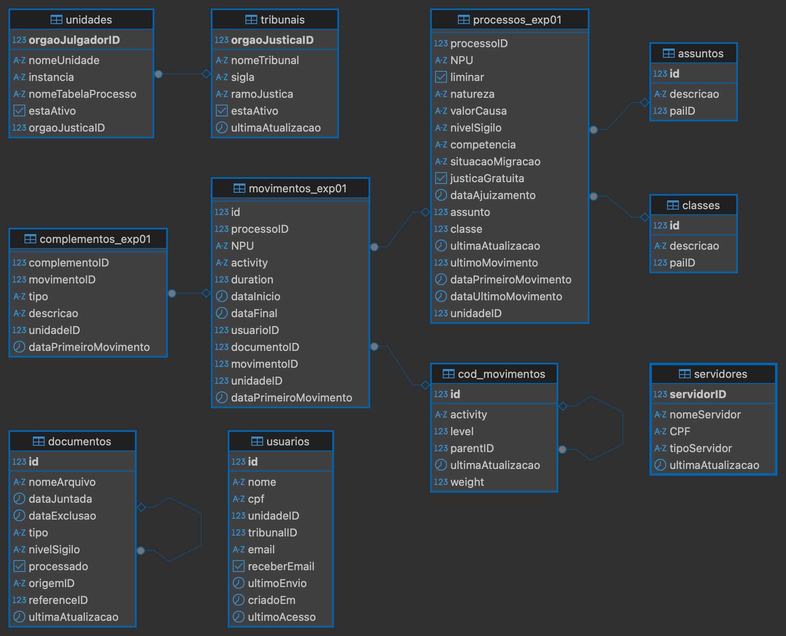
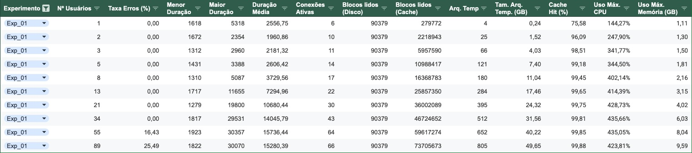
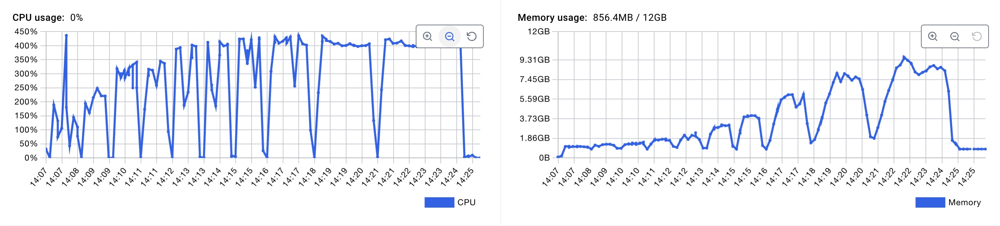

# 1 - Experimento 01 - Particionamento por Intervalo

## 1.1 - Estratégia de particionamento

O **particionamento por intervalo** é uma estratégia em que os dados são distribuídos entre partições com base em intervalos contínuos de valores em uma coluna específica, como uma data ou um identificador numérico. Em uma instância única de banco de dados, essa abordagem facilita consultas baseadas em intervalos, como relatórios ou análises temporais, pois direciona automaticamente as operações à partição relevante, reduzindo o escopo da leitura e melhorando a performance. Entre os benefícios, destacam-se a simplicidade na configuração e a eficiência em cenários com padrões previsíveis de acesso, como consultas de dados históricos ou por períodos específicos. Contudo, apresenta limitações, como o potencial de desequilíbrio na carga de trabalho caso os dados não sejam uniformemente distribuídos entre os intervalos, resultando em partições desproporcionalmente grandes. Além disso, consultas que cruzam vários intervalos podem se tornar menos eficientes, exigindo a leitura de múltiplas partições. O particionamento por intervalo é ideal para aplicações em que os dados possuem um ordenamento natural e as consultas frequentemente operam dentro de faixas específicas.

## 1.2 - Preparação

Nesta estapa, iremos preparar a base de dados para o particionamento das tabelas por intervalo.

> Premissa: Esta etapa já foi realizada no `Experimento 00`, caso necessário, repita os passos descritos na respectiva seção.

### 1.2.1 - Analise da distribuição dos dados

Para realização do particionamento por intervalo, primeiramento realizamos uma analise da distribuição dos dados ao longo dos anos, a fim de definir a granularidade das partições. 

A query abaixo nos dá o resultado de como os processos estão distribuídos em cada ano.

```sql
SELECT 
	DATE_TRUNC('year', "dataPrimeiroMovimento") as ano, 
  count(*) as qtd_processos
FROM processos_18006
GROUP BY DATE_TRUNC('year', "dataPrimeiroMovimento")
ORDER BY DATE_TRUNC('year', "dataPrimeiroMovimento")
```

| ano                   | qtd_processos |
| --------------------- | ------------- |
| 2013-01-01 00:00:00	|          5324 |
| 2014-01-01 00:00:00	|           465 |
| 2015-01-01 00:00:00	|         25329 |
| 2016-01-01 00:00:00	|         76213 |
| 2017-01-01 00:00:00	|         11179 |
| 2018-01-01 00:00:00	|         76895 |
| 2019-01-01 00:00:00	|         17404 |
| 2020-01-01 00:00:00	|         16263 |
| 2021-01-01 00:00:00	|         25782 |
| 2022-01-01 00:00:00	|         50124 |
| 2023-01-01 00:00:00	|         30581 |
| 2024-01-01 00:00:00	|         14876 |
| 2025-01-01 00:00:00	|             2 |
| NULL	                |            60 |

Dessa forma, verificamos que os processos estão distribuídos em 13 anos, ou seja, **13 partições**.

### 1.2.2 - Criação das tabelas com o Particionamento por Intervalo

Nesta etapa, iremos descrever os comandos necessários para criação das tabelas de **processos_exp01**, **movimentos_exp01** e **complementos_exp01** com o particionamento por intervalo ativado. 
Como descrito anteriormente, essas tabelas serão particionadas por ano, utilizando a técnica de particionamento do PostgreSQL chamada **Range Partitioning**, aplicada a coluna `dataPrimeiroMovimento`.


1. O comando abaixo cria as tabelas particionadas:

```sql
----------------------------------------
-- tabela particionada: processos_exp01
----------------------------------------

CREATE SEQUENCE IF NOT EXISTS public."processos_exp01_processoID_seq"
    INCREMENT 1
    START 1
    MINVALUE 1
    MAXVALUE 9223372036854775807
    CACHE 1;

ALTER SEQUENCE public."processos_exp01_processoID_seq"
    OWNER TO postgres;

CREATE TABLE IF NOT EXISTS public.processos_exp01
(
    "processoID" bigint NOT NULL DEFAULT nextval('"processos_exp01_processoID_seq"'::regclass),
    "NPU" character varying COLLATE pg_catalog."default" NOT NULL,
    liminar boolean,
    natureza character varying COLLATE pg_catalog."default",
    "valorCausa" character varying COLLATE pg_catalog."default",
    "nivelSigilo" character varying COLLATE pg_catalog."default",
    competencia character varying COLLATE pg_catalog."default",
    "situacaoMigracao" character varying COLLATE pg_catalog."default",
    "justicaGratuita" boolean,
    "dataAjuizamento" timestamp without time zone,
    assunto integer,
    classe integer,
    "ultimaAtualizacao" timestamp without time zone,
    "ultimoMovimento" bigint,
    "dataPrimeiroMovimento" timestamp without time zone,
    "dataUltimoMovimento" timestamp without time zone,
	"unidadeID" bigint NOT NULL,
    CONSTRAINT processos_exp01_assunto_fkey FOREIGN KEY (assunto)
        REFERENCES public.assuntos (id) MATCH SIMPLE
        ON UPDATE NO ACTION
        ON DELETE NO ACTION,
    CONSTRAINT processos_exp01_classe_fkey FOREIGN KEY (classe)
        REFERENCES public.classes (id) MATCH SIMPLE
        ON UPDATE NO ACTION
        ON DELETE NO ACTION
) PARTITION BY RANGE ("dataPrimeiroMovimento");

ALTER TABLE IF EXISTS public.processos_exp01
    OWNER to postgres;

ALTER SEQUENCE public."processos_exp01_processoID_seq"
    OWNED BY public.processos_exp01."processoID";

-- partições da tabela: processos_exp01

CREATE TABLE processos_exp01_2013 PARTITION OF processos_exp01
FOR VALUES FROM ('2013-01-01') TO ('2014-01-01');
CREATE TABLE processos_exp01_2014 PARTITION OF processos_exp01
FOR VALUES FROM ('2014-01-01') TO ('2015-01-01');
CREATE TABLE processos_exp01_2015 PARTITION OF processos_exp01
FOR VALUES FROM ('2015-01-01') TO ('2016-01-01');
CREATE TABLE processos_exp01_2016 PARTITION OF processos_exp01
FOR VALUES FROM ('2016-01-01') TO ('2017-01-01');
CREATE TABLE processos_exp01_2017 PARTITION OF processos_exp01
FOR VALUES FROM ('2017-01-01') TO ('2018-01-01');
CREATE TABLE processos_exp01_2018 PARTITION OF processos_exp01
FOR VALUES FROM ('2018-01-01') TO ('2019-01-01');
CREATE TABLE processos_exp01_2019 PARTITION OF processos_exp01
FOR VALUES FROM ('2019-01-01') TO ('2020-01-01');
CREATE TABLE processos_exp01_2020 PARTITION OF processos_exp01
FOR VALUES FROM ('2020-01-01') TO ('2021-01-01');
CREATE TABLE processos_exp01_2021 PARTITION OF processos_exp01
FOR VALUES FROM ('2021-01-01') TO ('2022-01-01');
CREATE TABLE processos_exp01_2022 PARTITION OF processos_exp01
FOR VALUES FROM ('2022-01-01') TO ('2023-01-01');
CREATE TABLE processos_exp01_2023 PARTITION OF processos_exp01
FOR VALUES FROM ('2023-01-01') TO ('2024-01-01');
CREATE TABLE processos_exp01_2024 PARTITION OF processos_exp01
FOR VALUES FROM ('2024-01-01') TO ('2025-01-01');
CREATE TABLE processos_exp01_2025 PARTITION OF processos_exp01
FOR VALUES FROM ('2025-01-01') TO ('2026-01-01');


-- índices da tabela: processos_exp01

CREATE INDEX processos_exp01_idx1 ON public.processos_exp01 ("dataPrimeiroMovimento", "unidadeID");
CREATE INDEX processos_exp01_idx2 ON public.processos_exp01 ("dataPrimeiroMovimento", "unidadeID", "processoID");
CREATE INDEX processos_exp01_idx3 ON public.processos_exp01 ("dataPrimeiroMovimento", "unidadeID", "assunto");
CREATE INDEX processos_exp01_idx4 ON public.processos_exp01 ("dataPrimeiroMovimento", "unidadeID", "classe");
CREATE INDEX processos_exp01_idx5 ON public.processos_exp01 ("dataPrimeiroMovimento", "unidadeID", "processoID", "classe", "assunto");

CREATE UNIQUE INDEX processos_exp01_unq1 ON public.processos_exp01 ("dataPrimeiroMovimento", "processoID");


----------------------------------------
-- tabela particionada: movimentos_exp01
----------------------------------------

CREATE SEQUENCE IF NOT EXISTS public."movimentos_exp01_id_seq"
    INCREMENT 1
    START 1
    MINVALUE 1
    MAXVALUE 9223372036854775807
    CACHE 1;

ALTER SEQUENCE public."movimentos_exp01_id_seq"
    OWNER TO postgres;

CREATE TABLE IF NOT EXISTS public.movimentos_exp01
(
    id bigint NOT NULL DEFAULT nextval('movimentos_exp01_id_seq'::regclass),
    "processoID" bigint,
    "NPU" character varying COLLATE pg_catalog."default",
    activity character varying COLLATE pg_catalog."default" NOT NULL,
    duration bigint,
    "dataInicio" timestamp without time zone,
    "dataFinal" timestamp without time zone NOT NULL,
    "usuarioID" bigint,
    "documentoID" bigint,
    "movimentoID" bigint,
	"unidadeID" bigint NOT NULL,
    "dataPrimeiroMovimento" timestamp without time zone,
    CONSTRAINT "movimentos_exp01_movimentoID_fkey" FOREIGN KEY ("movimentoID")
        REFERENCES public.cod_movimentos (id) MATCH SIMPLE
        ON UPDATE NO ACTION
        ON DELETE NO ACTION,
    CONSTRAINT "movimentos_exp01_processoID_fkey" FOREIGN KEY ("dataPrimeiroMovimento", "processoID")
        REFERENCES public.processos_exp01 ("dataPrimeiroMovimento", "processoID") MATCH SIMPLE
        ON UPDATE CASCADE
        ON DELETE CASCADE
) PARTITION BY RANGE ("dataPrimeiroMovimento");

ALTER TABLE IF EXISTS public.movimentos_exp01
    OWNER to postgres;

ALTER SEQUENCE public."movimentos_exp01_id_seq"
    OWNED BY public.movimentos_exp01.id;

-- partições da tabela: movimentos_exp01

CREATE TABLE movimentos_exp01_2013 PARTITION OF movimentos_exp01
FOR VALUES FROM ('2013-01-01') TO ('2014-01-01');
CREATE TABLE movimentos_exp01_2014 PARTITION OF movimentos_exp01
FOR VALUES FROM ('2014-01-01') TO ('2015-01-01');
CREATE TABLE movimentos_exp01_2015 PARTITION OF movimentos_exp01
FOR VALUES FROM ('2015-01-01') TO ('2016-01-01');
CREATE TABLE movimentos_exp01_2016 PARTITION OF movimentos_exp01
FOR VALUES FROM ('2016-01-01') TO ('2017-01-01');
CREATE TABLE movimentos_exp01_2017 PARTITION OF movimentos_exp01
FOR VALUES FROM ('2017-01-01') TO ('2018-01-01');
CREATE TABLE movimentos_exp01_2018 PARTITION OF movimentos_exp01
FOR VALUES FROM ('2018-01-01') TO ('2019-01-01');
CREATE TABLE movimentos_exp01_2019 PARTITION OF movimentos_exp01
FOR VALUES FROM ('2019-01-01') TO ('2020-01-01');
CREATE TABLE movimentos_exp01_2020 PARTITION OF movimentos_exp01
FOR VALUES FROM ('2020-01-01') TO ('2021-01-01');
CREATE TABLE movimentos_exp01_2021 PARTITION OF movimentos_exp01
FOR VALUES FROM ('2021-01-01') TO ('2022-01-01');
CREATE TABLE movimentos_exp01_2022 PARTITION OF movimentos_exp01
FOR VALUES FROM ('2022-01-01') TO ('2023-01-01');
CREATE TABLE movimentos_exp01_2023 PARTITION OF movimentos_exp01
FOR VALUES FROM ('2023-01-01') TO ('2024-01-01');
CREATE TABLE movimentos_exp01_2024 PARTITION OF movimentos_exp01
FOR VALUES FROM ('2024-01-01') TO ('2025-01-01');
CREATE TABLE movimentos_exp01_2025 PARTITION OF movimentos_exp01
FOR VALUES FROM ('2025-01-01') TO ('2026-01-01');

-- índices da tabela: movimentos_exp01

CREATE INDEX movimentos_exp01_idx1 ON public.movimentos_exp01 ("dataPrimeiroMovimento", "unidadeID");
CREATE INDEX movimentos_exp01_idx2 ON public.movimentos_exp01 ("dataPrimeiroMovimento", "unidadeID", "id");
CREATE INDEX movimentos_exp01_idx3 ON public.movimentos_exp01 ("dataPrimeiroMovimento", "unidadeID", "processoID");
CREATE INDEX movimentos_exp01_idx4 ON public.movimentos_exp01 ("dataPrimeiroMovimento", "unidadeID", "documentoID");
CREATE INDEX movimentos_exp01_idx5 ON public.movimentos_exp01 ("dataPrimeiroMovimento", "unidadeID", "processoID", "id", "dataFinal");


CREATE UNIQUE INDEX movimentos_exp01_unq1 ON public.movimentos_exp01 ("dataPrimeiroMovimento", "id");


----------------------------------------
-- tabela particionada: complementos_exp01
----------------------------------------

CREATE SEQUENCE IF NOT EXISTS public."complementos_exp01_complementoID_seq"
    INCREMENT 1
    START 1
    MINVALUE 1
    MAXVALUE 9223372036854775807
    CACHE 1;

ALTER SEQUENCE public."complementos_exp01_complementoID_seq"
    OWNER TO postgres;

CREATE TABLE IF NOT EXISTS public.complementos_exp01
(
    "complementoID" bigint NOT NULL DEFAULT nextval('"complementos_exp01_complementoID_seq"'::regclass),
    "movimentoID" bigint,
    tipo character varying COLLATE pg_catalog."default" NOT NULL,
    descricao character varying COLLATE pg_catalog."default" NOT NULL,
	"unidadeID" bigint NOT NULL,
    "dataPrimeiroMovimento" timestamp without time zone,
    CONSTRAINT "complementos_exp01_movimentoID_fkey" FOREIGN KEY ("dataPrimeiroMovimento", "movimentoID")
        REFERENCES public.movimentos_exp01 ("dataPrimeiroMovimento", "id") MATCH SIMPLE
        ON UPDATE CASCADE
        ON DELETE CASCADE
) PARTITION BY RANGE ("dataPrimeiroMovimento");

ALTER TABLE IF EXISTS public.complementos_exp01
    OWNER to postgres;

ALTER SEQUENCE public."complementos_exp01_complementoID_seq"
    OWNED BY public.complementos_exp01."complementoID";

-- partições da tabela: complementos_exp01

CREATE TABLE complementos_exp01_2013 PARTITION OF complementos_exp01
FOR VALUES FROM ('2013-01-01') TO ('2014-01-01');
CREATE TABLE complementos_exp01_2014 PARTITION OF complementos_exp01
FOR VALUES FROM ('2014-01-01') TO ('2015-01-01');
CREATE TABLE complementos_exp01_2015 PARTITION OF complementos_exp01
FOR VALUES FROM ('2015-01-01') TO ('2016-01-01');
CREATE TABLE complementos_exp01_2016 PARTITION OF complementos_exp01
FOR VALUES FROM ('2016-01-01') TO ('2017-01-01');
CREATE TABLE complementos_exp01_2017 PARTITION OF complementos_exp01
FOR VALUES FROM ('2017-01-01') TO ('2018-01-01');
CREATE TABLE complementos_exp01_2018 PARTITION OF complementos_exp01
FOR VALUES FROM ('2018-01-01') TO ('2019-01-01');
CREATE TABLE complementos_exp01_2019 PARTITION OF complementos_exp01
FOR VALUES FROM ('2019-01-01') TO ('2020-01-01');
CREATE TABLE complementos_exp01_2020 PARTITION OF complementos_exp01
FOR VALUES FROM ('2020-01-01') TO ('2021-01-01');
CREATE TABLE complementos_exp01_2021 PARTITION OF complementos_exp01
FOR VALUES FROM ('2021-01-01') TO ('2022-01-01');
CREATE TABLE complementos_exp01_2022 PARTITION OF complementos_exp01
FOR VALUES FROM ('2022-01-01') TO ('2023-01-01');
CREATE TABLE complementos_exp01_2023 PARTITION OF complementos_exp01
FOR VALUES FROM ('2023-01-01') TO ('2024-01-01');
CREATE TABLE complementos_exp01_2024 PARTITION OF complementos_exp01
FOR VALUES FROM ('2024-01-01') TO ('2025-01-01');
CREATE TABLE complementos_exp01_2025 PARTITION OF complementos_exp01
FOR VALUES FROM ('2025-01-01') TO ('2026-01-01');


-- índices da tabela: complementos_exp01

CREATE INDEX complementos_exp01_idx1 ON public.complementos_exp01 ("dataPrimeiroMovimento", "unidadeID");
CREATE INDEX complementos_exp01_idx2 ON public.complementos_exp01 ("dataPrimeiroMovimento", "unidadeID", "complementoID");
CREATE INDEX complementos_exp01_idx3 ON public.complementos_exp01 ("dataPrimeiroMovimento", "unidadeID", "movimentoID") INCLUDE (descricao);

CREATE UNIQUE INDEX complementos_exp01_unq1 ON public.complementos_exp01 ("dataPrimeiroMovimento", "complementoID");

```

### 1.2.3 - Migração de dados

Nessa estapa realizaremos a migração dos dados existentes nas tabelas de origem (não particionadas), para as novas tabelas com particionamento.

> Atenção: Foi necessário aplicar o filtro `"dataPrimeiroMovimento" IS NOT NULL` pois existem registros onde o campo utilizado para particionamento é nulo.


1. Os comandos abaixo são utilizados para migrar os dados:

```sql

-- processos_exp01

INSERT INTO public.processos_exp01
SELECT *
    FROM public.processos_18006 WHERE "dataPrimeiroMovimento" IS NOT NULL;

INSERT INTO public.processos_exp01
SELECT *
    FROM public.processos_18007 WHERE "dataPrimeiroMovimento" IS NOT NULL;

INSERT INTO public.processos_exp01
SELECT *
    FROM public.processos_18008 WHERE "dataPrimeiroMovimento" IS NOT NULL;

-- movimentos_exp01

INSERT INTO public.movimentos_exp01
SELECT m.*, p."dataPrimeiroMovimento"
    FROM public.movimentos_18006 m
    INNER JOIN public.processos_18006 p ON p."processoID" = m."processoID";

INSERT INTO public.movimentos_exp01
SELECT m.*, p."dataPrimeiroMovimento"
    FROM public.movimentos_18007 m
    INNER JOIN public.processos_18007 p ON p."processoID" = m."processoID";

INSERT INTO public.movimentos_exp01
SELECT m.*, p."dataPrimeiroMovimento"
    FROM public.movimentos_18008 m
    INNER JOIN public.processos_18008 p ON p."processoID" = m."processoID";

-- complementos_exp01


INSERT INTO public.complementos_exp01
SELECT c.*, m."dataPrimeiroMovimento"
    FROM public.complementos_18006 c
    INNER JOIN public.movimentos_exp01 m ON
        m."unidadeID" = c."unidadeID" AND m.id = c."movimentoID";

INSERT INTO public.complementos_exp01
SELECT c.*, m."dataPrimeiroMovimento"
    FROM public.complementos_18007 c
    INNER JOIN public.movimentos_exp01 m ON
        m."unidadeID" = c."unidadeID" AND m.id = c."movimentoID";

INSERT INTO public.complementos_exp01
SELECT c.*, m."dataPrimeiroMovimento"
    FROM public.complementos_18008 c
    INNER JOIN public.movimentos_exp01 m ON
        m."unidadeID" = c."unidadeID" AND m.id = c."movimentoID";

VACUUM ANALYZE complementos_exp01;
VACUUM ANALYZE movimentos_exp01;
VACUUM ANALYZE processos_exp01;
```

3. Modelo de dados atualizado com a estratégia:



## 1.3 - Consulta SQL de referência

Neste experimento a query de referência foi ajustada para utilizar as tabelas com o respectivo particionamento.

Abaixo está a consulta SQL utilizada:

```sql
EXPLAIN ANALYSE
SELECT
    p."NPU", 
    p."processoID", 
    p."ultimaAtualizacao",
    c.descricao AS classe, 
    a.descricao AS assunto,
    m.activity, 
    m."dataInicio", 
    m."dataFinal", 
    m."usuarioID",
    m.duration, 
    m."movimentoID", 
    com.descricao AS complemento,
    s."nomeServidor", 
    s."tipoServidor", 
    d.tipo AS documento
FROM 
    processos_exp01 AS p
INNER JOIN
    movimentos_exp01 AS m 
    ON m."processoID" = p."processoID"
INNER JOIN
    classes AS c ON p.classe = c.id
LEFT JOIN
    assuntos AS a ON p.assunto = a.id
LEFT JOIN
    complementos_exp01 AS com 
    ON com."movimentoID" = m."id" 
LEFT JOIN
    servidores AS s ON s."servidorID" = m."usuarioID"
LEFT JOIN
    documentos AS d ON d."id" = m."documentoID"
WHERE 
    p."dataPrimeiroMovimento" >= '2020-01-01'AND p."unidadeID" = 18006 
	AND m."dataPrimeiroMovimento" >= '2020-01-01' AND m."unidadeID" = 18006
	AND com."dataPrimeiroMovimento" >= '2020-01-01' AND com."unidadeID" = 18006
ORDER BY 
    p."processoID", m."dataFinal";
```

## 1.4 - Métricas avaliadas e resultados

A tabela abaixo apresenta os resultados consolidados das métricas coletadas durante a execução deste experimento.



> Podemos perceber que a partir do cenário de testes com 55 usuários simultâneos, o banco de dados passou falhar **16,43%** das consultas realizadas.

### 1.4.1 - Tempo de Resposta

A execução da consulta SQL de forma isolada levou: **1,19** segundos.

A tabela anterior apresenta o tempo de resposta mínimo, máximo e médio, para cada um dos cenários de teste que simulam a carga crescente de usuários.

### 1.4.2 - Utilização de Recursos

A imagem abaixo apresenta os gráficos de consumo de CPU e Memória, durante a execução dos cenários de teste.



### 1.4.3 - Escalabilidade

De acordo com a tabela podemos perceber que e a arquitetura atual permitiu escalar até o cenário com 34 usuários simultâneos, e a partir do cenário com 55 usuários, o banco de dados passou falhar **16,43%** das consultas realizadas.

### 1.4.4 - Equilíbrio de Carga

Taxa de uso das partições (%) =  (18 / 39) * 100 = **46,15%**

### 1.4.5 - Taxa de Transferência de Dados

Taxa: **353.945** registros / **1,19** segundos = **297.432,77** registros por segundo.

### 1.4.6 - Custo de Redistribuição

Nessa abordagem, o custo de redistribuição é BAIXO, uma vez que para incluir um novo ano basta criar uma nova partição, que pode ser realizado feito de forma automatizada. 

### 1.4.7 - Eficiência de Consultas

Temos:

- P_Acessadas: **18**
- P_Total: **39**
- T_Query: **1,19 segundos**
- T_Ideal: **3 segundos** 

> Eficiência (%) =  (18 / 39) * (1 - (1,19 / 3)) * 100 => **27,84%**.

Constatamos que nessa estratégia a consulta obteve uma eficiencia **33,17%** maior que a situação atual.

## 1.5 - Considerações

> Vantagens:

1️⃣ Melhor Organização e Gerenciamento de Dados
- Permite dividir os dados em camadas lógicas bem definidas.
- Cada partição contém um subconjunto mais gerenciável de registros, reduzindo a sobrecarga ao acessar os dados.

2️⃣ Melhor Performance para Consultas Específicas
- Se a maioria das consultas filtra pelos dois critérios (anoPrimeiroMovimento e unidadeID), o planner do PostgreSQL pode eliminar grandes partes da tabela rapidamente.
- O partition pruning permite que apenas as partições relevantes sejam acessadas, reduzindo I/O e tempo de execução.

3️⃣ Manutenção Facilitada
- Como os dados são divididos em faixas de tempo (RANGE), é possível arquivar ou remover dados antigos facilmente sem impactar registros mais recentes.
- Cada partição de unidade (LIST) permite fazer operações de manutenção mais rápidas, como VACUUM e REINDEX, sem bloquear toda a tabela.

4️⃣ Melhor Distribuição de Carga
- Distribuir os dados entre múltiplas partições melhora a concorrência e evita contention (disputas de locks) ao acessar registros diferentes.
- Isso é útil em bancos de dados OLTP onde muitas transações ocorrem simultaneamente.

5️⃣ Permite Escalabilidade Horizontal
- O particionamento híbrido pode ser expandido facilmente conforme a necessidade da aplicação.
Exemplo: se um novo ano for adicionado (RANGE), basta criar uma nova partição sem afetar os anos anteriores.

> Desvantagens:

1️⃣ Complexidade na Gerência de Partições
- Requer planejamento cuidadoso para definir corretamente os critérios de particionamento.
- Se o número de unidades (LIST) crescer muito dentro de um ano, pode ser necessário reorganizar as partições.

2️⃣ Custo Alto para Redistribuir Dados
- Se novos valores de particionamento forem adicionados, pode ser necessário migrar dados existentes para novas partições.
- Em RANGE, adicionar uma partição para um novo ano é fácil, mas em LIST, redistribuir registros pode ser caro.

3️⃣ Dificuldade em Consultas Que Não Usam as Chaves de Particionamento
- Se uma consulta não filtra por anoPrimeiroMovimento ou unidadeID, o PostgreSQL pode ter que varrer todas as partições.

> Exemplo problemático:
```sql
SELECT * FROM processos_exp01 WHERE "processoID" = 123456;
```
> → Sem filtro por anoPrimeiroMovimento ou unidadeID, a query pode escanear todas as partições.

4️⃣ Índices e Foreign Keys Podem Ser Problemáticos
- Cada partição precisa de índices próprios, aumentando o consumo de armazenamento.
- Foreign Keys não são diretamente suportadas em tabelas particionadas, o que pode dificultar integridade referencial.

5️⃣ Gerenciamento de Carga Pode Ser Desbalanceado
- Se a distribuição dos dados não for bem planejada, algumas partições podem ficar desproporcionalmente grandes.
- Exemplo: Se um unidadeID específico recebe muito mais registros que os outros, pode ocorrer desbalanceamento de carga, prejudicando consultas e operações de manutenção.