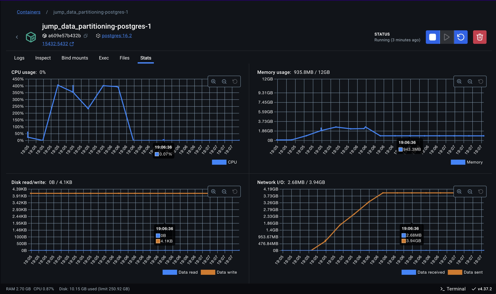
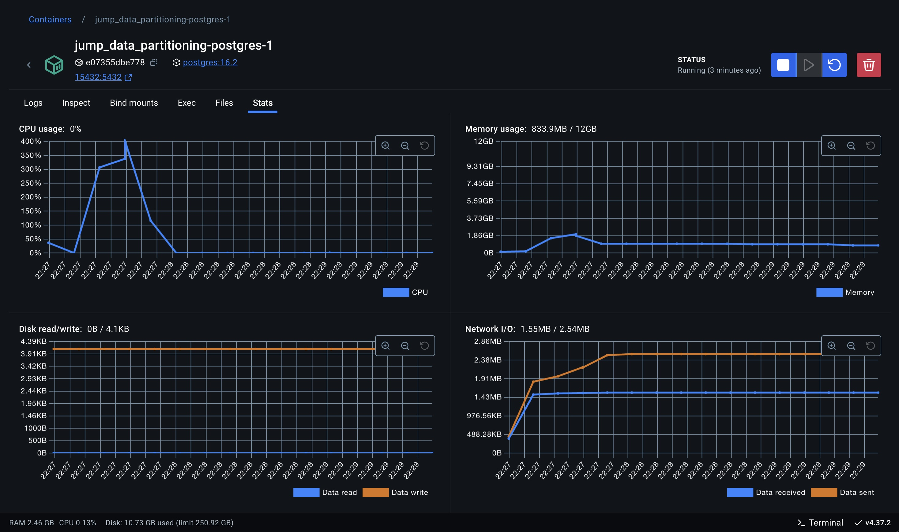
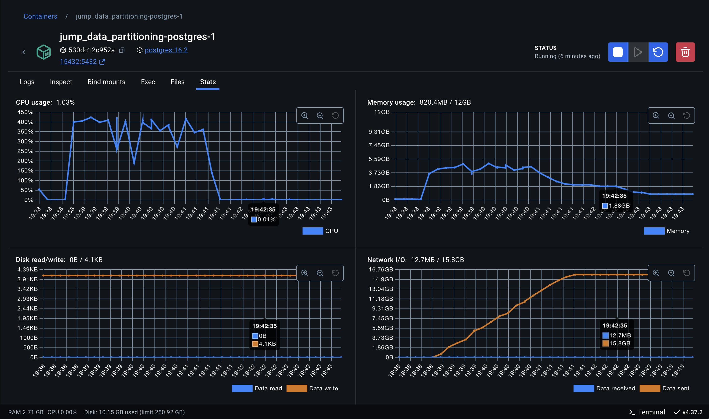

# 1 - Experimento 01 - Particionamento Por Intervalo

O **particionamento por intervalo** é uma estratégia em que os dados são distribuídos entre partições com base em intervalos contínuos de valores em uma coluna específica, como uma data ou um identificador numérico. Em uma instância única de banco de dados, essa abordagem facilita consultas baseadas em intervalos, como relatórios ou análises temporais, pois direciona automaticamente as operações à partição relevante, reduzindo o escopo da leitura e melhorando a performance. Entre os benefícios, destacam-se a simplicidade na configuração e a eficiência em cenários com padrões previsíveis de acesso, como consultas de dados históricos ou por períodos específicos. Contudo, apresenta limitações, como o potencial de desequilíbrio na carga de trabalho caso os dados não sejam uniformemente distribuídos entre os intervalos, resultando em partições desproporcionalmente grandes. Além disso, consultas que cruzam vários intervalos podem se tornar menos eficientes, exigindo a leitura de múltiplas partições. O particionamento por intervalo é ideal para aplicações em que os dados possuem um ordenamento natural e as consultas frequentemente operam dentro de faixas específicas.

## 1.2 - Cenários de testes

Para avaliar essa estratégia se faz necessário executar alguns procedimentos no banco de dados para que as tabelas tenham suporte ao particionamento de dados por intervalo. Pois o banco de dados não suporta o particionamento em tabela pré existente.

1. Avaliar distribuição dos dados para determinar a segmentação das tabelas.

Analisando os dados da base fornecida podemos verificar os processos estão distribuídos em cada ano, o que define a quantidade de partições necessárias.

```sql
SELECT 
	DATE_TRUNC('year', "dataPrimeiroMovimento") as ano, 
  count(*) as qtd_processos
FROM processos_18006
GROUP BY DATE_TRUNC('year', "dataPrimeiroMovimento")
ORDER BY DATE_TRUNC('year', "dataPrimeiroMovimento")
```

| ano                 | qtd_processos |
| ------------------- | ------------- |
| 2013-01-01 00:00:00	|          5324 |
| 2014-01-01 00:00:00	|           465 |
| 2015-01-01 00:00:00	|         25329 |
| 2016-01-01 00:00:00	|         76213 |
| 2017-01-01 00:00:00	|         11179 |
| 2018-01-01 00:00:00	|         76895 |
| 2019-01-01 00:00:00	|         17404 |
| 2020-01-01 00:00:00	|         16263 |
| 2021-01-01 00:00:00	|         25782 |
| 2022-01-01 00:00:00	|         50124 |
| 2023-01-01 00:00:00	|         30581 |
| 2024-01-01 00:00:00	|         14876 |
| 2025-01-01 00:00:00	|             2 |
| NULL	              |            60 |

Considerando o **particionamento por intervalo de anos**, verificamos que os processos estão distribuídos em **13 partições**.

2. Criando a tabela com particionamento por intevalo

O comando abaixo cria a nova tabela com particionamento por intevalo ativado:

```sql
CREATE SEQUENCE IF NOT EXISTS public."processos_particionada_18006_processoID_seq"
    INCREMENT 1
    START 1
    MINVALUE 1
    MAXVALUE 9223372036854775807
    CACHE 1;

ALTER SEQUENCE public."processos_particionada_18006_processoID_seq"
    OWNER TO postgres;
	
CREATE TABLE IF NOT EXISTS public.processos_particionada_18006
(
    "processoID" bigint NOT NULL DEFAULT nextval('"processos_particionada_18006_processoID_seq"'::regclass),
    "NPU" character varying COLLATE pg_catalog."default" NOT NULL,
    liminar boolean,
    natureza character varying COLLATE pg_catalog."default",
    "valorCausa" character varying COLLATE pg_catalog."default",
    "nivelSigilo" character varying COLLATE pg_catalog."default",
    competencia character varying COLLATE pg_catalog."default",
    "situacaoMigracao" character varying COLLATE pg_catalog."default",
    "justicaGratuita" boolean,
    "dataAjuizamento" timestamp without time zone,
    assunto integer,
    classe integer,
    "ultimaAtualizacao" timestamp without time zone,
    "ultimoMovimento" bigint,
    "dataPrimeiroMovimento" timestamp without time zone,
    "dataUltimoMovimento" timestamp without time zone,
    CONSTRAINT processos_particionada_18006_assunto_fkey FOREIGN KEY (assunto)
        REFERENCES public.assuntos (id) MATCH SIMPLE
        ON UPDATE NO ACTION
        ON DELETE NO ACTION,
    CONSTRAINT processos_particionada_18006_classe_fkey FOREIGN KEY (classe)
        REFERENCES public.classes (id) MATCH SIMPLE
        ON UPDATE NO ACTION
        ON DELETE NO ACTION
) PARTITION BY RANGE ("dataPrimeiroMovimento");

ALTER TABLE IF EXISTS public.processos_particionada_18006
    OWNER to postgres;

ALTER SEQUENCE public."processos_particionada_18006_processoID_seq"
    OWNED BY public.processos_particionada_18006."processoID";

CREATE INDEX IF NOT EXISTS idx_processos_particionada_18006_dataprimeiromovimento
    ON public.processos_particionada_18006 USING btree
    ("dataPrimeiroMovimento" ASC NULLS LAST);
```

3. Criando as tabelas das partições

Para cada ano presente na distribuição dos dados, será criada uma tabela de particionamento, bem como os respectivos índices de unicidade da coluna `processoID` e de performance na coluna `dataPrimeiroMovimento`, utilizando os seguintes comandos:

```sql
CREATE TABLE public.processos_particionada_18006_2013
PARTITION OF public.processos_particionada_18006
FOR VALUES FROM ('2013-01-01') TO ('2014-01-01');

CREATE UNIQUE INDEX idx_unq_processos_18006_2013_processoID
ON public.processos_particionada_18006_2013 ("processoID");

CREATE INDEX idx_processos_18006_2013_dataPrimeiroMovimento
ON public.processos_particionada_18006_2013 ("dataPrimeiroMovimento");

CREATE TABLE public.processos_particionada_18006_2014
PARTITION OF public.processos_particionada_18006
FOR VALUES FROM ('2014-01-01') TO ('2015-01-01');

CREATE UNIQUE INDEX idx_unq_processos_18006_2014_processoID
ON public.processos_particionada_18006_2014 ("processoID");

CREATE INDEX idx_processos_18006_2014_dataPrimeiroMovimento
ON public.processos_particionada_18006_2014 ("dataPrimeiroMovimento");

CREATE TABLE public.processos_particionada_18006_2015
PARTITION OF public.processos_particionada_18006
FOR VALUES FROM ('2015-01-01') TO ('2016-01-01');

CREATE UNIQUE INDEX idx_unq_processos_18006_2015_processoID
ON public.processos_particionada_18006_2015 ("processoID");

CREATE INDEX idx_processos_18006_2015_dataPrimeiroMovimento
ON public.processos_particionada_18006_2015 ("dataPrimeiroMovimento");

CREATE TABLE public.processos_particionada_18006_2016
PARTITION OF public.processos_particionada_18006
FOR VALUES FROM ('2016-01-01') TO ('2017-01-01');

CREATE UNIQUE INDEX idx_unq_processos_18006_2016_processoID
ON public.processos_particionada_18006_2016 ("processoID");

CREATE INDEX idx_processos_18006_2016_dataPrimeiroMovimento
ON public.processos_particionada_18006_2016 ("dataPrimeiroMovimento");

CREATE TABLE public.processos_particionada_18006_2017
PARTITION OF public.processos_particionada_18006
FOR VALUES FROM ('2017-01-01') TO ('2018-01-01');

CREATE UNIQUE INDEX idx_unq_processos_18006_2017_processoID
ON public.processos_particionada_18006_2017 ("processoID");

CREATE INDEX idx_processos_18006_2017_dataPrimeiroMovimento
ON public.processos_particionada_18006_2017 ("dataPrimeiroMovimento");

CREATE TABLE public.processos_particionada_18006_2018
PARTITION OF public.processos_particionada_18006
FOR VALUES FROM ('2018-01-01') TO ('2019-01-01');

CREATE UNIQUE INDEX idx_unq_processos_18006_2018_processoID
ON public.processos_particionada_18006_2018 ("processoID");

CREATE INDEX idx_processos_18006_2018_dataPrimeiroMovimento
ON public.processos_particionada_18006_2018 ("dataPrimeiroMovimento");

CREATE TABLE public.processos_particionada_18006_2019
PARTITION OF public.processos_particionada_18006
FOR VALUES FROM ('2019-01-01') TO ('2020-01-01');

CREATE UNIQUE INDEX idx_unq_processos_18006_2019_processoID
ON public.processos_particionada_18006_2019 ("processoID");

CREATE INDEX idx_processos_18006_2019_dataPrimeiroMovimento
ON public.processos_particionada_18006_2019 ("dataPrimeiroMovimento");

CREATE TABLE public.processos_particionada_18006_2020
PARTITION OF public.processos_particionada_18006
FOR VALUES FROM ('2020-01-01') TO ('2021-01-01');

CREATE UNIQUE INDEX idx_unq_processos_18006_2020_processoID
ON public.processos_particionada_18006_2020 ("processoID");

CREATE INDEX idx_processos_18006_2020_dataPrimeiroMovimento
ON public.processos_particionada_18006_2020 ("dataPrimeiroMovimento");

CREATE TABLE public.processos_particionada_18006_2021
PARTITION OF public.processos_particionada_18006
FOR VALUES FROM ('2021-01-01') TO ('2022-01-01');

CREATE UNIQUE INDEX idx_unq_processos_18006_2021_processoID
ON public.processos_particionada_18006_2021 ("processoID");

CREATE INDEX idx_processos_18006_2021_dataPrimeiroMovimento
ON public.processos_particionada_18006_2021 ("dataPrimeiroMovimento");

CREATE TABLE public.processos_particionada_18006_2022
PARTITION OF public.processos_particionada_18006
FOR VALUES FROM ('2022-01-01') TO ('2023-01-01');

CREATE UNIQUE INDEX idx_unq_processos_18006_2022_processoID
ON public.processos_particionada_18006_2022 ("processoID");

CREATE INDEX idx_processos_18006_2022_dataPrimeiroMovimento
ON public.processos_particionada_18006_2022 ("dataPrimeiroMovimento");

CREATE TABLE public.processos_particionada_18006_2023
PARTITION OF public.processos_particionada_18006
FOR VALUES FROM ('2023-01-01') TO ('2024-01-01');

CREATE UNIQUE INDEX idx_unq_processos_18006_2023_processoID
ON public.processos_particionada_18006_2023 ("processoID");

CREATE INDEX idx_processos_18006_2023_dataPrimeiroMovimento
ON public.processos_particionada_18006_2023 ("dataPrimeiroMovimento");

CREATE TABLE public.processos_particionada_18006_2024
PARTITION OF public.processos_particionada_18006
FOR VALUES FROM ('2024-01-01') TO ('2025-01-01');

CREATE UNIQUE INDEX idx_unq_processos_18006_2024_processoID
ON public.processos_particionada_18006_2024 ("processoID");

CREATE INDEX idx_processos_18006_2024_dataPrimeiroMovimento
ON public.processos_particionada_18006_2024 ("dataPrimeiroMovimento");

CREATE TABLE public.processos_particionada_18006_2025
PARTITION OF public.processos_particionada_18006
FOR VALUES FROM ('2025-01-01') TO ('2026-01-01');

CREATE UNIQUE INDEX idx_unq_processos_18006_2025_processoID
ON public.processos_particionada_18006_2025 ("processoID");

CREATE INDEX idx_processos_18006_2025_dataPrimeiroMovimento
ON public.processos_particionada_18006_2025 ("dataPrimeiroMovimento");

```

4. Migração dos dados existentes na tabela original, não particionada.

O comando realizará a migração dos dados da tabela original `processos_particionada_18006` para tabela particionada `processos_particionada_18006`. 

> Atenção: Foi necessário aplicar o filtro `"dataPrimeiroMovimento" IS NOT NULL` pois existem registros onde o campo utilizado para particionamento é nulo.

```sql
INSERT INTO public.processos_particionada_18006
SELECT *
FROM public.processos_18006 WHERE "dataPrimeiroMovimento" IS NOT NULL;
```

- Total de registros retornando pela query e inseridos na migração: **350.437**

## 1.3 - Ambiente de testes

### 1.3.1 - Equipamento Host

- MacBook Pro 
- Apple M2 Max
- 32 GB
- SSD 1TB

### 1.3.2 - Execução em containers

Será utilizado o Docker como ferramenta de virtualização em containers para execução do servidor de banco de dados Postgres.

- Docker: version 27.4.0, build bde2b89
- Docker Compose: version v2.31.0-desktop.2

### 1.3.3 - Banco de dados

Utilizamos Postgres: version 16.2, que é o banco de dados utilizado pelo JuMP.

#### Configurações

> 01 instância de container

```yaml
services:

  postgres:
    image: postgres:16.2
    shm_size: "4g"
    deploy:
      resources:
        limits:
          cpus: "4.0"
          memory: "12g"
        reservations:
          cpus: "2.0"
          memory: "6g"
```

## 1.4 - Simulação da carga

Para simulação de cargas de execução utilizaremos a ferramenta JMeter para criar um plano de testes que possibile simular diferentes cenários de cargas dos usuários utilizando a aplicação.

Os cenários do plano de teste segue uma sequencia fibonaci para determinar a quantidade de threads (usuários simulâneos) em cada cenário, sendo que cada thread (usuário) executa 10 requisições sequenciais de disparo da query no banco de dados.

- [Apache JMeter: version 5.6.3](https://jmeter.apache.org/index.html)  


## 1.5 - Métricas avaliadas e resultados

### 1.5.1 - Tempo de Processamento

| # Threads (Usuários em paralelo) | # Requests / Thread    | # Repetições     | Duração média | Duração mínima | Duração máxima | Duração mediana | 
| -------------------------------- | ---------------------- | ---------------- | ------------- | -------------- | -------------- | --------------- |
| 1                                | 10                     | 10               |     2604,9 ms |      2397,0 ms |      3610,0 ms |       2520,5 ms |
| 2                                | 10                     | 20               |     4653,6 ms |      3486,0 ms |      6856,0 ms |       4489,0 ms |
| 3                                | 10                     | 30               |     5982,3 ms |      2450,0 ms |     14975,0 ms |       4836,0 ms |
| 5                                | 10                     | 50               |     8405,2 ms |      2416,0 ms |     22182,0 ms |       5482,0 ms |
| 8                                | 10                     | 80               |    13600,9 ms |      2393,0 ms |     27838,0 ms |       9471,5 ms |
| 13                               | 10                     | 130              |    25298,3 ms |      4783,0 ms |     43957,0 ms |      27686,0 ms |
| 21                               | 10                     | 210              |    ------- ms |      ------ ms |     ------- ms |      ------- ms |

Constatamos que a partir do cenário com 21 threads simultâneas a estratégia utilizada não permitiu escalar o banco de dados para atender o crescimento
da demanda conforme a execução dos testes, uma vez que com o aumento de usuários em paralelo, a execução da query passou a superar o limite máximo de 
180.000 ms (3 minutos).


### 1.5.2 - Utilização de Recursos  

| # Threads (Em paralelo) | # Requests/Thread | # Repetições | Uso de CPU | Uso de RAM | Disk (read) | Disk (write) | Network I/O (received) | Network I/O (sent) | 
| ----------------------- | ----------------- | ------------ | ---------- | ---------- | ----------- | ------------ | ---------------------  | ------------------ |
| 1                       | 10                | 10           |   398,94 % |    1,75 GB |        0 KB |         0 KB |                2,47 MB |            1,98 GB |
| 2                       | 10                | 20           |   405,96 % |    2,65 GB |        0 KB |         0 KB |                2,68 MB |            3,94 GB |
| 3                       | 10                | 30           |   411,72 % |    2,99 GB |        0 KB |         0 KB |                4,73 MB |            5,92 GB |
| 5                       | 10                | 50           |   414,09 % |    3,58 GB |        0 KB |         0 KB |               12,80 MB |            9,88 GB |
| 8                       | 10                | 80           |   423,27 % |    4,99 GB |        0 KB |         0 KB |               12,70 MB |           15,80 GB |
| 13                      | 10                | 80           |   439,54 % |    6,94 GB |        0 KB |         0 KB |               23,10 MB |           25,70 GB |


Abaixo, estão os screenshots das estatísticas coletadas para cada cenário executado:

#### 1 Thread


#### 2 Threads



#### 3 Threads


#### 5 Threads



#### 8 Threads



#### 8 Resultado


#### 8 Threads

Não foi possível executar o cenário uma vez que o servidor não conseguiu responder as solicitações simultâneas.


### 1.5.3 - Escalabilidade

Para essa métrica, implementamos uma aplicação em Java utilizando Spring Boot, que publica um endpoint REST responsável por executar a query de referência, realizar a leitura do ResultSet, capturando o timestamp inicial e final da execução para cálculo da duração.

Utilizamos a ferramenta JMeter para criar um plano de testes que possibilitou simular a carga de usuários simultâneos utilizando a aplicação.

| # Threads (Usuários em paralelo) | # Requests / Thread    | # Repetições     | Duração média | Duração mínima | Duração máxima | Duração mediana | 
| -------------------------------- | ---------------------- | ---------------- | ------------- | -------------- | -------------- | --------------- |
| 1                                | 10                     | 10               |     9763,9 ms |      8486,0 ms |     11003,0 ms |       9686,0 ms |
| 2                                | 10                     | 20               |    14027,8 ms |      9224,0 ms |     20246,0 ms |      12232,5 ms |
| 3                                | 10                     | 30               |    18119,6 ms |      9288,0 ms |     37184,0 ms |      14618,0 ms |
| 5                                | 10                     | 50               |    28012,6 ms |      9441,0 ms |     61072,0 ms |      22456,0 ms |
| 8                                | 10                     | 80               |    ------- ms |     ------- ms |     ------- ms |      ------- ms |

Constatamos que a partir do cenário com 8 thread simultâneas a estratégia utilizada não permitiu escalar o banco de dados para atender o crescimento
da demanda conforme a execução dos testes, uma vez que com o aumento de usuários em paralelo, a execução da query passou a superar o limite máximo de 
180.000 ms (3 minutos).

### 1.5.4 - Equilíbrio de Carga

Não se aplica.

### 1.5.5 - Taxa de Transferência de Dados (Throughput)

- Comando para ativar o rastreamento de tempos de entrada/saída (I/O) em operações realizadas pelo banco de dados.

```sql
SET track_io_timing = on;

EXPLAIN ANALYZE 
    -- CONSULTA SQL DE REFERÊNCIA
    SELECT * FROM ...;
    
```

- Taxa: **3.364.537 registros** / **7,44 segundos** = **451897,94 registros por segundo**

### 1.5.6 - Custo de Redistribuição

Não se aplica.

### 1.5.7 - Eficiência de Consultas

A eficiência pode ser expressa como uma relação entre o tempo de execução, tempo ideal e o número de partições acessadas:

#### Fórmula:


```plaintext
Eficiência (%) = (1 - (P_Acessadas / P_Total)) * (1 - (T_Query / T_Ideal)) * 100
```

Onde:
- P_Acessadas: Quantidade de partições acessadas.
- P_Total: Total de partições disponíveis.
- T_Query: Tempo total de execução da query (Execution Time no EXPLAIN ANALYZE).
- T_Ideal: Tempo esperado para a melhor execução possível (vamos estabelecer como ideal o tempo de execução na arquitetura atual = 10 segundos).

Sendo assim, temos:

- P_Acessadas: **6**
- P_Total: **13**
- T_Query: **0.464 segundos**
- T_Ideal: **10 segundos** 

> Eficiência (%) =  (1 - (18 / 117)) * (1 - (0,464 / 10)) * 100 => (1 - (0,153846153846154)) * (1 - (0,0464)) * 100 = **80,68%**

Nesta arquitetura, a consulta foi **80,68%** mais eficiente do que na arquitetura atual, e **48,87%** mais eficiente que a estratégia de particionamento por hash.

### 1.5.8 - Consistência de Dados

Essa métrica não se aplica a essa estratégia, uma vez que não existe movimentação de dados, seja no próprio host ou em hosts distintos.

### 1.5.9 - Capacidade de Adaptação

Essa métrica não se aplica a essa estratégia, uma vez que ela não realiza mudanças ou ajustes dinâmicamente.

### 1.5.10 - Custo Operacional

Não foi avaliado o custo operacional pois se trata da estratégia atualmente implementada.