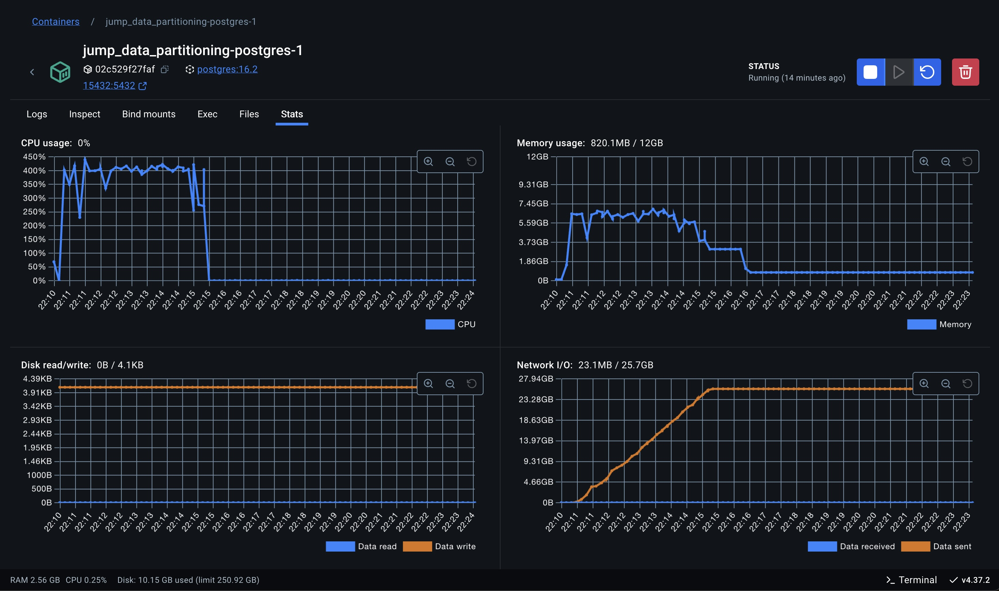
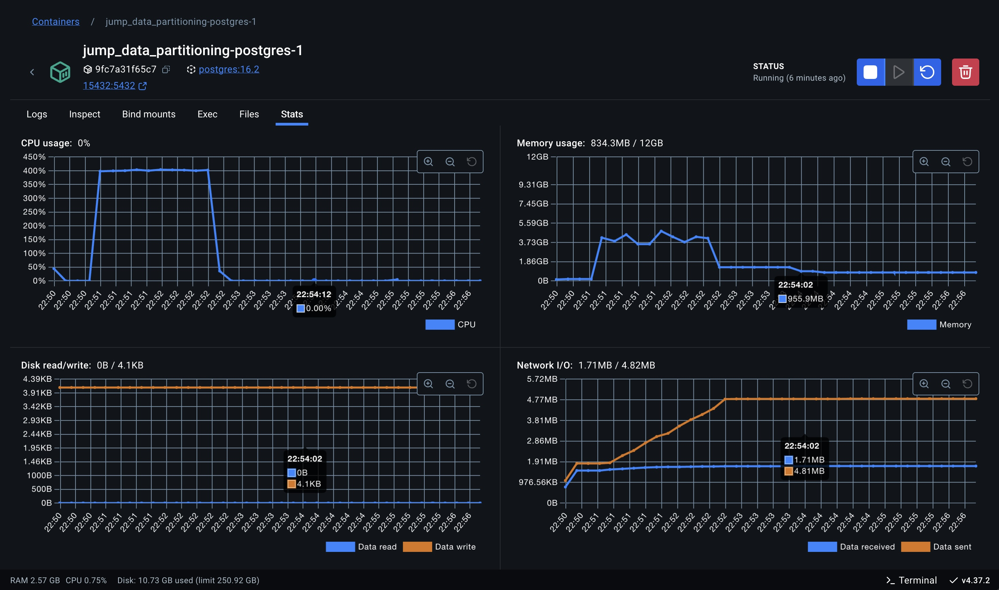
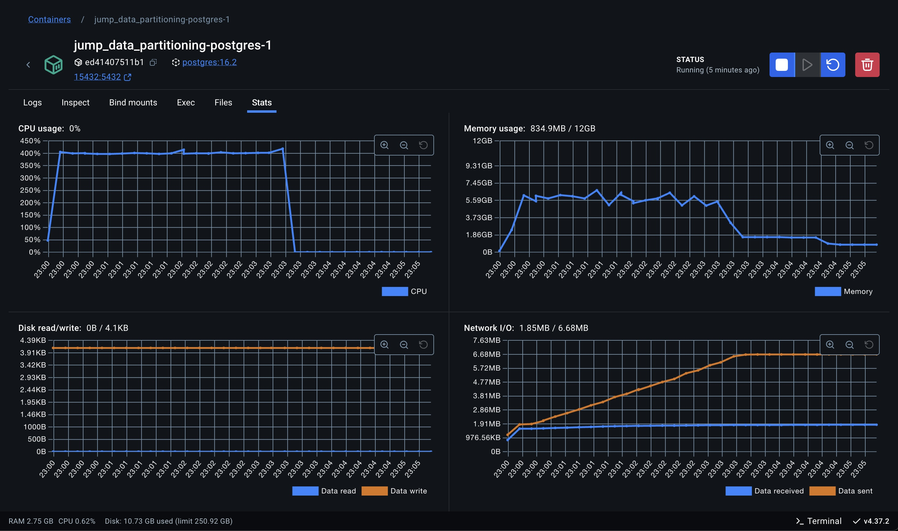
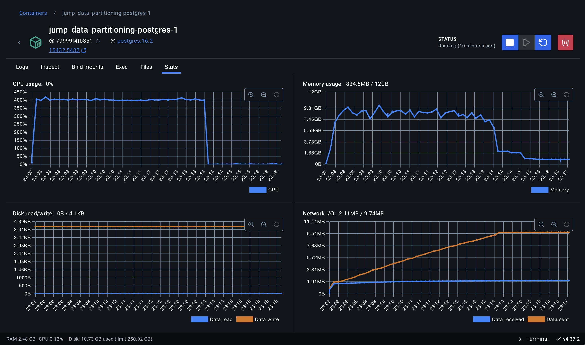
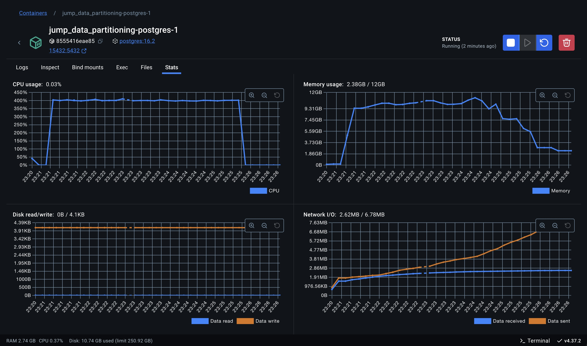

# 1 - Experimento 03 - Particionamento Híbrido

O **particionamento por intervalo** é uma estratégia em que os dados são distribuídos entre partições com base em intervalos contínuos de valores em uma coluna específica, como uma data ou um identificador numérico. Em uma instância única de banco de dados, essa abordagem facilita consultas baseadas em intervalos, como relatórios ou análises temporais, pois direciona automaticamente as operações à partição relevante, reduzindo o escopo da leitura e melhorando a performance. Entre os benefícios, destacam-se a simplicidade na configuração e a eficiência em cenários com padrões previsíveis de acesso, como consultas de dados históricos ou por períodos específicos. Contudo, apresenta limitações, como o potencial de desequilíbrio na carga de trabalho caso os dados não sejam uniformemente distribuídos entre os intervalos, resultando em partições desproporcionalmente grandes. Além disso, consultas que cruzam vários intervalos podem se tornar menos eficientes, exigindo a leitura de múltiplas partições. O particionamento por intervalo é ideal para aplicações em que os dados possuem um ordenamento natural e as consultas frequentemente operam dentro de faixas específicas.

## 1.1 - Preparação

Para avaliar essa estratégia se faz necessário executar alguns procedimentos no banco de dados para que as tabelas tenham suporte ao particionamento de dados por intervalo. Pois o banco de dados não suporta o particionamento em tabela pré existente.

1. Avaliar distribuição dos dados para determinar a segmentação das tabelas.

Analisando os dados da base fornecida podemos verificar os processos estão distribuídos em cada ano, o que define a quantidade de partições necessárias.

```sql
SELECT 
	DATE_TRUNC('year', "dataPrimeiroMovimento") as ano, 
  count(*) as qtd_processos
FROM processos_18006
GROUP BY DATE_TRUNC('year', "dataPrimeiroMovimento")
ORDER BY DATE_TRUNC('year', "dataPrimeiroMovimento")
```

| ano                 | qtd_processos |
| ------------------- | ------------- |
| 2013-01-01 00:00:00	|          5324 |
| 2014-01-01 00:00:00	|           465 |
| 2015-01-01 00:00:00	|         25329 |
| 2016-01-01 00:00:00	|         76213 |
| 2017-01-01 00:00:00	|         11179 |
| 2018-01-01 00:00:00	|         76895 |
| 2019-01-01 00:00:00	|         17404 |
| 2020-01-01 00:00:00	|         16263 |
| 2021-01-01 00:00:00	|         25782 |
| 2022-01-01 00:00:00	|         50124 |
| 2023-01-01 00:00:00	|         30581 |
| 2024-01-01 00:00:00	|         14876 |
| 2025-01-01 00:00:00	|             2 |
| NULL	                |            60 |

Considerando o **particionamento por intervalo de anos**, verificamos que os processos estão distribuídos em **13 partições**.


## 1.2 - Incremento de dados e unificação dos registros nas tabelas únicas

Nesta etapa, iremos unificar os registros existentes em tabelas únicas.

Como a base de dados que foi fornecida só dispunha de registros para uma única unidade judiciária (id: 18006), optamos por clonar as tabelas desta unidade para simular o cenário com múltiplas unidades judiciárias.

1. Criando a coluna **unidadeID** nas tabelas originais de `complementos_18006`, `movimentos_18006` e `processos_18006`.

```sql
-- Unidade Judiciária: 18006

-- Tabelas para complementos_18006
ALTER TABLE IF EXISTS public.complementos_18006
    ADD COLUMN "unidadeID" bigint;
UPDATE public.complementos_18006 SET "unidadeID" = 18006;
ALTER TABLE IF EXISTS public.complementos_18006
    ALTER COLUMN "unidadeID" SET NOT NULL;

-- Tabelas para movimentos_18006
ALTER TABLE IF EXISTS public.movimentos_18006
    ADD COLUMN "unidadeID" bigint;
UPDATE public.movimentos_18006 SET "unidadeID" = 18006;
ALTER TABLE IF EXISTS public.movimentos_18006
    ALTER COLUMN "unidadeID" SET NOT NULL;

-- Tabelas para processos_18006
ALTER TABLE IF EXISTS public.processos_18006
    ADD COLUMN "unidadeID" bigint;
UPDATE public.processos_18006 SET "unidadeID" = 18006;
ALTER TABLE IF EXISTS public.processos_18006
    ALTER COLUMN "unidadeID" SET NOT NULL;
```

2. Clonando as tabelas da unidade judiciária existente

```sql

-- Clonando para criar tabelas da unidade: 18007

-- processos_18007

CREATE TABLE public.processos_18007 AS
SELECT
"processoID" + 1000000000 AS "processoID", -- Adiciona um offset para as chaves primárias serem únicas
"NPU", liminar, natureza, "valorCausa", "nivelSigilo", competencia,
"situacaoMigracao", "justicaGratuita", "dataAjuizamento", assunto, classe,
"ultimaAtualizacao", "ultimoMovimento", "dataPrimeiroMovimento", "dataUltimoMovimento",
'18007'::bigint AS "unidadeID"
FROM public.processos_18006;

ALTER TABLE IF EXISTS public.processos_18007
    ADD CONSTRAINT processos_18007_pkey PRIMARY KEY ("processoID");
ALTER TABLE IF EXISTS public.processos_18007
    ADD CONSTRAINT processos_18007_classe_fkey FOREIGN KEY (classe)
    REFERENCES public.classes (id) MATCH SIMPLE
    ON UPDATE NO ACTION
    ON DELETE NO ACTION;
ALTER TABLE IF EXISTS public.processos_18007
    ADD CONSTRAINT processos_18007_assunto_fkey FOREIGN KEY (assunto)
    REFERENCES public.assuntos (id) MATCH SIMPLE
    ON UPDATE NO ACTION
    ON DELETE NO ACTION;

-- movimentos_18007

CREATE TABLE public.movimentos_18007 AS
SELECT
id + 10000000000 AS id, -- Adiciona um offset para as chaves primárias serem únicas
"processoID" + 1000000000 AS "processoID", -- Adiciona um offset para as chaves primárias serem únicas
"NPU", activity, duration, "dataInicio", "dataFinal", "usuarioID", "documentoID", "movimentoID",
'18007'::bigint AS "unidadeID"
FROM public.movimentos_18006;


ALTER TABLE IF EXISTS public.movimentos_18007
    ADD CONSTRAINT movimentos_18007_pkey PRIMARY KEY (id);
ALTER TABLE IF EXISTS public.movimentos_18007
    ADD CONSTRAINT "movimentos_18007_processoID_fkey" FOREIGN KEY ("processoID")
    REFERENCES public.processos_18007 ("processoID") MATCH SIMPLE
    ON UPDATE NO ACTION
    ON DELETE NO ACTION;
ALTER TABLE IF EXISTS public.movimentos_18007
    ADD CONSTRAINT "movimentos_18007_movimentoID_fkey" FOREIGN KEY ("movimentoID")
    REFERENCES public.cod_movimentos (id) MATCH SIMPLE
    ON UPDATE NO ACTION
    ON DELETE NO ACTION;

-- complementos_18007

CREATE TABLE public.complementos_18007 AS
SELECT
"complementoID" + 10000000000 AS "complementoID", -- Adiciona um offset para as chaves primárias serem únicas
"movimentoID" + 10000000000 AS "movimentoID", -- Adiciona um offset para as chaves primárias serem únicas
tipo, descricao,
'18007'::bigint AS "unidadeID"
FROM public.complementos_18006;

ALTER TABLE IF EXISTS public.complementos_18007
    ADD CONSTRAINT complementos_18007_pkey PRIMARY KEY ("complementoID");
ALTER TABLE IF EXISTS public.complementos_18007
    ADD CONSTRAINT "complementos_18007_movimentoID_fkey" FOREIGN KEY ("movimentoID")
    REFERENCES public.movimentos_18007 (id) MATCH SIMPLE
    ON UPDATE CASCADE
    ON DELETE CASCADE;

-- Clonando para criar tabelas da unidade: 18008

-- processos_18008

CREATE TABLE public.processos_18008 AS
SELECT
"processoID" + 2000000000 AS "processoID", -- Adiciona um offset para as chaves primárias serem únicas
"NPU", liminar, natureza, "valorCausa", "nivelSigilo", competencia,
"situacaoMigracao", "justicaGratuita", "dataAjuizamento", assunto, classe,
"ultimaAtualizacao", "ultimoMovimento", "dataPrimeiroMovimento", "dataUltimoMovimento",
'18008'::bigint AS "unidadeID"
FROM public.processos_18006;

ALTER TABLE IF EXISTS public.processos_18008
    ADD CONSTRAINT processos_18008_pkey PRIMARY KEY ("processoID");
ALTER TABLE IF EXISTS public.processos_18008
    ADD CONSTRAINT processos_18008_classe_fkey FOREIGN KEY (classe)
    REFERENCES public.classes (id) MATCH SIMPLE
    ON UPDATE NO ACTION
    ON DELETE NO ACTION;
ALTER TABLE IF EXISTS public.processos_18008
    ADD CONSTRAINT processos_18008_assunto_fkey FOREIGN KEY (assunto)
    REFERENCES public.assuntos (id) MATCH SIMPLE
    ON UPDATE NO ACTION
    ON DELETE NO ACTION;

-- movimentos_18008

CREATE TABLE public.movimentos_18008 AS
SELECT
id + 20000000000 AS id, -- Adiciona um offset para as chaves primárias serem únicas
"processoID" + 2000000000 AS "processoID", -- Adiciona um offset para as chaves primárias serem únicas
"NPU", activity, duration, "dataInicio", "dataFinal", "usuarioID", "documentoID", "movimentoID",
'18008'::bigint AS "unidadeID"
FROM public.movimentos_18006;


ALTER TABLE IF EXISTS public.movimentos_18008
    ADD CONSTRAINT movimentos_18008_pkey PRIMARY KEY (id);
ALTER TABLE IF EXISTS public.movimentos_18008
    ADD CONSTRAINT "movimentos_18008_processoID_fkey" FOREIGN KEY ("processoID")
    REFERENCES public.processos_18008 ("processoID") MATCH SIMPLE
    ON UPDATE NO ACTION
    ON DELETE NO ACTION;
ALTER TABLE IF EXISTS public.movimentos_18008
    ADD CONSTRAINT "movimentos_18008_movimentoID_fkey" FOREIGN KEY ("movimentoID")
    REFERENCES public.cod_movimentos (id) MATCH SIMPLE
    ON UPDATE NO ACTION
    ON DELETE NO ACTION;

-- complementos_18008

CREATE TABLE public.complementos_18008 AS
SELECT
"complementoID" + 20000000000 AS "complementoID", -- Adiciona um offset para as chaves primárias serem únicas
"movimentoID" + 20000000000 AS "movimentoID", -- Adiciona um offset para as chaves primárias serem únicas
tipo, descricao,
'18008'::bigint AS "unidadeID"
FROM public.complementos_18006;

ALTER TABLE IF EXISTS public.complementos_18008
    ADD CONSTRAINT complementos_18008_pkey PRIMARY KEY ("complementoID");
ALTER TABLE IF EXISTS public.complementos_18008
    ADD CONSTRAINT "complementos_18008_movimentoID_fkey" FOREIGN KEY ("movimentoID")
    REFERENCES public.movimentos_18008 (id) MATCH SIMPLE
    ON UPDATE CASCADE
    ON DELETE CASCADE;

```

## 1.3 - Criação das tabelas com o Particionamento por Intervalo

Nesta etapa, iremos descrever os comandos necessários para criação das tabelas de **processos_exp01**, **movimentos_exp01** e **complementos_exp01** com o particionamento por intervalo ativado. Como descrito anteriormente, iremos particionar as tabelas por ano, utilizando a técnica de **Particionamento por Intervalo (RANGE)** aplicada a coluna `dataPrimeiroMovimento`.


O comando abaixo cria seguintes tabelas: **processos_exp01**, **movimentos_exp01** e **complementos_exp01**:

```sql

----------------------------------------
-- tabela particionada: processos_exp01
----------------------------------------

CREATE SEQUENCE IF NOT EXISTS public."processos_exp01_processoID_seq"
    INCREMENT 1
    START 1
    MINVALUE 1
    MAXVALUE 9223372036854775807
    CACHE 1;

ALTER SEQUENCE public."processos_exp01_processoID_seq"
    OWNER TO postgres;

CREATE TABLE IF NOT EXISTS public.processos_exp01
(
    "processoID" bigint NOT NULL DEFAULT nextval('"processos_exp01_processoID_seq"'::regclass),
    "NPU" character varying COLLATE pg_catalog."default" NOT NULL,
    liminar boolean,
    natureza character varying COLLATE pg_catalog."default",
    "valorCausa" character varying COLLATE pg_catalog."default",
    "nivelSigilo" character varying COLLATE pg_catalog."default",
    competencia character varying COLLATE pg_catalog."default",
    "situacaoMigracao" character varying COLLATE pg_catalog."default",
    "justicaGratuita" boolean,
    "dataAjuizamento" timestamp without time zone,
    assunto integer,
    classe integer,
    "ultimaAtualizacao" timestamp without time zone,
    "ultimoMovimento" bigint,
    "dataPrimeiroMovimento" timestamp without time zone,
    "dataUltimoMovimento" timestamp without time zone,
	"unidadeID" bigint NOT NULL,
    CONSTRAINT processos_exp01_assunto_fkey FOREIGN KEY (assunto)
        REFERENCES public.assuntos (id) MATCH SIMPLE
        ON UPDATE NO ACTION
        ON DELETE NO ACTION,
    CONSTRAINT processos_exp01_classe_fkey FOREIGN KEY (classe)
        REFERENCES public.classes (id) MATCH SIMPLE
        ON UPDATE NO ACTION
        ON DELETE NO ACTION
) PARTITION BY RANGE ("dataPrimeiroMovimento");

ALTER TABLE IF EXISTS public.processos_exp01
    OWNER to postgres;

ALTER SEQUENCE public."processos_exp01_processoID_seq"
    OWNED BY public.processos_exp01."processoID";

-- partições da tabela: processos_exp01

CREATE TABLE processos_exp01_2013 PARTITION OF processos_exp01
FOR VALUES FROM ('2013-01-01') TO ('2014-01-01');
CREATE TABLE processos_exp01_2014 PARTITION OF processos_exp01
FOR VALUES FROM ('2014-01-01') TO ('2015-01-01');
CREATE TABLE processos_exp01_2015 PARTITION OF processos_exp01
FOR VALUES FROM ('2015-01-01') TO ('2016-01-01');
CREATE TABLE processos_exp01_2016 PARTITION OF processos_exp01
FOR VALUES FROM ('2016-01-01') TO ('2017-01-01');
CREATE TABLE processos_exp01_2017 PARTITION OF processos_exp01
FOR VALUES FROM ('2017-01-01') TO ('2018-01-01');
CREATE TABLE processos_exp01_2018 PARTITION OF processos_exp01
FOR VALUES FROM ('2018-01-01') TO ('2019-01-01');
CREATE TABLE processos_exp01_2019 PARTITION OF processos_exp01
FOR VALUES FROM ('2019-01-01') TO ('2020-01-01');
CREATE TABLE processos_exp01_2020 PARTITION OF processos_exp01
FOR VALUES FROM ('2020-01-01') TO ('2021-01-01');
CREATE TABLE processos_exp01_2021 PARTITION OF processos_exp01
FOR VALUES FROM ('2021-01-01') TO ('2022-01-01');
CREATE TABLE processos_exp01_2022 PARTITION OF processos_exp01
FOR VALUES FROM ('2022-01-01') TO ('2023-01-01');
CREATE TABLE processos_exp01_2023 PARTITION OF processos_exp01
FOR VALUES FROM ('2023-01-01') TO ('2024-01-01');
CREATE TABLE processos_exp01_2024 PARTITION OF processos_exp01
FOR VALUES FROM ('2024-01-01') TO ('2025-01-01');
CREATE TABLE processos_exp01_2025 PARTITION OF processos_exp01
FOR VALUES FROM ('2025-01-01') TO ('2026-01-01');


-- índices da tabela: processos_exp01

CREATE INDEX processos_exp01_idx1 ON public.processos_exp01 ("dataPrimeiroMovimento", "unidadeID");
CREATE INDEX processos_exp01_idx2 ON public.processos_exp01 ("dataPrimeiroMovimento", "unidadeID", "processoID");
CREATE INDEX processos_exp01_idx3 ON public.processos_exp01 ("dataPrimeiroMovimento", "unidadeID", "assunto");
CREATE INDEX processos_exp01_idx4 ON public.processos_exp01 ("dataPrimeiroMovimento", "unidadeID", "classe");
CREATE INDEX processos_exp01_idx5 ON public.processos_exp01 ("dataPrimeiroMovimento", "unidadeID", "processoID", "classe", "assunto");

CREATE UNIQUE INDEX processos_exp01_unq1 ON public.processos_exp01 ("dataPrimeiroMovimento", "processoID");


----------------------------------------
-- tabela particionada: movimentos_exp01
----------------------------------------

CREATE SEQUENCE IF NOT EXISTS public."movimentos_exp01_id_seq"
    INCREMENT 1
    START 1
    MINVALUE 1
    MAXVALUE 9223372036854775807
    CACHE 1;

ALTER SEQUENCE public."movimentos_exp01_id_seq"
    OWNER TO postgres;

CREATE TABLE IF NOT EXISTS public.movimentos_exp01
(
    id bigint NOT NULL DEFAULT nextval('movimentos_exp01_id_seq'::regclass),
    "processoID" bigint,
    "NPU" character varying COLLATE pg_catalog."default",
    activity character varying COLLATE pg_catalog."default" NOT NULL,
    duration bigint,
    "dataInicio" timestamp without time zone,
    "dataFinal" timestamp without time zone NOT NULL,
    "usuarioID" bigint,
    "documentoID" bigint,
    "movimentoID" bigint,
	"unidadeID" bigint NOT NULL,
    "dataPrimeiroMovimento" timestamp without time zone,
    CONSTRAINT "movimentos_exp01_movimentoID_fkey" FOREIGN KEY ("movimentoID")
        REFERENCES public.cod_movimentos (id) MATCH SIMPLE
        ON UPDATE NO ACTION
        ON DELETE NO ACTION,
    CONSTRAINT "movimentos_exp01_processoID_fkey" FOREIGN KEY ("dataPrimeiroMovimento", "processoID")
        REFERENCES public.processos_exp01 ("dataPrimeiroMovimento", "processoID") MATCH SIMPLE
        ON UPDATE CASCADE
        ON DELETE CASCADE
) PARTITION BY RANGE ("dataPrimeiroMovimento");

ALTER TABLE IF EXISTS public.movimentos_exp01
    OWNER to postgres;

ALTER SEQUENCE public."movimentos_exp01_id_seq"
    OWNED BY public.movimentos_exp01.id;

-- partições da tabela: movimentos_exp01

CREATE TABLE movimentos_exp01_2013 PARTITION OF movimentos_exp01
FOR VALUES FROM ('2013-01-01') TO ('2014-01-01');
CREATE TABLE movimentos_exp01_2014 PARTITION OF movimentos_exp01
FOR VALUES FROM ('2014-01-01') TO ('2015-01-01');
CREATE TABLE movimentos_exp01_2015 PARTITION OF movimentos_exp01
FOR VALUES FROM ('2015-01-01') TO ('2016-01-01');
CREATE TABLE movimentos_exp01_2016 PARTITION OF movimentos_exp01
FOR VALUES FROM ('2016-01-01') TO ('2017-01-01');
CREATE TABLE movimentos_exp01_2017 PARTITION OF movimentos_exp01
FOR VALUES FROM ('2017-01-01') TO ('2018-01-01');
CREATE TABLE movimentos_exp01_2018 PARTITION OF movimentos_exp01
FOR VALUES FROM ('2018-01-01') TO ('2019-01-01');
CREATE TABLE movimentos_exp01_2019 PARTITION OF movimentos_exp01
FOR VALUES FROM ('2019-01-01') TO ('2020-01-01');
CREATE TABLE movimentos_exp01_2020 PARTITION OF movimentos_exp01
FOR VALUES FROM ('2020-01-01') TO ('2021-01-01');
CREATE TABLE movimentos_exp01_2021 PARTITION OF movimentos_exp01
FOR VALUES FROM ('2021-01-01') TO ('2022-01-01');
CREATE TABLE movimentos_exp01_2022 PARTITION OF movimentos_exp01
FOR VALUES FROM ('2022-01-01') TO ('2023-01-01');
CREATE TABLE movimentos_exp01_2023 PARTITION OF movimentos_exp01
FOR VALUES FROM ('2023-01-01') TO ('2024-01-01');
CREATE TABLE movimentos_exp01_2024 PARTITION OF movimentos_exp01
FOR VALUES FROM ('2024-01-01') TO ('2025-01-01');
CREATE TABLE movimentos_exp01_2025 PARTITION OF movimentos_exp01
FOR VALUES FROM ('2025-01-01') TO ('2026-01-01');

-- índices da tabela: movimentos_exp01

CREATE INDEX movimentos_exp01_idx1 ON public.movimentos_exp01 ("dataPrimeiroMovimento", "unidadeID");
CREATE INDEX movimentos_exp01_idx2 ON public.movimentos_exp01 ("dataPrimeiroMovimento", "unidadeID", "id");
CREATE INDEX movimentos_exp01_idx3 ON public.movimentos_exp01 ("dataPrimeiroMovimento", "unidadeID", "processoID");
CREATE INDEX movimentos_exp01_idx4 ON public.movimentos_exp01 ("dataPrimeiroMovimento", "unidadeID", "documentoID");
CREATE INDEX movimentos_exp01_idx5 ON public.movimentos_exp01 ("dataPrimeiroMovimento", "unidadeID", "processoID", "id", "dataFinal");


CREATE UNIQUE INDEX movimentos_exp01_unq1 ON public.movimentos_exp01 ("dataPrimeiroMovimento", "id");


----------------------------------------
-- tabela particionada: complementos_exp01
----------------------------------------

CREATE SEQUENCE IF NOT EXISTS public."complementos_exp01_complementoID_seq"
    INCREMENT 1
    START 1
    MINVALUE 1
    MAXVALUE 9223372036854775807
    CACHE 1;

ALTER SEQUENCE public."complementos_exp01_complementoID_seq"
    OWNER TO postgres;

CREATE TABLE IF NOT EXISTS public.complementos_exp01
(
    "complementoID" bigint NOT NULL DEFAULT nextval('"complementos_exp01_complementoID_seq"'::regclass),
    "movimentoID" bigint,
    tipo character varying COLLATE pg_catalog."default" NOT NULL,
    descricao character varying COLLATE pg_catalog."default" NOT NULL,
	"unidadeID" bigint NOT NULL,
    "dataPrimeiroMovimento" timestamp without time zone,
    CONSTRAINT "complementos_exp01_movimentoID_fkey" FOREIGN KEY ("dataPrimeiroMovimento", "movimentoID")
        REFERENCES public.movimentos_exp01 ("dataPrimeiroMovimento", "id") MATCH SIMPLE
        ON UPDATE CASCADE
        ON DELETE CASCADE
) PARTITION BY RANGE ("dataPrimeiroMovimento");

ALTER TABLE IF EXISTS public.complementos_exp01
    OWNER to postgres;

ALTER SEQUENCE public."complementos_exp01_complementoID_seq"
    OWNED BY public.complementos_exp01."complementoID";

-- partições da tabela: complementos_exp01

CREATE TABLE complementos_exp01_2013 PARTITION OF complementos_exp01
FOR VALUES FROM ('2013-01-01') TO ('2014-01-01');
CREATE TABLE complementos_exp01_2014 PARTITION OF complementos_exp01
FOR VALUES FROM ('2014-01-01') TO ('2015-01-01');
CREATE TABLE complementos_exp01_2015 PARTITION OF complementos_exp01
FOR VALUES FROM ('2015-01-01') TO ('2016-01-01');
CREATE TABLE complementos_exp01_2016 PARTITION OF complementos_exp01
FOR VALUES FROM ('2016-01-01') TO ('2017-01-01');
CREATE TABLE complementos_exp01_2017 PARTITION OF complementos_exp01
FOR VALUES FROM ('2017-01-01') TO ('2018-01-01');
CREATE TABLE complementos_exp01_2018 PARTITION OF complementos_exp01
FOR VALUES FROM ('2018-01-01') TO ('2019-01-01');
CREATE TABLE complementos_exp01_2019 PARTITION OF complementos_exp01
FOR VALUES FROM ('2019-01-01') TO ('2020-01-01');
CREATE TABLE complementos_exp01_2020 PARTITION OF complementos_exp01
FOR VALUES FROM ('2020-01-01') TO ('2021-01-01');
CREATE TABLE complementos_exp01_2021 PARTITION OF complementos_exp01
FOR VALUES FROM ('2021-01-01') TO ('2022-01-01');
CREATE TABLE complementos_exp01_2022 PARTITION OF complementos_exp01
FOR VALUES FROM ('2022-01-01') TO ('2023-01-01');
CREATE TABLE complementos_exp01_2023 PARTITION OF complementos_exp01
FOR VALUES FROM ('2023-01-01') TO ('2024-01-01');
CREATE TABLE complementos_exp01_2024 PARTITION OF complementos_exp01
FOR VALUES FROM ('2024-01-01') TO ('2025-01-01');
CREATE TABLE complementos_exp01_2025 PARTITION OF complementos_exp01
FOR VALUES FROM ('2025-01-01') TO ('2026-01-01');


-- índices da tabela: complementos_exp01

CREATE INDEX complementos_exp01_idx1 ON public.complementos_exp01 ("dataPrimeiroMovimento", "unidadeID");
CREATE INDEX complementos_exp01_idx2 ON public.complementos_exp01 ("dataPrimeiroMovimento", "unidadeID", "complementoID");
CREATE INDEX complementos_exp01_idx3 ON public.complementos_exp01 ("dataPrimeiroMovimento", "unidadeID", "movimentoID") INCLUDE (descricao);

CREATE UNIQUE INDEX complementos_exp01_unq1 ON public.complementos_exp01 ("dataPrimeiroMovimento", "complementoID");

```

## 1.4 - Migração dos dados existentes, da tabela original (não particionada) para tabela particionada.

Nessa estapa realizaremos a migração dos dados existentes nas tabelas de origem para as tabelas particionadas.

> Atenção: Foi necessário aplicar o filtro `"dataPrimeiroMovimento" IS NOT NULL` pois existem registros onde o campo utilizado para particionamento é nulo.

```sql

-- processos_exp01

INSERT INTO public.processos_exp01
SELECT *
    FROM public.processos_18006 WHERE "dataPrimeiroMovimento" IS NOT NULL;

INSERT INTO public.processos_exp01
SELECT *
    FROM public.processos_18007 WHERE "dataPrimeiroMovimento" IS NOT NULL;

INSERT INTO public.processos_exp01
SELECT *
    FROM public.processos_18008 WHERE "dataPrimeiroMovimento" IS NOT NULL;

-- movimentos_exp01

INSERT INTO public.movimentos_exp01
SELECT m.*, p."dataPrimeiroMovimento"
    FROM public.movimentos_18006 m
    INNER JOIN public.processos_18006 p ON p."processoID" = m."processoID";

INSERT INTO public.movimentos_exp01
SELECT m.*, p."dataPrimeiroMovimento"
    FROM public.movimentos_18007 m
    INNER JOIN public.processos_18007 p ON p."processoID" = m."processoID";

INSERT INTO public.movimentos_exp01
SELECT m.*, p."dataPrimeiroMovimento"
    FROM public.movimentos_18008 m
    INNER JOIN public.processos_18008 p ON p."processoID" = m."processoID";

-- complementos_exp01


INSERT INTO public.complementos_exp01
SELECT c.*, m."dataPrimeiroMovimento"
    FROM public.complementos_18006 c
    INNER JOIN public.movimentos_exp01 m ON
        m."unidadeID" = c."unidadeID" AND m.id = c."movimentoID";

INSERT INTO public.complementos_exp01
SELECT c.*, m."dataPrimeiroMovimento"
    FROM public.complementos_18007 c
    INNER JOIN public.movimentos_exp01 m ON
        m."unidadeID" = c."unidadeID" AND m.id = c."movimentoID";

INSERT INTO public.complementos_exp01
SELECT c.*, m."dataPrimeiroMovimento"
    FROM public.complementos_18008 c
    INNER JOIN public.movimentos_exp01 m ON
        m."unidadeID" = c."unidadeID" AND m.id = c."movimentoID";

VACUUM ANALYZE complementos_exp01;
VACUUM ANALYZE movimentos_exp01;
VACUUM ANALYZE processos_exp01;

```

## 1.5 - Ambiente de testes

### 1.5.1 - Equipamento Host

- MacBook Pro
- Apple M2 Max
- 32 GB
- SSD 1TB

### 1.5.2 - Execução em containers

Será utilizado o Docker como ferramenta de virtualização em containers para execução do servidor de banco de dados Postgres.

- Docker: version 27.4.0, build bde2b89
- Docker Compose: version v2.31.0-desktop.2

### 1.5.3 - Banco de dados

Utilizamos Postgres: version 16.2, que é o banco de dados utilizado pelo JuMP.

#### Configurações

> 01 instância de container

```yaml
services:
  postgres:
    image: postgres:16.2
    shm_size: "6g"
    sysctls:
      kernel.shmmax: 6442450944
      kernel.shmall: 1572864
    deploy:
      resources:
        limits:
          cpus: "4.0"
          memory: "12g"
        reservations:
          cpus: "2.0"
          memory: "6g"
```

## 1.6 - Simulação da carga

Para simulação de cargas de execução utilizaremos a ferramenta JMeter para criar um plano de testes que possibile simular diferentes cenários de cargas dos usuários utilizando a aplicação.

Os cenários do plano de teste segue uma sequencia fibonaci para determinar a quantidade de threads (usuários simulâneos) em cada cenário, sendo que cada thread (usuário) executa 10 requisições sequenciais de disparo da query no banco de dados.

- [Apache JMeter: version 5.6.3](https://jmeter.apache.org/index.html)

### 1.6.1 Query

Para avaliar essa estratégia será utilizada a seguinte consulta SQL de referêcia:

```sql
EXPLAIN ANALYSE
SELECT
    p."NPU", 
    p."processoID", 
    p."ultimaAtualizacao",
    c.descricao AS classe, 
    a.descricao AS assunto,
    m.activity, 
    m."dataInicio", 
    m."dataFinal", 
    m."usuarioID",
    m.duration, 
    m."movimentoID", 
    com.descricao AS complemento,
    s."nomeServidor", 
    s."tipoServidor", 
    d.tipo AS documento
FROM 
    processos_exp01 AS p
INNER JOIN
    movimentos_exp01 AS m 
    ON m."processoID" = p."processoID"
INNER JOIN
    classes AS c ON p.classe = c.id
LEFT JOIN
    assuntos AS a ON p.assunto = a.id
LEFT JOIN
    complementos_exp01 AS com 
    ON com."movimentoID" = m."id" 
LEFT JOIN
    servidores AS s ON s."servidorID" = m."usuarioID"
LEFT JOIN
    documentos AS d ON d."id" = m."documentoID"
WHERE 
    p."dataPrimeiroMovimento" >= '2020-01-01'AND p."unidadeID" = 18006 
	AND m."dataPrimeiroMovimento" >= '2020-01-01' AND m."unidadeID" = 18006
	AND com."dataPrimeiroMovimento" >= '2020-01-01' AND com."unidadeID" = 18006
ORDER BY 
    p."processoID", m."dataFinal";
```

## 1.7 - Métricas avaliadas e resultados

### 1.7.1 - Tempo de Processamento

| # Threads (Usuários em paralelo) | # Requests / Thread | # Repetições | Falhas (Timeout) | Duração média | Duração mínima | Duração máxima | Duração mediana |
| -------------------------------- | ------------------- | ------------ | ---------------- | ------------- | -------------- | -------------- | --------------- |
| 1                                | 10                  | 10           |                0 |     1401,9 ms |      1183,0 ms |      2106,0 ms |       1366,0 ms |
| 2                                | 10                  | 20           |                0 |     1783,8 ms |      1500,0 ms |      2733,0 ms |       1707,0 ms |
| 3                                | 10                  | 30           |                0 |     1954,7 ms |      1140,0 ms |      2977,0 ms |       1871,5 ms |
| 5                                | 10                  | 50           |                0 |     2767,8 ms |      1169,0 ms |      4382,0 ms |       2659,0 ms |
| 8                                | 10                  | 80           |                0 |     4207,2 ms |      2050,0 ms |      6290,0 ms |       4295,5 ms |
| 13                               | 10                  | 130          |                0 |     6530,6 ms |      1681,0 ms |      9178,0 ms |       6411,5 ms |
| 21                               | 10                  | 210          |                0 |    10331,7 ms |      1881,0 ms |     17482,0 ms |      10062,0 ms |
| 34                               | 10                  | 340          |                0 |    17294,1 ms |      2008,0 ms |     34351,0 ms |      16678,0 ms |
| 55                               | 10                  | 550          |                0 |    35743,0 ms |      2849,0 ms |     68093,0 ms |      36322,0 ms |
| 89                               | 10                  | 890          |              510 |    32509,4 ms |       930,0 ms |     79656,0 ms |      32387,0 ms |


Constatamos que a partir do cenário com 89 threads simultâneas a estratégia utilizada começou a apresentar falhas, um total de X casos de erro (57.30%). 
Os erros ocorridos neste experimento estão diretamente relacionado ao alto consumo de memória com a execução concorrente das consultas que realizam acessos simultâneos às partições. 
Isso demonstra que com o aumento de dados nas partições (fixas), com mais unidades sendo carregadas na base de dados, a tendência é que esse tipo de erro seja experimentado com mais frequencia, mesmo em cenários com menos usuários simultâneos.


### 1.7.2 - Utilização de Recursos

| # Threads (Em paralelo) | # Requests/Thread | # Repetições | Uso de CPU | Uso de RAM | Disk (read) | Disk (write) | Network I/O (received) | Network I/O (sent) |
| ----------------------- | ----------------- | ------------ | ---------- | ---------- | ----------- | ------------ | ---------------------- | ------------------ |
| 1                       | 10                | 10           | 197,83 %   |    1,15 GB |        0 KB |         0 KB |                1,51 MB |            1,97 MB |
| 2                       | 10                | 20           | 380,66 %   |    1,40 GB |        0 KB |         0 KB |                1,52 MB |            2,11 MB |
| 3                       | 10                | 30           | 339,01 %   |    1,63 GB |        0 KB |         0 KB |                1,53 MB |            2,26 GB |
| 5                       | 10                | 50           | 417,98 %   |    2,16 GB |        0 KB |         0 KB |                3,28 MB |            4,29 MB |
| 8                       | 10                | 80           | 408,68 %   |    2,67 GB |        0 KB |         0 KB |                1,58 MB |            2,97 MB |
| 13                      | 10                | 130          | 419,29 %   |    3,67 GB |        0 KB |         0 KB |                1,63 MB |            3,68 MB |
| 21                      | 10                | 210          | 403,92 %   |    4,82 GB |        0 KB |         0 KB |                1,71 MB |            4,82 MB |
| 34                      | 10                | 340          | 418,57 %   |    6,68 GB |        0 KB |         0 KB |                1,85 MB |            6,68 MB |
| 55                      | 10                | 550          | 417,63 %   |    9,78 GB |        0 KB |         0 KB |                2,10 MB |            9,74 MB |
| 89                      | 10                | 890          | 410,03 %   |   11,13 GB |        0 KB |         0 KB |                2,64 MB |            6,78 MB |

Abaixo, estão os screenshots das estatísticas coletadas para cada cenário executado:

#### 1 Thread


#### 2 Threads


#### 3 Threads


#### 5 Threads


#### 8 Threads


#### 13 Threads



#### 21 Threads



#### 34 Threads



#### 55 Threads



#### 89 Threads



A partir deste cenário, com 89 usuários simultâneos, começamos a experimentar erros de execução nas consultas ao banco de dados.

### 1.7.3 - Escalabilidade

Para essa métrica, implementamos uma aplicação em Java utilizando Spring Boot, que publica um endpoint REST responsável por executar a query de referência, realizar a leitura do ResultSet, capturando o timestamp inicial e final da execução para cálculo da duração.

Utilizamos a ferramenta JMeter para criar um plano de testes que possibilitou simular a carga de usuários simultâneos utilizando a aplicação.

Conforme apresentado na tabela `1.7.1 - Tempo de Processamento`, constatamos que a partir do cenário com 89 threads simultâneas a estratégia utilizada não permitiu escalar o banco de dados para atender o crescimento da demanda, conforme a execução dos testes, uma vez que com o aumento de usuários em paralelo a execução da query passou a superar o limite máximo de 180.000 ms (3 minutos).

### 1.7.4 - Equilíbrio de Carga

Não se aplica.

### 1.7.5 - Taxa de Transferência de Dados (Throughput)

- Comando para ativar o rastreamento de tempos de entrada/saída (I/O) em operações realizadas pelo banco de dados.

```sql
EXPLAIN ANALYSE
SELECT
    p."NPU", 
    p."processoID", 
    p."ultimaAtualizacao",
    c.descricao AS classe, 
    a.descricao AS assunto,
    m.activity, 
    m."dataInicio", 
    m."dataFinal", 
    m."usuarioID",
    m.duration, 
    m."movimentoID", 
    com.descricao AS complemento,
    s."nomeServidor", 
    s."tipoServidor", 
    d.tipo AS documento
FROM 
    processos_exp01 AS p
INNER JOIN
    movimentos_exp01 AS m 
    ON m."processoID" = p."processoID"
INNER JOIN
    classes AS c ON p.classe = c.id
LEFT JOIN
    assuntos AS a ON p.assunto = a.id
LEFT JOIN
    complementos_exp01 AS com 
    ON com."movimentoID" = m."id" 
LEFT JOIN
    servidores AS s ON s."servidorID" = m."usuarioID"
LEFT JOIN
    documentos AS d ON d."id" = m."documentoID"
WHERE 
    p."dataPrimeiroMovimento" >= '2020-01-01'AND p."unidadeID" = 18006 
	AND m."dataPrimeiroMovimento" >= '2020-01-01' AND m."unidadeID" = 18006
	AND com."dataPrimeiroMovimento" >= '2020-01-01' AND com."unidadeID" = 18006
ORDER BY 
    p."processoID", m."dataFinal";
```

- Taxa: **353.945 registros** / **0,913 segundos** = **353.945 registros por segundo**

### 1.7.6 - Custo de Redistribuição

Não se aplica.

### 1.7.7 - Eficiência de Consultas

A eficiência pode ser expressa como uma relação entre o tempo de execução, tempo ideal e o número de partições acessadas:

#### Fórmula:


```plaintext
Eficiência (%) = (1 - (P_Acessadas / P_Total)) * (1 - (T_Query / T_Ideal)) * 100
```

Onde:
- P_Acessadas: Quantidade de partições acessadas.
- P_Total: Total de partições disponíveis.
- T_Query: Tempo total de execução da query (Execution Time no EXPLAIN ANALYZE).
- T_Ideal: Tempo esperado para a melhor execução possível (vamos estabelecer como ideal o tempo de execução na arquitetura atual = 10 segundos).

Sendo assim, temos:

- P_Acessadas: **6**
- P_Total: **13**
- T_Query: **0,913 segundos**
- T_Ideal: **10 segundos** 

> Eficiência (%) =  (1 - (6 / 13)) * (1 - (0,913 / 10)) * 100 => (1 - (0,461538461538462)) * (1 - (0,0913)) * 100 = **48,92%**

Nesta arquitetura, a consulta foi **48,92%** mais eficiente do que na arquitetura atual.


### 1.7.8 - Consistência de Dados

Essa métrica não se aplica a essa estratégia, uma vez que não existe movimentação de dados, seja no próprio host ou em hosts distintos.

### 1.7.9 - Capacidade de Adaptação

Essa métrica não se aplica a essa estratégia, uma vez que ela não realiza mudanças ou ajustes dinâmicamente.

### 1.7.10 - Custo Operacional

Não foi avaliado o custo operacional pois se trata da estratégia atualmente implementada.

## 1.8 - Considerações

> Vantagens:

1️⃣ Melhor Organização e Gerenciamento de Dados
- Permite dividir os dados em camadas lógicas bem definidas.
- Cada partição contém um subconjunto mais gerenciável de registros, reduzindo a sobrecarga ao acessar os dados.

2️⃣ Melhor Performance para Consultas Específicas
- Se a maioria das consultas filtra pelos dois critérios (anoPrimeiroMovimento e unidadeID), o planner do PostgreSQL pode eliminar grandes partes da tabela rapidamente.
- O partition pruning permite que apenas as partições relevantes sejam acessadas, reduzindo I/O e tempo de execução.

3️⃣ Manutenção Facilitada
- Como os dados são divididos em faixas de tempo (RANGE), é possível arquivar ou remover dados antigos facilmente sem impactar registros mais recentes.
- Cada partição de unidade (LIST) permite fazer operações de manutenção mais rápidas, como VACUUM e REINDEX, sem bloquear toda a tabela.

4️⃣ Melhor Distribuição de Carga
- Distribuir os dados entre múltiplas partições melhora a concorrência e evita contention (disputas de locks) ao acessar registros diferentes.
- Isso é útil em bancos de dados OLTP onde muitas transações ocorrem simultaneamente.

5️⃣ Permite Escalabilidade Horizontal
- O particionamento híbrido pode ser expandido facilmente conforme a necessidade da aplicação.
Exemplo: se um novo ano for adicionado (RANGE), basta criar uma nova partição sem afetar os anos anteriores.

> Desvantagens:

1️⃣ Complexidade na Gerência de Partições
- Requer planejamento cuidadoso para definir corretamente os critérios de particionamento.
- Se o número de unidades (LIST) crescer muito dentro de um ano, pode ser necessário reorganizar as partições.

2️⃣ Custo Alto para Redistribuir Dados
- Se novos valores de particionamento forem adicionados, pode ser necessário migrar dados existentes para novas partições.
- Em RANGE, adicionar uma partição para um novo ano é fácil, mas em LIST, redistribuir registros pode ser caro.

3️⃣ Dificuldade em Consultas Que Não Usam as Chaves de Particionamento
- Se uma consulta não filtra por anoPrimeiroMovimento ou unidadeID, o PostgreSQL pode ter que varrer todas as partições.

> Exemplo problemático:
```sql
SELECT * FROM processos_exp01 WHERE "processoID" = 123456;
```
> → Sem filtro por anoPrimeiroMovimento ou unidadeID, a query pode escanear todas as partições.

4️⃣ Índices e Foreign Keys Podem Ser Problemáticos
- Cada partição precisa de índices próprios, aumentando o consumo de armazenamento.
- Foreign Keys não são diretamente suportadas em tabelas particionadas, o que pode dificultar integridade referencial.

5️⃣ Gerenciamento de Carga Pode Ser Desbalanceado
- Se a distribuição dos dados não for bem planejada, algumas partições podem ficar desproporcionalmente grandes.
- Exemplo: Se um unidadeID específico recebe muito mais registros que os outros, pode ocorrer desbalanceamento de carga, prejudicando consultas e operações de manutenção.