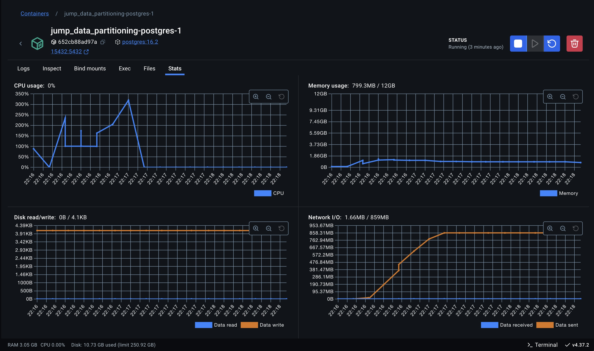
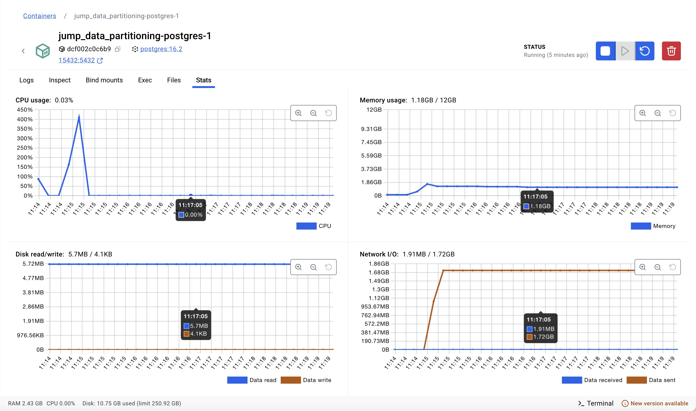
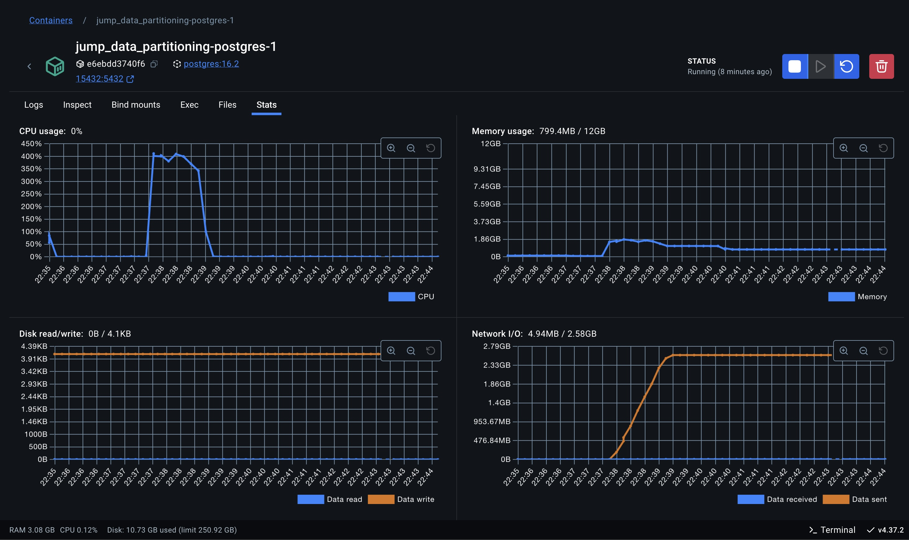
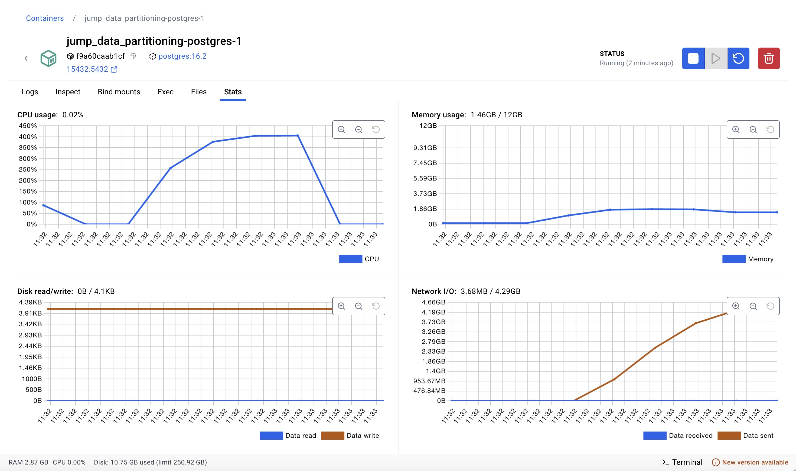
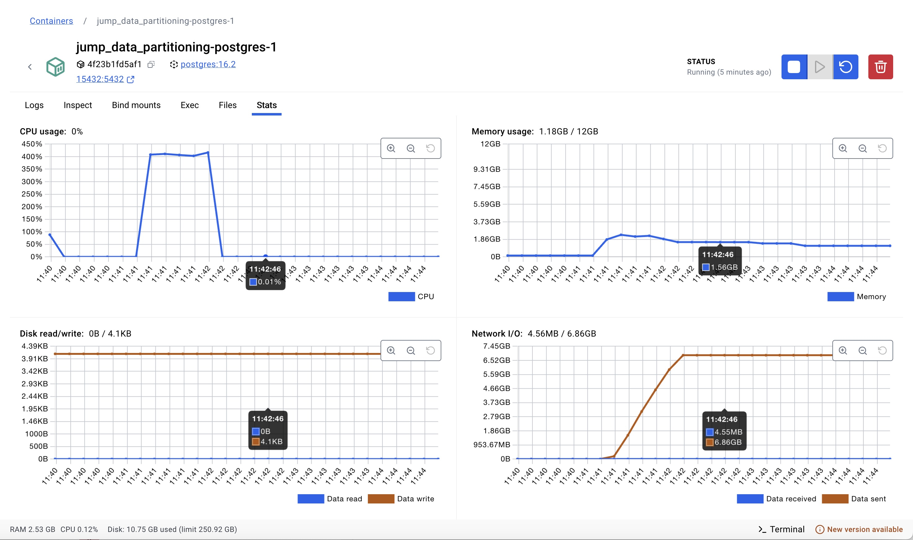
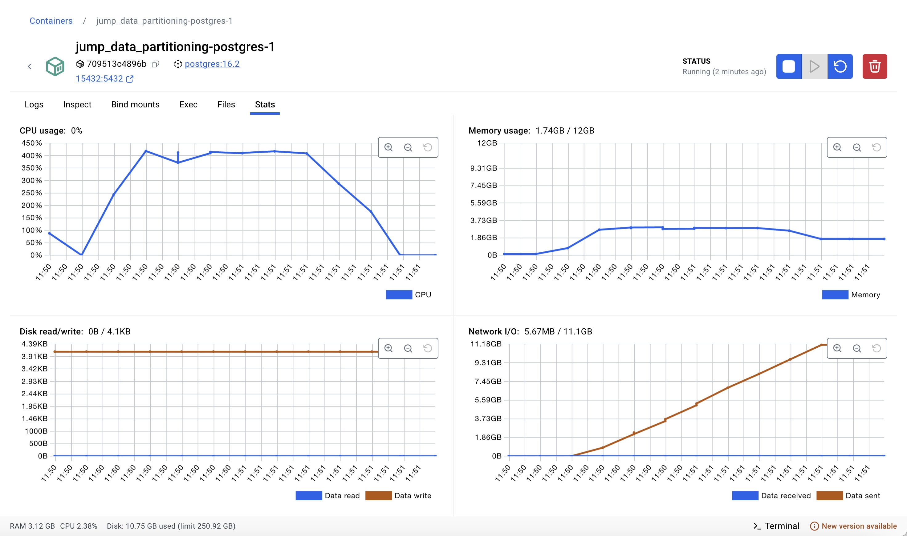
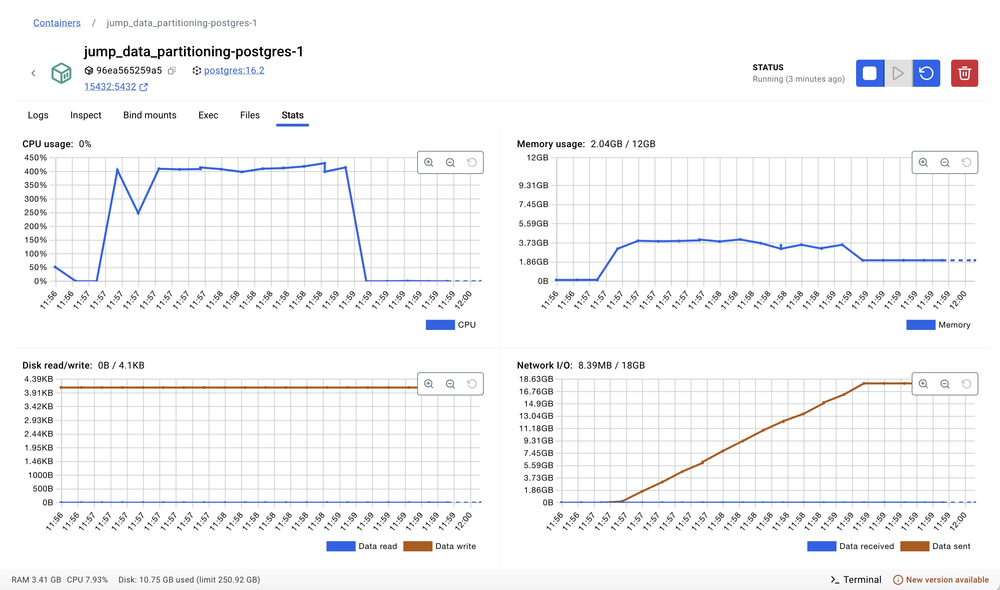
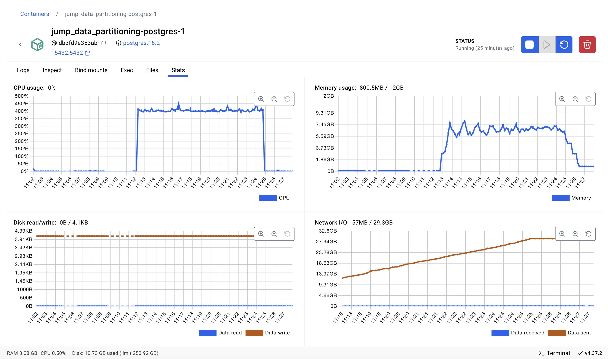

# 1 - Experimento 02 - Particionamento Por Hash

O **particionamento por hash** é uma estratégia de particionamento em que os dados são distribuídos entre partições com base no resultado de uma função de hash aplicada a uma ou mais colunas, como a chave primária. Em um cenário com apenas uma instância de banco de dados, essa técnica permite uma distribuição mais uniforme dos dados entre as partições, reduzindo a probabilidade de hotspots e otimizando o uso de recursos como CPU e I/O. Entre os benefícios estão a melhora no balanceamento de carga, já que as partições tendem a conter volumes de dados semelhantes, e a eficiência em consultas que acessam uma única partição, pois o mapeamento direto evita varreduras desnecessárias. No entanto, suas limitações incluem a dificuldade em realizar consultas que cruzam múltiplas partições, que podem sofrer degradação de desempenho devido à necessidade de unir dados de várias partições. Além disso, a manutenção, como adicionar novas partições ou redistribuir dados, pode ser complexa e custosa, especialmente em sistemas com alto volume de dados. Assim, o particionamento por hash é mais adequado para cenários em que a maioria das consultas depende de acesso direto a chaves específicas e os padrões de acesso são bem distribuídos.

## 1.1 - Preparação

Para avaliar essa estratégia se faz necessário executar alguns procedimentos no banco de dados para que as tabelas tenham suporte ao particionamento de dados por hash, pois o banco de dados utilizado (PostgreSQL) não suporta o particionamento em tabela pré existente.

Além disso, o modelo de dados atual está armazenando os registros de processos, movimentos e complementos em tabelas separadas por unidade judiciária, ou seja, para cada unidade judiciária existem as respectivas tabelas de processos, movimentos e complementos daquela unidade.

Para avalidar a estratégia de particionamento por hash, iremos unificar as tabelas de processos, movimentos e complementos, de cada unidade em tabelas únicas de processos, movimentos e complementos, adicionando uma coluna que representa a chave de unidade judiciária.

## 1.2 - Definição da função hash

As partições das tabelas de **processos**, **movimentos** e **complementos** serão criadas levando em consideração o resultado de uma função hash, que receberá como entrada os valores das seguintes colunas:

- a unidade judiciária; e
- o ano do primeiro movimento.

Contudo, o particionamento por hash não garante que todos os registros com a mesma unidadeID e anoPrimeiroMovimento irão para a mesma partição. Em vez disso, o particionamento por hash distribui os dados pseudo-aleatoriamente entre as partições com base na função hash.

A função hash combina os dois valores, o que significa:

> HASH(18006, 2023) % 39 pode ser 3.
> HASH(25000, 2020) % 39 também pode ser 3.

Assim, ambos os registros serão armazenados na partição **processos_exp02_3**, por exemplo. Permitindo que dados de diferentes anos e unidades apareçam em uma mesma partição.

Essa distribuição visa equilibrar partições, não agrupar por valores. Ao contrário do particionamento LIST ou RANGE, que garante o agrupamento lógico, o particionamento hash distribui os dados uniformemente em todas as partições.


## 1.3 - Unificação dos registros nas tabelas particionadas

Nesta etapa, iremos unificar os registros existentes em tabelas únicas.

Como a base de dados que foi fornecida só dispunha de registros para uma única unidade judiciária (id: 18006), optamos por clonar as tabelas desta unidade para simular o cenário com múltiplas unidades judiciárias.

1. Clonando as tabelas da unidade judiciária existente

```sql

-- Tabelas para unidade 18007

-- processos_18007

CREATE TABLE public.processos_18007 AS
SELECT
"processoID" + 1000000000 AS "processoID", -- Adiciona um offset para as chaves primárias serem únicas
"NPU", liminar, natureza, "valorCausa", "nivelSigilo", competencia,
"situacaoMigracao", "justicaGratuita", "dataAjuizamento", assunto, classe,
"ultimaAtualizacao", "ultimoMovimento", "dataPrimeiroMovimento", "dataUltimoMovimento",
'18007'::bigint AS "unidadeID"
FROM public.processos_18006;

ALTER TABLE IF EXISTS public.processos_18007
    ADD CONSTRAINT processos_18007_pkey PRIMARY KEY ("processoID");
ALTER TABLE IF EXISTS public.processos_18007
    ADD CONSTRAINT processos_18007_classe_fkey FOREIGN KEY (classe)
    REFERENCES public.classes (id) MATCH SIMPLE
    ON UPDATE NO ACTION
    ON DELETE NO ACTION;
ALTER TABLE IF EXISTS public.processos_18007
    ADD CONSTRAINT processos_18007_assunto_fkey FOREIGN KEY (assunto)
    REFERENCES public.assuntos (id) MATCH SIMPLE
    ON UPDATE NO ACTION
    ON DELETE NO ACTION;

-- movimentos_18007

CREATE TABLE public.movimentos_18007 AS
SELECT
id + 10000000000 AS id, -- Adiciona um offset para as chaves primárias serem únicas
"processoID" + 1000000000 AS "processoID", -- Adiciona um offset para as chaves primárias serem únicas
"NPU", activity, duration, "dataInicio", "dataFinal", "usuarioID", "documentoID", "movimentoID",
'18007'::bigint AS "unidadeID"
FROM public.movimentos_18006;


ALTER TABLE IF EXISTS public.movimentos_18007
    ADD CONSTRAINT movimentos_18007_pkey PRIMARY KEY (id);
ALTER TABLE IF EXISTS public.movimentos_18007
    ADD CONSTRAINT "movimentos_18007_processoID_fkey" FOREIGN KEY ("processoID")
    REFERENCES public.processos_18007 ("processoID") MATCH SIMPLE
    ON UPDATE NO ACTION
    ON DELETE NO ACTION;
ALTER TABLE IF EXISTS public.movimentos_18007
    ADD CONSTRAINT "movimentos_18007_movimentoID_fkey" FOREIGN KEY ("movimentoID")
    REFERENCES public.cod_movimentos (id) MATCH SIMPLE
    ON UPDATE NO ACTION
    ON DELETE NO ACTION;

-- complementos_18007

CREATE TABLE public.complementos_18007 AS
SELECT
"complementoID" + 10000000000 AS "complementoID", -- Adiciona um offset para as chaves primárias serem únicas
"movimentoID" + 10000000000 AS "movimentoID", -- Adiciona um offset para as chaves primárias serem únicas
tipo, descricao,
'18007'::bigint AS "unidadeID"
FROM public.complementos_18006;

ALTER TABLE IF EXISTS public.complementos_18007
    ADD CONSTRAINT complementos_18007_pkey PRIMARY KEY ("complementoID");
ALTER TABLE IF EXISTS public.complementos_18007
    ADD CONSTRAINT "complementos_18007_movimentoID_fkey" FOREIGN KEY ("movimentoID")
    REFERENCES public.movimentos_18007 (id) MATCH SIMPLE
    ON UPDATE CASCADE
    ON DELETE CASCADE;


-- Tabelas para unidade 18008

-- processos_18008

CREATE TABLE public.processos_18008 AS
SELECT
"processoID" + 2000000000 AS "processoID", -- Adiciona um offset para as chaves primárias serem únicas
"NPU", liminar, natureza, "valorCausa", "nivelSigilo", competencia,
"situacaoMigracao", "justicaGratuita", "dataAjuizamento", assunto, classe,
"ultimaAtualizacao", "ultimoMovimento", "dataPrimeiroMovimento", "dataUltimoMovimento",
'18008'::bigint AS "unidadeID"
FROM public.processos_18006;

ALTER TABLE IF EXISTS public.processos_18008
    ADD CONSTRAINT processos_18008_pkey PRIMARY KEY ("processoID");
ALTER TABLE IF EXISTS public.processos_18008
    ADD CONSTRAINT processos_18008_classe_fkey FOREIGN KEY (classe)
    REFERENCES public.classes (id) MATCH SIMPLE
    ON UPDATE NO ACTION
    ON DELETE NO ACTION;
ALTER TABLE IF EXISTS public.processos_18008
    ADD CONSTRAINT processos_18008_assunto_fkey FOREIGN KEY (assunto)
    REFERENCES public.assuntos (id) MATCH SIMPLE
    ON UPDATE NO ACTION
    ON DELETE NO ACTION;

-- movimentos_18008

CREATE TABLE public.movimentos_18008 AS
SELECT
id + 20000000000 AS id, -- Adiciona um offset para as chaves primárias serem únicas
"processoID" + 2000000000 AS "processoID", -- Adiciona um offset para as chaves primárias serem únicas
"NPU", activity, duration, "dataInicio", "dataFinal", "usuarioID", "documentoID", "movimentoID",
'18008'::bigint AS "unidadeID"
FROM public.movimentos_18006;


ALTER TABLE IF EXISTS public.movimentos_18008
    ADD CONSTRAINT movimentos_18008_pkey PRIMARY KEY (id);
ALTER TABLE IF EXISTS public.movimentos_18008
    ADD CONSTRAINT "movimentos_18008_processoID_fkey" FOREIGN KEY ("processoID")
    REFERENCES public.processos_18008 ("processoID") MATCH SIMPLE
    ON UPDATE NO ACTION
    ON DELETE NO ACTION;
ALTER TABLE IF EXISTS public.movimentos_18008
    ADD CONSTRAINT "movimentos_18008_movimentoID_fkey" FOREIGN KEY ("movimentoID")
    REFERENCES public.cod_movimentos (id) MATCH SIMPLE
    ON UPDATE NO ACTION
    ON DELETE NO ACTION;

-- complementos_18008

CREATE TABLE public.complementos_18008 AS
SELECT
"complementoID" + 20000000000 AS "complementoID", -- Adiciona um offset para as chaves primárias serem únicas
"movimentoID" + 20000000000 AS "movimentoID", -- Adiciona um offset para as chaves primárias serem únicas
tipo, descricao,
'18008'::bigint AS "unidadeID"
FROM public.complementos_18006;

ALTER TABLE IF EXISTS public.complementos_18008
    ADD CONSTRAINT complementos_18008_pkey PRIMARY KEY ("complementoID");
ALTER TABLE IF EXISTS public.complementos_18008
    ADD CONSTRAINT "complementos_18008_movimentoID_fkey" FOREIGN KEY ("movimentoID")
    REFERENCES public.movimentos_18008 (id) MATCH SIMPLE
    ON UPDATE CASCADE
    ON DELETE CASCADE;

```

2. Criando a coluna **unidadeID** nas tabelas originais de complementos_18006, movimentos_18006 e processos_18006.

```sql

-- Unidade Judiciária: 18006

-- Tabelas para complementos_18006
ALTER TABLE IF EXISTS public.complementos_18006
    ADD COLUMN "unidadeID" bigint;
UPDATE public.complementos_18006 SET "unidadeID" = 18006;
ALTER TABLE IF EXISTS public.complementos_18006
    ALTER COLUMN "unidadeID" SET NOT NULL;

-- Tabelas para movimentos_18006
ALTER TABLE IF EXISTS public.movimentos_18006
    ADD COLUMN "unidadeID" bigint;
UPDATE public.movimentos_18006 SET "unidadeID" = 18006;
ALTER TABLE IF EXISTS public.movimentos_18006
    ALTER COLUMN "unidadeID" SET NOT NULL;

-- Tabelas para processos_18006
ALTER TABLE IF EXISTS public.processos_18006
    ADD COLUMN "unidadeID" bigint;
UPDATE public.processos_18006 SET "unidadeID" = 18006;
ALTER TABLE IF EXISTS public.processos_18006
    ALTER COLUMN "unidadeID" SET NOT NULL;
```

3. Criando as tabelas com particionamento por hash

O comando abaixo cria seguintes tabelas: **processos_exp02**, **movimentos_exp02** e **complementos_exp02**, com o particionamento por hash ativado:

```sql
CREATE SEQUENCE IF NOT EXISTS public."processos_exp02_processoID_seq"
    INCREMENT 1
    START 1
    MINVALUE 1
    MAXVALUE 9223372036854775807
    CACHE 1;

ALTER SEQUENCE public."processos_exp02_processoID_seq"
    OWNER TO postgres;

CREATE TABLE IF NOT EXISTS public.processos_exp02
(
    "processoID" bigint NOT NULL DEFAULT nextval('"processos_exp02_processoID_seq"'::regclass),
    "NPU" character varying COLLATE pg_catalog."default" NOT NULL,
    liminar boolean,
    natureza character varying COLLATE pg_catalog."default",
    "valorCausa" character varying COLLATE pg_catalog."default",
    "nivelSigilo" character varying COLLATE pg_catalog."default",
    competencia character varying COLLATE pg_catalog."default",
    "situacaoMigracao" character varying COLLATE pg_catalog."default",
    "justicaGratuita" boolean,
    "dataAjuizamento" timestamp without time zone,
    assunto integer,
    classe integer,
    "ultimaAtualizacao" timestamp without time zone,
    "ultimoMovimento" bigint,
    "dataPrimeiroMovimento" timestamp without time zone,
    "dataUltimoMovimento" timestamp without time zone,
    "unidadeID" bigint NOT NULL,
    "anoPrimeiroMovimento" integer,
    CONSTRAINT processos_exp02_assunto_fkey FOREIGN KEY (assunto)
        REFERENCES public.assuntos (id) MATCH SIMPLE
        ON UPDATE NO ACTION
        ON DELETE NO ACTION,
    CONSTRAINT processos_exp02_classe_fkey FOREIGN KEY (classe)
        REFERENCES public.classes (id) MATCH SIMPLE
        ON UPDATE NO ACTION
        ON DELETE NO ACTION
) PARTITION BY HASH ("unidadeID", "anoPrimeiroMovimento");

ALTER TABLE IF EXISTS public.processos_exp02
    OWNER to postgres;

ALTER SEQUENCE public."processos_exp02_processoID_seq"
    OWNED BY public.processos_exp02."processoID";

CREATE UNIQUE INDEX processos_exp02_unq1 
    ON public.processos_exp02 ("unidadeID", "anoPrimeiroMovimento", "processoID");


-- movimentos

CREATE SEQUENCE IF NOT EXISTS public."movimentos_exp02_id_seq"
    INCREMENT 1
    START 1
    MINVALUE 1
    MAXVALUE 9223372036854775807
    CACHE 1;

ALTER SEQUENCE public."movimentos_exp02_id_seq"
    OWNER TO postgres;

CREATE TABLE IF NOT EXISTS public.movimentos_exp02
(
    id bigint NOT NULL DEFAULT nextval('movimentos_exp02_id_seq'::regclass),
    "processoID" bigint,
    "NPU" character varying COLLATE pg_catalog."default",
    activity character varying COLLATE pg_catalog."default" NOT NULL,
    duration bigint,
    "dataInicio" timestamp without time zone,
    "dataFinal" timestamp without time zone NOT NULL,
    "usuarioID" bigint,
    "documentoID" bigint,
    "movimentoID" bigint,
    "unidadeID" bigint NOT NULL,
    "anoPrimeiroMovimento" integer,
    CONSTRAINT "movimentos_exp02_movimentoID_fkey" FOREIGN KEY ("movimentoID")
        REFERENCES public.cod_movimentos (id) MATCH SIMPLE
        ON UPDATE NO ACTION
        ON DELETE NO ACTION,
    CONSTRAINT "movimentos_exp02_processoID_fkey" FOREIGN KEY ("processoID", "unidadeID", "anoPrimeiroMovimento")
        REFERENCES public.processos_exp02 ("processoID", "unidadeID", "anoPrimeiroMovimento") MATCH SIMPLE
        ON UPDATE CASCADE
        ON DELETE CASCADE
) PARTITION BY HASH ("unidadeID", "anoPrimeiroMovimento");

ALTER TABLE IF EXISTS public.movimentos_exp02
    OWNER to postgres;

ALTER SEQUENCE public."movimentos_exp02_id_seq"
    OWNED BY public.movimentos_exp02.id;

CREATE UNIQUE INDEX movimentos_exp02_unq1 
    ON public.movimentos_exp02 ("unidadeID", "anoPrimeiroMovimento", "id");

-- complementos

CREATE SEQUENCE IF NOT EXISTS public."complementos_exp02_complementoID_seq"
    INCREMENT 1
    START 1
    MINVALUE 1
    MAXVALUE 9223372036854775807
    CACHE 1;

ALTER SEQUENCE public."complementos_exp02_complementoID_seq"
    OWNER TO postgres;

CREATE TABLE IF NOT EXISTS public.complementos_exp02
(
    "complementoID" bigint NOT NULL DEFAULT nextval('"complementos_exp02_complementoID_seq"'::regclass),
    "movimentoID" bigint,
    tipo character varying COLLATE pg_catalog."default" NOT NULL,
    descricao character varying COLLATE pg_catalog."default" NOT NULL,
    "unidadeID" bigint NOT NULL,
    "anoPrimeiroMovimento" integer,
    CONSTRAINT "complementos_exp02_movimentoID_fkey" FOREIGN KEY ("movimentoID", "unidadeID", "anoPrimeiroMovimento")
        REFERENCES public.movimentos_exp02 (id, "unidadeID", "anoPrimeiroMovimento") MATCH SIMPLE
        ON UPDATE CASCADE
        ON DELETE CASCADE
) PARTITION BY HASH ("unidadeID", "anoPrimeiroMovimento");

ALTER TABLE IF EXISTS public.complementos_exp02
    OWNER to postgres;

ALTER SEQUENCE public."complementos_exp02_complementoID_seq"
    OWNED BY public.complementos_exp02."complementoID";

CREATE UNIQUE INDEX complementos_exp02_unq1 ON public.complementos_exp02 ("unidadeID", "anoPrimeiroMovimento", "complementoID");

```

4. Criando as tabelas das partições e índices

Como já avaliado no experimento anterior, considerando a distribuição por ano, os registros de processos estão distribuídos em 13 anos (partes). 
Sendo assim, para cada tupla ("unidadeID" + "ano") presente na distribuição dos dados, será criada uma tabela de particionamento, totalizando 39 partições.

Os comanos abaixo criam as tabelas e índices mencionados:

```sql
CREATE TABLE processos_exp02_0 PARTITION OF processos_exp02 FOR VALUES WITH (MODULUS 39, REMAINDER 0);
CREATE TABLE processos_exp02_1 PARTITION OF processos_exp02 FOR VALUES WITH (MODULUS 39, REMAINDER 1);
CREATE TABLE processos_exp02_2 PARTITION OF processos_exp02 FOR VALUES WITH (MODULUS 39, REMAINDER 2);
CREATE TABLE processos_exp02_3 PARTITION OF processos_exp02 FOR VALUES WITH (MODULUS 39, REMAINDER 3);
CREATE TABLE processos_exp02_4 PARTITION OF processos_exp02 FOR VALUES WITH (MODULUS 39, REMAINDER 4);
CREATE TABLE processos_exp02_5 PARTITION OF processos_exp02 FOR VALUES WITH (MODULUS 39, REMAINDER 5);
CREATE TABLE processos_exp02_6 PARTITION OF processos_exp02 FOR VALUES WITH (MODULUS 39, REMAINDER 6);
CREATE TABLE processos_exp02_7 PARTITION OF processos_exp02 FOR VALUES WITH (MODULUS 39, REMAINDER 7);
CREATE TABLE processos_exp02_8 PARTITION OF processos_exp02 FOR VALUES WITH (MODULUS 39, REMAINDER 8);
CREATE TABLE processos_exp02_9 PARTITION OF processos_exp02 FOR VALUES WITH (MODULUS 39, REMAINDER 9);
CREATE TABLE processos_exp02_10 PARTITION OF processos_exp02 FOR VALUES WITH (MODULUS 39, REMAINDER 10);
CREATE TABLE processos_exp02_11 PARTITION OF processos_exp02 FOR VALUES WITH (MODULUS 39, REMAINDER 11);
CREATE TABLE processos_exp02_12 PARTITION OF processos_exp02 FOR VALUES WITH (MODULUS 39, REMAINDER 12);
CREATE TABLE processos_exp02_13 PARTITION OF processos_exp02 FOR VALUES WITH (MODULUS 39, REMAINDER 13);
CREATE TABLE processos_exp02_14 PARTITION OF processos_exp02 FOR VALUES WITH (MODULUS 39, REMAINDER 14);
CREATE TABLE processos_exp02_15 PARTITION OF processos_exp02 FOR VALUES WITH (MODULUS 39, REMAINDER 15);
CREATE TABLE processos_exp02_16 PARTITION OF processos_exp02 FOR VALUES WITH (MODULUS 39, REMAINDER 16);
CREATE TABLE processos_exp02_17 PARTITION OF processos_exp02 FOR VALUES WITH (MODULUS 39, REMAINDER 17);
CREATE TABLE processos_exp02_18 PARTITION OF processos_exp02 FOR VALUES WITH (MODULUS 39, REMAINDER 18);
CREATE TABLE processos_exp02_19 PARTITION OF processos_exp02 FOR VALUES WITH (MODULUS 39, REMAINDER 19);
CREATE TABLE processos_exp02_20 PARTITION OF processos_exp02 FOR VALUES WITH (MODULUS 39, REMAINDER 20);
CREATE TABLE processos_exp02_21 PARTITION OF processos_exp02 FOR VALUES WITH (MODULUS 39, REMAINDER 21);
CREATE TABLE processos_exp02_22 PARTITION OF processos_exp02 FOR VALUES WITH (MODULUS 39, REMAINDER 22);
CREATE TABLE processos_exp02_23 PARTITION OF processos_exp02 FOR VALUES WITH (MODULUS 39, REMAINDER 23);
CREATE TABLE processos_exp02_24 PARTITION OF processos_exp02 FOR VALUES WITH (MODULUS 39, REMAINDER 24);
CREATE TABLE processos_exp02_25 PARTITION OF processos_exp02 FOR VALUES WITH (MODULUS 39, REMAINDER 25);
CREATE TABLE processos_exp02_26 PARTITION OF processos_exp02 FOR VALUES WITH (MODULUS 39, REMAINDER 26);
CREATE TABLE processos_exp02_27 PARTITION OF processos_exp02 FOR VALUES WITH (MODULUS 39, REMAINDER 27);
CREATE TABLE processos_exp02_28 PARTITION OF processos_exp02 FOR VALUES WITH (MODULUS 39, REMAINDER 28);
CREATE TABLE processos_exp02_29 PARTITION OF processos_exp02 FOR VALUES WITH (MODULUS 39, REMAINDER 29);
CREATE TABLE processos_exp02_30 PARTITION OF processos_exp02 FOR VALUES WITH (MODULUS 39, REMAINDER 30);
CREATE TABLE processos_exp02_31 PARTITION OF processos_exp02 FOR VALUES WITH (MODULUS 39, REMAINDER 31);
CREATE TABLE processos_exp02_32 PARTITION OF processos_exp02 FOR VALUES WITH (MODULUS 39, REMAINDER 32);
CREATE TABLE processos_exp02_33 PARTITION OF processos_exp02 FOR VALUES WITH (MODULUS 39, REMAINDER 33);
CREATE TABLE processos_exp02_34 PARTITION OF processos_exp02 FOR VALUES WITH (MODULUS 39, REMAINDER 34);
CREATE TABLE processos_exp02_35 PARTITION OF processos_exp02 FOR VALUES WITH (MODULUS 39, REMAINDER 35);
CREATE TABLE processos_exp02_36 PARTITION OF processos_exp02 FOR VALUES WITH (MODULUS 39, REMAINDER 36);
CREATE TABLE processos_exp02_37 PARTITION OF processos_exp02 FOR VALUES WITH (MODULUS 39, REMAINDER 37);
CREATE TABLE processos_exp02_38 PARTITION OF processos_exp02 FOR VALUES WITH (MODULUS 39, REMAINDER 38);


CREATE INDEX processos_exp02_idx1 ON public.processos_exp02 ("unidadeID", "anoPrimeiroMovimento", "processoID");
CREATE INDEX processos_exp02_idx2 ON public.processos_exp02 ("unidadeID", "anoPrimeiroMovimento");
CREATE INDEX processos_exp02_idx3 ON public.processos_exp02 ("unidadeID", "anoPrimeiroMovimento", "assunto");
CREATE INDEX processos_exp02_idx4 ON public.processos_exp02 ("unidadeID", "anoPrimeiroMovimento", "classe");


-- movimentos

CREATE TABLE movimentos_exp02_0 PARTITION OF movimentos_exp02 FOR VALUES WITH (MODULUS 39, REMAINDER 0);
CREATE TABLE movimentos_exp02_1 PARTITION OF movimentos_exp02 FOR VALUES WITH (MODULUS 39, REMAINDER 1);
CREATE TABLE movimentos_exp02_2 PARTITION OF movimentos_exp02 FOR VALUES WITH (MODULUS 39, REMAINDER 2);
CREATE TABLE movimentos_exp02_3 PARTITION OF movimentos_exp02 FOR VALUES WITH (MODULUS 39, REMAINDER 3);
CREATE TABLE movimentos_exp02_4 PARTITION OF movimentos_exp02 FOR VALUES WITH (MODULUS 39, REMAINDER 4);
CREATE TABLE movimentos_exp02_5 PARTITION OF movimentos_exp02 FOR VALUES WITH (MODULUS 39, REMAINDER 5);
CREATE TABLE movimentos_exp02_6 PARTITION OF movimentos_exp02 FOR VALUES WITH (MODULUS 39, REMAINDER 6);
CREATE TABLE movimentos_exp02_7 PARTITION OF movimentos_exp02 FOR VALUES WITH (MODULUS 39, REMAINDER 7);
CREATE TABLE movimentos_exp02_8 PARTITION OF movimentos_exp02 FOR VALUES WITH (MODULUS 39, REMAINDER 8);
CREATE TABLE movimentos_exp02_9 PARTITION OF movimentos_exp02 FOR VALUES WITH (MODULUS 39, REMAINDER 9);
CREATE TABLE movimentos_exp02_10 PARTITION OF movimentos_exp02 FOR VALUES WITH (MODULUS 39, REMAINDER 10);
CREATE TABLE movimentos_exp02_11 PARTITION OF movimentos_exp02 FOR VALUES WITH (MODULUS 39, REMAINDER 11);
CREATE TABLE movimentos_exp02_12 PARTITION OF movimentos_exp02 FOR VALUES WITH (MODULUS 39, REMAINDER 12);
CREATE TABLE movimentos_exp02_13 PARTITION OF movimentos_exp02 FOR VALUES WITH (MODULUS 39, REMAINDER 13);
CREATE TABLE movimentos_exp02_14 PARTITION OF movimentos_exp02 FOR VALUES WITH (MODULUS 39, REMAINDER 14);
CREATE TABLE movimentos_exp02_15 PARTITION OF movimentos_exp02 FOR VALUES WITH (MODULUS 39, REMAINDER 15);
CREATE TABLE movimentos_exp02_16 PARTITION OF movimentos_exp02 FOR VALUES WITH (MODULUS 39, REMAINDER 16);
CREATE TABLE movimentos_exp02_17 PARTITION OF movimentos_exp02 FOR VALUES WITH (MODULUS 39, REMAINDER 17);
CREATE TABLE movimentos_exp02_18 PARTITION OF movimentos_exp02 FOR VALUES WITH (MODULUS 39, REMAINDER 18);
CREATE TABLE movimentos_exp02_19 PARTITION OF movimentos_exp02 FOR VALUES WITH (MODULUS 39, REMAINDER 19);
CREATE TABLE movimentos_exp02_20 PARTITION OF movimentos_exp02 FOR VALUES WITH (MODULUS 39, REMAINDER 20);
CREATE TABLE movimentos_exp02_21 PARTITION OF movimentos_exp02 FOR VALUES WITH (MODULUS 39, REMAINDER 21);
CREATE TABLE movimentos_exp02_22 PARTITION OF movimentos_exp02 FOR VALUES WITH (MODULUS 39, REMAINDER 22);
CREATE TABLE movimentos_exp02_23 PARTITION OF movimentos_exp02 FOR VALUES WITH (MODULUS 39, REMAINDER 23);
CREATE TABLE movimentos_exp02_24 PARTITION OF movimentos_exp02 FOR VALUES WITH (MODULUS 39, REMAINDER 24);
CREATE TABLE movimentos_exp02_25 PARTITION OF movimentos_exp02 FOR VALUES WITH (MODULUS 39, REMAINDER 25);
CREATE TABLE movimentos_exp02_26 PARTITION OF movimentos_exp02 FOR VALUES WITH (MODULUS 39, REMAINDER 26);
CREATE TABLE movimentos_exp02_27 PARTITION OF movimentos_exp02 FOR VALUES WITH (MODULUS 39, REMAINDER 27);
CREATE TABLE movimentos_exp02_28 PARTITION OF movimentos_exp02 FOR VALUES WITH (MODULUS 39, REMAINDER 28);
CREATE TABLE movimentos_exp02_29 PARTITION OF movimentos_exp02 FOR VALUES WITH (MODULUS 39, REMAINDER 29);
CREATE TABLE movimentos_exp02_30 PARTITION OF movimentos_exp02 FOR VALUES WITH (MODULUS 39, REMAINDER 30);
CREATE TABLE movimentos_exp02_31 PARTITION OF movimentos_exp02 FOR VALUES WITH (MODULUS 39, REMAINDER 31);
CREATE TABLE movimentos_exp02_32 PARTITION OF movimentos_exp02 FOR VALUES WITH (MODULUS 39, REMAINDER 32);
CREATE TABLE movimentos_exp02_33 PARTITION OF movimentos_exp02 FOR VALUES WITH (MODULUS 39, REMAINDER 33);
CREATE TABLE movimentos_exp02_34 PARTITION OF movimentos_exp02 FOR VALUES WITH (MODULUS 39, REMAINDER 34);
CREATE TABLE movimentos_exp02_35 PARTITION OF movimentos_exp02 FOR VALUES WITH (MODULUS 39, REMAINDER 35);
CREATE TABLE movimentos_exp02_36 PARTITION OF movimentos_exp02 FOR VALUES WITH (MODULUS 39, REMAINDER 36);
CREATE TABLE movimentos_exp02_37 PARTITION OF movimentos_exp02 FOR VALUES WITH (MODULUS 39, REMAINDER 37);
CREATE TABLE movimentos_exp02_38 PARTITION OF movimentos_exp02 FOR VALUES WITH (MODULUS 39, REMAINDER 38);


CREATE INDEX movimentos_exp02_idx1 ON public.movimentos_exp02 ("unidadeID", "anoPrimeiroMovimento", "id");
CREATE INDEX movimentos_exp02_idx2 ON public.movimentos_exp02 ("unidadeID", "anoPrimeiroMovimento", "processoID");
CREATE INDEX movimentos_exp02_idx3 ON public.movimentos_exp02 ("unidadeID", "anoPrimeiroMovimento");
CREATE INDEX movimentos_exp02_idx4 ON public.movimentos_exp02 ("processoID", "unidadeID", "anoPrimeiroMovimento", "dataFinal") INCLUDE(activity, duration, "movimentoID");
CREATE INDEX movimentos_exp02_idx5 ON public.movimentos_exp02 ("unidadeID", "anoPrimeiroMovimento", "documentoID");
CREATE INDEX movimentos_exp02_idx6 ON public.movimentos_exp02 ("processoID", "dataFinal");


-- complementos

CREATE TABLE complementos_exp02_0 PARTITION OF complementos_exp02 FOR VALUES WITH (MODULUS 39, REMAINDER 0);
CREATE TABLE complementos_exp02_1 PARTITION OF complementos_exp02 FOR VALUES WITH (MODULUS 39, REMAINDER 1);
CREATE TABLE complementos_exp02_2 PARTITION OF complementos_exp02 FOR VALUES WITH (MODULUS 39, REMAINDER 2);
CREATE TABLE complementos_exp02_3 PARTITION OF complementos_exp02 FOR VALUES WITH (MODULUS 39, REMAINDER 3);
CREATE TABLE complementos_exp02_4 PARTITION OF complementos_exp02 FOR VALUES WITH (MODULUS 39, REMAINDER 4);
CREATE TABLE complementos_exp02_5 PARTITION OF complementos_exp02 FOR VALUES WITH (MODULUS 39, REMAINDER 5);
CREATE TABLE complementos_exp02_6 PARTITION OF complementos_exp02 FOR VALUES WITH (MODULUS 39, REMAINDER 6);
CREATE TABLE complementos_exp02_7 PARTITION OF complementos_exp02 FOR VALUES WITH (MODULUS 39, REMAINDER 7);
CREATE TABLE complementos_exp02_8 PARTITION OF complementos_exp02 FOR VALUES WITH (MODULUS 39, REMAINDER 8);
CREATE TABLE complementos_exp02_9 PARTITION OF complementos_exp02 FOR VALUES WITH (MODULUS 39, REMAINDER 9);
CREATE TABLE complementos_exp02_10 PARTITION OF complementos_exp02 FOR VALUES WITH (MODULUS 39, REMAINDER 10);
CREATE TABLE complementos_exp02_11 PARTITION OF complementos_exp02 FOR VALUES WITH (MODULUS 39, REMAINDER 11);
CREATE TABLE complementos_exp02_12 PARTITION OF complementos_exp02 FOR VALUES WITH (MODULUS 39, REMAINDER 12);
CREATE TABLE complementos_exp02_13 PARTITION OF complementos_exp02 FOR VALUES WITH (MODULUS 39, REMAINDER 13);
CREATE TABLE complementos_exp02_14 PARTITION OF complementos_exp02 FOR VALUES WITH (MODULUS 39, REMAINDER 14);
CREATE TABLE complementos_exp02_15 PARTITION OF complementos_exp02 FOR VALUES WITH (MODULUS 39, REMAINDER 15);
CREATE TABLE complementos_exp02_16 PARTITION OF complementos_exp02 FOR VALUES WITH (MODULUS 39, REMAINDER 16);
CREATE TABLE complementos_exp02_17 PARTITION OF complementos_exp02 FOR VALUES WITH (MODULUS 39, REMAINDER 17);
CREATE TABLE complementos_exp02_18 PARTITION OF complementos_exp02 FOR VALUES WITH (MODULUS 39, REMAINDER 18);
CREATE TABLE complementos_exp02_19 PARTITION OF complementos_exp02 FOR VALUES WITH (MODULUS 39, REMAINDER 19);
CREATE TABLE complementos_exp02_20 PARTITION OF complementos_exp02 FOR VALUES WITH (MODULUS 39, REMAINDER 20);
CREATE TABLE complementos_exp02_21 PARTITION OF complementos_exp02 FOR VALUES WITH (MODULUS 39, REMAINDER 21);
CREATE TABLE complementos_exp02_22 PARTITION OF complementos_exp02 FOR VALUES WITH (MODULUS 39, REMAINDER 22);
CREATE TABLE complementos_exp02_23 PARTITION OF complementos_exp02 FOR VALUES WITH (MODULUS 39, REMAINDER 23);
CREATE TABLE complementos_exp02_24 PARTITION OF complementos_exp02 FOR VALUES WITH (MODULUS 39, REMAINDER 24);
CREATE TABLE complementos_exp02_25 PARTITION OF complementos_exp02 FOR VALUES WITH (MODULUS 39, REMAINDER 25);
CREATE TABLE complementos_exp02_26 PARTITION OF complementos_exp02 FOR VALUES WITH (MODULUS 39, REMAINDER 26);
CREATE TABLE complementos_exp02_27 PARTITION OF complementos_exp02 FOR VALUES WITH (MODULUS 39, REMAINDER 27);
CREATE TABLE complementos_exp02_28 PARTITION OF complementos_exp02 FOR VALUES WITH (MODULUS 39, REMAINDER 28);
CREATE TABLE complementos_exp02_29 PARTITION OF complementos_exp02 FOR VALUES WITH (MODULUS 39, REMAINDER 29);
CREATE TABLE complementos_exp02_30 PARTITION OF complementos_exp02 FOR VALUES WITH (MODULUS 39, REMAINDER 30);
CREATE TABLE complementos_exp02_31 PARTITION OF complementos_exp02 FOR VALUES WITH (MODULUS 39, REMAINDER 31);
CREATE TABLE complementos_exp02_32 PARTITION OF complementos_exp02 FOR VALUES WITH (MODULUS 39, REMAINDER 32);
CREATE TABLE complementos_exp02_33 PARTITION OF complementos_exp02 FOR VALUES WITH (MODULUS 39, REMAINDER 33);
CREATE TABLE complementos_exp02_34 PARTITION OF complementos_exp02 FOR VALUES WITH (MODULUS 39, REMAINDER 34);
CREATE TABLE complementos_exp02_35 PARTITION OF complementos_exp02 FOR VALUES WITH (MODULUS 39, REMAINDER 35);
CREATE TABLE complementos_exp02_36 PARTITION OF complementos_exp02 FOR VALUES WITH (MODULUS 39, REMAINDER 36);
CREATE TABLE complementos_exp02_37 PARTITION OF complementos_exp02 FOR VALUES WITH (MODULUS 39, REMAINDER 37);
CREATE TABLE complementos_exp02_38 PARTITION OF complementos_exp02 FOR VALUES WITH (MODULUS 39, REMAINDER 38);


CREATE INDEX complementos_exp02_idx1 ON public.complementos_exp02 ("unidadeID", "anoPrimeiroMovimento", "complementoID");
CREATE INDEX complementos_exp02_idx2 ON public.complementos_exp02 ("unidadeID", "anoPrimeiroMovimento", "movimentoID");
CREATE INDEX complementos_exp02_idx3 ON public.complementos_exp02 ("unidadeID", "anoPrimeiroMovimento");

```

5. Migração dos dados existentes na tabela original (não particionada) para tabela particionada por hash.

O comando realizará a migração dos dados da tabela original `processos_18006` para tabela particionada `processos_exp02`.

> Atenção: Foi necessário aplicar o filtro `"dataPrimeiroMovimento" IS NOT NULL` pois existem registros onde o campo utilizado para particionamento é nulo.

```sql

-- processos_exp02

INSERT INTO public.processos_exp02
SELECT *, EXTRACT(YEAR FROM "dataPrimeiroMovimento") AS "anoPrimeiroMovimento"
	FROM public.processos_18006 WHERE "dataPrimeiroMovimento" IS NOT NULL;

INSERT INTO public.processos_exp02
SELECT *, EXTRACT(YEAR FROM "dataPrimeiroMovimento") AS "anoPrimeiroMovimento"
	FROM public.processos_18007 WHERE "dataPrimeiroMovimento" IS NOT NULL;

INSERT INTO public.processos_exp02
SELECT *, EXTRACT(YEAR FROM "dataPrimeiroMovimento") AS "anoPrimeiroMovimento"
	FROM public.processos_18008 WHERE "dataPrimeiroMovimento" IS NOT NULL;

-- movimentos_exp02

INSERT INTO public.movimentos_exp02
SELECT m.*, EXTRACT(YEAR FROM p."dataPrimeiroMovimento") AS "anoPrimeiroMovimento"
	FROM public.movimentos_18006 m
	INNER JOIN public.processos_18006 p ON p."processoID" = m."processoID";

INSERT INTO public.movimentos_exp02
SELECT m.*, EXTRACT(YEAR FROM p."dataPrimeiroMovimento") AS "anoPrimeiroMovimento"
	FROM public.movimentos_18007 m
	INNER JOIN public.processos_18007 p ON p."processoID" = m."processoID";

INSERT INTO public.movimentos_exp02
SELECT m.*, EXTRACT(YEAR FROM p."dataPrimeiroMovimento") AS "anoPrimeiroMovimento"
	FROM public.movimentos_18008 m
	INNER JOIN public.processos_18008 p ON p."processoID" = m."processoID";

-- complementos_exp02

INSERT INTO public.complementos_exp02
SELECT c.*, m."anoPrimeiroMovimento"
	FROM public.complementos_18006 c
	INNER JOIN public.movimentos_exp02 m ON
		m."unidadeID" = c."unidadeID" AND m.id = c."movimentoID";

INSERT INTO public.complementos_exp02
SELECT c.*, m."anoPrimeiroMovimento"
	FROM public.complementos_18007 c
	INNER JOIN public.movimentos_exp02 m ON
		m."unidadeID" = c."unidadeID" AND m.id = c."movimentoID";

INSERT INTO public.complementos_exp02
SELECT c.*, m."anoPrimeiroMovimento"
	FROM public.complementos_18008 c
	INNER JOIN public.movimentos_exp02 m ON
		m."unidadeID" = c."unidadeID" AND m.id = c."movimentoID";

```

- Total de registros retornando pela query e inseridos na migração: **1.051.311**

## 1.5 - Ambiente de testes

### 1.5.1 - Equipamento Host

- MacBook Pro
- Apple M2 Max
- 32 GB
- SSD 1TB

### 1.5.2 - Execução em containers

Será utilizado o Docker como ferramenta de virtualização em containers para execução do servidor de banco de dados Postgres.

- Docker: version 27.4.0, build bde2b89
- Docker Compose: version v2.31.0-desktop.2

### 1.5.3 - Banco de dados

Utilizamos Postgres: version 16.2, que é o banco de dados utilizado pelo JuMP.

#### Configurações

> 01 instância de container

```yaml
services:
  postgres:
    image: postgres:16.2
    shm_size: "4g"
    deploy:
      resources:
        limits:
          cpus: "4.0"
          memory: "12g"
        reservations:
          cpus: "2.0"
          memory: "6g"
```

## 1.6 - Simulação da carga

Para simulação de cargas de execução utilizaremos a ferramenta JMeter para criar um plano de testes que possibile simular diferentes cenários de cargas dos usuários utilizando a aplicação.

Os cenários do plano de teste segue uma sequencia fibonaci para determinar a quantidade de threads (usuários simulâneos) em cada cenário, sendo que cada thread (usuário) executa 10 requisições sequenciais de disparo da query no banco de dados.

- [Apache JMeter: version 5.6.3](https://jmeter.apache.org/index.html)

### 1.6.1 Query

Para avaliar essa estratégia será utilizada a seguinte consulta SQL de referêcia:

```sql
SELECT
    p."NPU", 
    p."processoID", 
    p."ultimaAtualizacao",
    c.descricao AS classe, 
    a.descricao AS assunto,
    m.activity, 
    m."dataInicio", 
    m."dataFinal", 
    m."usuarioID",
    m.duration, 
    m."movimentoID", 
    com.descricao AS complemento,
    s."nomeServidor", 
    s."tipoServidor", 
    d.tipo AS documento
FROM 
    processos_exp02 AS p
INNER JOIN
    movimentos_exp02 AS m 
    ON 
	m."unidadeID" = p."unidadeID"
	AND m."anoPrimeiroMovimento" >= p."anoPrimeiroMovimento"
	AND m."processoID" = p."processoID"
INNER JOIN
    classes AS c ON p.classe = c.id
LEFT JOIN
    assuntos AS a ON p.assunto = a.id
LEFT JOIN
    complementos_exp02 AS com 
    ON 
	com."unidadeID" = m."unidadeID" 
	AND com."anoPrimeiroMovimento" >= p."anoPrimeiroMovimento"
	AND com."movimentoID" = m."id" 
LEFT JOIN
    servidores AS s ON s."servidorID" = m."usuarioID"
LEFT JOIN
    documentos AS d ON d."id" = m."documentoID"
WHERE 
    p."unidadeID" = 18006 AND p."anoPrimeiroMovimento" >= 2020
	AND m."unidadeID" = 18006 AND m."anoPrimeiroMovimento" >= 2020
	AND com."unidadeID" = 18006 AND com."anoPrimeiroMovimento" >= 2020
ORDER BY 
    p."processoID", m."dataFinal";
```

## 1.7 - Métricas avaliadas e resultados

### 1.7.1 - Tempo de Processamento

| # Threads (Usuários em paralelo) | # Requests / Thread | # Repetições | Falhas (Timeout) | Duração média | Duração mínima | Duração máxima | Duração mediana |
| -------------------------------- | ------------------- | ------------ | ---------------- | ------------- | -------------- | -------------- | --------------- |
| 1                                | 10                  | 10           |                0 | 4946,5 ms     | 4675,0 ms      | 5732,0 ms      | 4835,0 ms       |
| 2                                | 10                  | 20           |                0 | 6399,7 ms     | 4997,0 ms      | 8593,0 ms      | 6328,0 ms       |
| 3                                | 10                  | 30           |                0 | 7650,9 ms     | 4775,0 ms      | 11376,0 ms     | 7550,0 ms       |
| 5                                | 10                  | 50           |                0 | 12513,3 ms    | 8059,0 ms      | 18665,0 ms     | 12118,0 ms      |
| 8                                | 10                  | 80           |                0 | 19275,8 ms    | 6414,0 ms      | 26110,0 ms     | 19771,0 ms      |
| 13                               | 10                  | 130          |                0 | 25711,1 ms    | 6014,0 ms      | 37431,0 ms     | 26599,0 ms      |
| 21                               | 10                  | 210          |                0 | 40961,6 ms    | 11836,0 ms     | 79113,0 ms     | 42867,5 ms      |
| 34                               | 10                  | 340          |                0 | 72349,7 ms    | 15597,0 ms     | 109198,0 ms    | 74255,0 ms      |
| 55                               | 10                  | 550          |               72 | 139699,7 ms   | 14745,0 ms     | 181299,0 ms    | 148002,5 ms     |

Constatamos que a partir do cenário com 55 threads simultâneas a estratégia utilizada começou a apresentar falhas, um total de 72, casos onde o tempo de resposta foram superiores ao limite estabelecido para o timeout de execução de query de 180.000 ms (3 minutos), e portanto, não permitiu escalar o banco de dados para atender o crescimento da demanda e exeucuções em paralelo, conforme a execução dos testes.


### 1.5.2 - Utilização de Recursos

| # Threads (Em paralelo) | # Requests/Thread | # Repetições | Uso de CPU | Uso de RAM | Disk (read) | Disk (write) | Network I/O (received) | Network I/O (sent) |
| ----------------------- | ----------------- | ------------ | ---------- | ---------- | ----------- | ------------ | ---------------------- | ------------------ |
| 1                       | 10                | 10           | 319,46 %   | 1,25 GB    | 0 KB        | 0 KB         | 859,00 MB              | 1,66 MB            |
| 2                       | 10                | 20           | 405,96 %   | 1,66 GB    | 0 KB        | 0 KB         | 5,58 MB                | 1,72 GB            |
| 3                       | 10                | 30           | 411,38 %   | 1,84 GB    | 0 KB        | 0 KB         | 4,94 MB                | 2,58 GB            |
| 5                       | 10                | 50           | 410,61 %   | 2,37 GB    | 0 KB        | 0 KB         | 5,72 MB                | 4,30 GB            |
| 8                       | 10                | 80           | 447,99 %   | 2,79 GB    | 0 KB        | 0 KB         | 8,42 MB                | 6,89 GB            |
| 13                      | 10                | 80           | 410,71 %   | 3,91 GB    | 0 KB        | 0 KB         | 14,70 MB               | 11,20 GB           |
| 21                      | 10                | 210          | 416,86 %   | 4,95 GB    | 0 KB        | 0 KB         | 37,60 MB               | 18,10 GB           |
| 34                      | 10                | 340          | 450,60 %   | 8,01 GB    | 0 KB        | 0 KB         | 57,00 MB               | 29,30 GB           |
| 55                      | 10                | 550          | 434,66 %   | 11,73 GB   | 35,4 MB     | 152 MB       | 112,00 MB              | 43,30 GB           |

Abaixo, estão os screenshots das estatísticas coletadas para cada cenário executado:

#### 1 Thread



#### 2 Threads



#### 3 Threads



#### 5 Threads



#### 8 Threads



#### 13 Threads



#### 21 Threads



#### 34 Threads



Não foi possível executar o cenário uma vez que o servidor não conseguiu responder as solicitações simultâneas.

### 1.5.3 - Escalabilidade

Para essa métrica, implementamos uma aplicação em Java utilizando Spring Boot, que publica um endpoint REST responsável por executar a query de referência, realizar a leitura do ResultSet, capturando o timestamp inicial e final da execução para cálculo da duração.

Utilizamos a ferramenta JMeter para criar um plano de testes que possibilitou simular a carga de usuários simultâneos utilizando a aplicação.

| # Threads (Usuários em paralelo) | # Requests / Thread | # Repetições | Duração média | Duração mínima | Duração máxima | Duração mediana |
| -------------------------------- | ------------------- | ------------ | ------------- | -------------- | -------------- | --------------- |
| 1                                | 10                  | 10           | 9763,9 ms     | 8486,0 ms      | 11003,0 ms     | 9686,0 ms       |
| 2                                | 10                  | 20           | 14027,8 ms    | 9224,0 ms      | 20246,0 ms     | 12232,5 ms      |
| 3                                | 10                  | 30           | 18119,6 ms    | 9288,0 ms      | 37184,0 ms     | 14618,0 ms      |
| 5                                | 10                  | 50           | 28012,6 ms    | 9441,0 ms      | 61072,0 ms     | 22456,0 ms      |
| 8                                | 10                  | 80           | ------- ms    | ------- ms     | ------- ms     | ------- ms      |

Constatamos que a partir do cenário com 8 thread simultâneas a estratégia utilizada não permitiu escalar o banco de dados para atender o crescimento
da demanda conforme a execução dos testes, uma vez que com o aumento de usuários em paralelo, a execução da query passou a superar o limite máximo de
180.000 ms (3 minutos).

### 1.5.4 - Equilíbrio de Carga

Não se aplica.

### 1.5.5 - Taxa de Transferência de Dados (Throughput)

- Comando para ativar o rastreamento de tempos de entrada/saída (I/O) em operações realizadas pelo banco de dados.

```sql
SET track_io_timing = on;

EXPLAIN ANALYZE
    -- CONSULTA SQL DE REFERÊNCIA
    SELECT * FROM ...;

```

- Taxa: **3.364.537 registros** / **7,44 segundos** = **451897,94 registros por segundo**

### 1.5.6 - Custo de Redistribuição

Não se aplica.

### 1.5.7 - Eficiência de Consultas

A eficiência pode ser expressa como uma relação entre o tempo de execução e o número de partições acessadas:

#### Fórmula:

```plaintext
Eficiência (%) = (1 / Tempo de Execução Total) * (Número de Partições Acessadas / Partições Totais) * 100
```

- Tempo de Execução Total: **10 segundos**
- Número de Partições Acessadas: **1**
- Partições Totais: **1**

> Eficiência (%) = (1 / 10) _ (1 / 1) _ 100 = **10%**

### 1.5.8 - Consistência de Dados

Essa métrica não se aplica a essa estratégia, uma vez que não existe movimentação de dados, seja no próprio host ou em hosts distintos.

### 1.5.9 - Capacidade de Adaptação

Essa métrica não se aplica a essa estratégia, uma vez que ela não realiza mudanças ou ajustes dinâmicamente.

### 1.5.10 - Custo Operacional

Não foi avaliado o custo operacional pois se trata da estratégia atualmente implementada.
