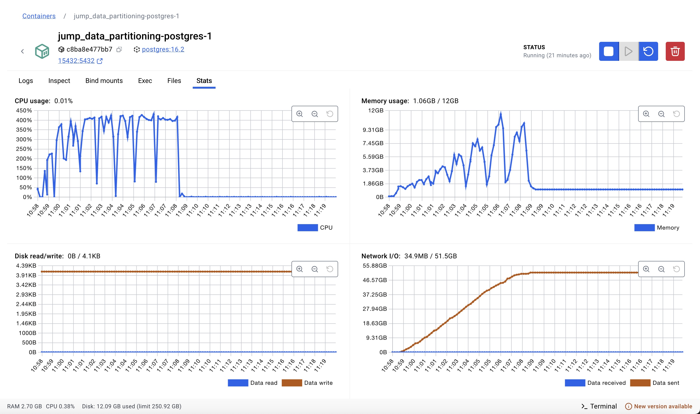
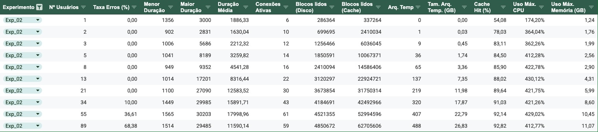

# 1 - Experimento 02 - Particionamento Por Hash

## 1.1 - Estratégia de particionamento

O **particionamento por hash** é uma estratégia de particionamento em que os dados são distribuídos entre partições com base no resultado de uma função de hash aplicada a uma ou mais colunas, como a chave primária. Em um cenário com apenas uma instância de banco de dados, essa técnica permite uma distribuição mais uniforme dos dados entre as partições, reduzindo a probabilidade de hotspots e otimizando o uso de recursos como CPU e I/O. Entre os benefícios estão a melhora no balanceamento de carga, já que as partições tendem a conter volumes de dados semelhantes, e a eficiência em consultas que acessam uma única partição, pois o mapeamento direto evita varreduras desnecessárias. No entanto, suas limitações incluem a dificuldade em realizar consultas que cruzam múltiplas partições, que podem sofrer degradação de desempenho devido à necessidade de unir dados de várias partições. Além disso, a manutenção, como adicionar novas partições ou redistribuir dados, pode ser complexa e custosa, especialmente em sistemas com alto volume de dados. Assim, o particionamento por hash é mais adequado para cenários em que a maioria das consultas depende de acesso direto a chaves específicas e os padrões de acesso são bem distribuídos.

## 1.2 - Preparação

Nesta estapa, iremos preparar a base de dados para o particionamento das tabelas por intervalo.

> Premissa: Esta etapa já foi realizada no `Experimento 00`, caso necessário, repita os passos descritos na respectiva seção.

### 1.2.1 - Definição da função hash

As partições das tabelas de **processos**, **movimentos** e **complementos** serão criadas levando em consideração o resultado de uma função HASH, que receberá como entrada os valores das seguintes colunas:

- a unidade judiciária; e
- o ano do primeiro movimento.

Contudo, o particionamento por HASH não garante que todos os registros com a mesma unidadeID e anoPrimeiroMovimento irão para a mesma partição. Em vez disso, o particionamento por hash distribui os dados pseudo-aleatoriamente entre as partições com base na função hash.

A função hash combina os dois valores, o que significa:

> HASH(18006, 2023) % 39 pode ser 3.
> HASH(25000, 2020) % 39 também pode ser 3.

Assim, ambos os registros serão armazenados na partição **processos_exp02_3**, por exemplo. Permitindo que dados de diferentes anos e unidades apareçam em uma mesma partição.

Essa distribuição visa equilibrar partições, não agrupar por valores. Ao contrário do Particionamento por Lista (LIST) ou por Intervalo (RANGE), que garante o agrupamento lógico, o particionamento por hash distribui os dados uniformemente em todas as partições.

### 1.2.2 - Definição da quantidade de partições

Considerando que na base de dados existem registros de 3 unidades distintas, distrubuídas em 13 anos, utilizaremos em nosso experimento 13 partições, para que os processos das 3 unidades sejam distribuídos de forma equilibrada entre elas. 

### 1.2.3 - Criação das tabelas com o Particionamento por HASH

Nesta etapa, iremos descrever os comandos necessários para criação das tabelas de **processos_exp02**, **movimentos_exp02** e **complementos_exp02** com o particionamento por HASH ativado. 

Como descrito anteriormente, essas tabelas serão particionadas utilizando a técnica de particionamento do PostgreSQL chamada **Hash Partitioning**, com o HASH baseado nas colunas `anoPrimeiroMovimento` e `unidadeID`.

1. O comando abaixo cria as tabelas particionadas:

```sql
----------------------------------------
-- tabela particionada: processos_exp02
----------------------------------------

CREATE SEQUENCE IF NOT EXISTS public."processos_exp02_processoID_seq"
    INCREMENT 1
    START 1
    MINVALUE 1
    MAXVALUE 9223372036854775807
    CACHE 1;

ALTER SEQUENCE public."processos_exp02_processoID_seq"
    OWNER TO postgres;

CREATE TABLE IF NOT EXISTS public.processos_exp02
(
    "processoID" bigint NOT NULL DEFAULT nextval('"processos_exp02_processoID_seq"'::regclass),
    "NPU" character varying COLLATE pg_catalog."default" NOT NULL,
    liminar boolean,
    natureza character varying COLLATE pg_catalog."default",
    "valorCausa" character varying COLLATE pg_catalog."default",
    "nivelSigilo" character varying COLLATE pg_catalog."default",
    competencia character varying COLLATE pg_catalog."default",
    "situacaoMigracao" character varying COLLATE pg_catalog."default",
    "justicaGratuita" boolean,
    "dataAjuizamento" timestamp without time zone,
    assunto integer,
    classe integer,
    "ultimaAtualizacao" timestamp without time zone,
    "ultimoMovimento" bigint,
    "dataPrimeiroMovimento" timestamp without time zone,
    "dataUltimoMovimento" timestamp without time zone,
	"unidadeID" bigint NOT NULL,
    "anoPrimeiroMovimento" integer,
    CONSTRAINT processos_exp02_assunto_fkey FOREIGN KEY (assunto)
        REFERENCES public.assuntos (id) MATCH SIMPLE
        ON UPDATE NO ACTION
        ON DELETE NO ACTION,
    CONSTRAINT processos_exp02_classe_fkey FOREIGN KEY (classe)
        REFERENCES public.classes (id) MATCH SIMPLE
        ON UPDATE NO ACTION
        ON DELETE NO ACTION
) PARTITION BY HASH ("processoID", "unidadeID");

ALTER TABLE IF EXISTS public.processos_exp02
    OWNER to postgres;

ALTER SEQUENCE public."processos_exp02_processoID_seq"
    OWNED BY public.processos_exp02."processoID";

-- partições da tabela: processos_exp02

CREATE TABLE processos_exp02_0 PARTITION OF processos_exp02 FOR VALUES WITH (MODULUS 13, REMAINDER 0);
CREATE TABLE processos_exp02_1 PARTITION OF processos_exp02 FOR VALUES WITH (MODULUS 13, REMAINDER 1);
CREATE TABLE processos_exp02_2 PARTITION OF processos_exp02 FOR VALUES WITH (MODULUS 13, REMAINDER 2);
CREATE TABLE processos_exp02_3 PARTITION OF processos_exp02 FOR VALUES WITH (MODULUS 13, REMAINDER 3);
CREATE TABLE processos_exp02_4 PARTITION OF processos_exp02 FOR VALUES WITH (MODULUS 13, REMAINDER 4);
CREATE TABLE processos_exp02_5 PARTITION OF processos_exp02 FOR VALUES WITH (MODULUS 13, REMAINDER 5);
CREATE TABLE processos_exp02_6 PARTITION OF processos_exp02 FOR VALUES WITH (MODULUS 13, REMAINDER 6);
CREATE TABLE processos_exp02_7 PARTITION OF processos_exp02 FOR VALUES WITH (MODULUS 13, REMAINDER 7);
CREATE TABLE processos_exp02_8 PARTITION OF processos_exp02 FOR VALUES WITH (MODULUS 13, REMAINDER 8);
CREATE TABLE processos_exp02_9 PARTITION OF processos_exp02 FOR VALUES WITH (MODULUS 13, REMAINDER 9);
CREATE TABLE processos_exp02_10 PARTITION OF processos_exp02 FOR VALUES WITH (MODULUS 13, REMAINDER 10);
CREATE TABLE processos_exp02_11 PARTITION OF processos_exp02 FOR VALUES WITH (MODULUS 13, REMAINDER 11);
CREATE TABLE processos_exp02_12 PARTITION OF processos_exp02 FOR VALUES WITH (MODULUS 13, REMAINDER 12);


-- índices da tabela: processos_exp02

CREATE INDEX processos_exp02_idx1 ON public.processos_exp02 ("anoPrimeiroMovimento", "unidadeID");
CREATE INDEX processos_exp02_idx2 ON public.processos_exp02 ("anoPrimeiroMovimento", "unidadeID", "processoID");
CREATE INDEX processos_exp02_idx3 ON public.processos_exp02 ("anoPrimeiroMovimento", "unidadeID", "assunto");
CREATE INDEX processos_exp02_idx4 ON public.processos_exp02 ("anoPrimeiroMovimento", "unidadeID", "classe");
CREATE INDEX processos_exp02_idx5 ON public.processos_exp02 ("anoPrimeiroMovimento", "unidadeID", "processoID", "classe", "assunto");
CREATE INDEX processos_exp02_idx6 ON processos_exp02 ("processoID", "anoPrimeiroMovimento", "unidadeID");


CREATE UNIQUE INDEX processos_exp02_unq1 ON public.processos_exp02 ("anoPrimeiroMovimento", "unidadeID", "processoID");


----------------------------------------
-- tabela particionada: movimentos_exp02
----------------------------------------

CREATE SEQUENCE IF NOT EXISTS public."movimentos_exp02_id_seq"
    INCREMENT 1
    START 1
    MINVALUE 1
    MAXVALUE 9223372036854775807
    CACHE 1;

ALTER SEQUENCE public."movimentos_exp02_id_seq"
    OWNER TO postgres;

CREATE TABLE IF NOT EXISTS public.movimentos_exp02
(
    id bigint NOT NULL DEFAULT nextval('movimentos_exp02_id_seq'::regclass),
    "processoID" bigint,
    "NPU" character varying COLLATE pg_catalog."default",
    activity character varying COLLATE pg_catalog."default" NOT NULL,
    duration bigint,
    "dataInicio" timestamp without time zone,
    "dataFinal" timestamp without time zone NOT NULL,
    "usuarioID" bigint,
    "documentoID" bigint,
    "movimentoID" bigint,
	"unidadeID" bigint NOT NULL,
    "anoPrimeiroMovimento" integer,
    CONSTRAINT "movimentos_exp02_movimentoID_fkey" FOREIGN KEY ("movimentoID")
        REFERENCES public.cod_movimentos (id) MATCH SIMPLE
        ON UPDATE NO ACTION
        ON DELETE NO ACTION,
    CONSTRAINT "movimentos_exp02_processoID_fkey" FOREIGN KEY ("anoPrimeiroMovimento", "unidadeID", "processoID")
        REFERENCES public.processos_exp02 ("anoPrimeiroMovimento", "unidadeID", "processoID") MATCH SIMPLE
        ON UPDATE CASCADE
        ON DELETE CASCADE
) PARTITION BY HASH ("processoID", "unidadeID");

ALTER TABLE IF EXISTS public.movimentos_exp02
    OWNER to postgres;

ALTER SEQUENCE public."movimentos_exp02_id_seq"
    OWNED BY public.movimentos_exp02.id;

-- partições da tabela: movimentos_exp02

CREATE TABLE movimentos_exp02_0 PARTITION OF movimentos_exp02 FOR VALUES WITH (MODULUS 13, REMAINDER 0);
CREATE TABLE movimentos_exp02_1 PARTITION OF movimentos_exp02 FOR VALUES WITH (MODULUS 13, REMAINDER 1);
CREATE TABLE movimentos_exp02_2 PARTITION OF movimentos_exp02 FOR VALUES WITH (MODULUS 13, REMAINDER 2);
CREATE TABLE movimentos_exp02_3 PARTITION OF movimentos_exp02 FOR VALUES WITH (MODULUS 13, REMAINDER 3);
CREATE TABLE movimentos_exp02_4 PARTITION OF movimentos_exp02 FOR VALUES WITH (MODULUS 13, REMAINDER 4);
CREATE TABLE movimentos_exp02_5 PARTITION OF movimentos_exp02 FOR VALUES WITH (MODULUS 13, REMAINDER 5);
CREATE TABLE movimentos_exp02_6 PARTITION OF movimentos_exp02 FOR VALUES WITH (MODULUS 13, REMAINDER 6);
CREATE TABLE movimentos_exp02_7 PARTITION OF movimentos_exp02 FOR VALUES WITH (MODULUS 13, REMAINDER 7);
CREATE TABLE movimentos_exp02_8 PARTITION OF movimentos_exp02 FOR VALUES WITH (MODULUS 13, REMAINDER 8);
CREATE TABLE movimentos_exp02_9 PARTITION OF movimentos_exp02 FOR VALUES WITH (MODULUS 13, REMAINDER 9);
CREATE TABLE movimentos_exp02_10 PARTITION OF movimentos_exp02 FOR VALUES WITH (MODULUS 13, REMAINDER 10);
CREATE TABLE movimentos_exp02_11 PARTITION OF movimentos_exp02 FOR VALUES WITH (MODULUS 13, REMAINDER 11);
CREATE TABLE movimentos_exp02_12 PARTITION OF movimentos_exp02 FOR VALUES WITH (MODULUS 13, REMAINDER 12);

-- índices da tabela: movimentos_exp02

CREATE INDEX movimentos_exp02_idx1 ON public.movimentos_exp02 ("anoPrimeiroMovimento", "unidadeID");
CREATE INDEX movimentos_exp02_idx2 ON public.movimentos_exp02 ("anoPrimeiroMovimento", "unidadeID", "id");
CREATE INDEX movimentos_exp02_idx3 ON public.movimentos_exp02 ("anoPrimeiroMovimento", "unidadeID", "processoID");
CREATE INDEX movimentos_exp02_idx4 ON public.movimentos_exp02 ("anoPrimeiroMovimento", "unidadeID", "documentoID");
CREATE INDEX movimentos_exp02_idx5 ON public.movimentos_exp02 ("anoPrimeiroMovimento", "unidadeID", "processoID", "id", "dataFinal");
CREATE INDEX movimentos_exp02_idx6 ON public.movimentos_exp02 ("processoID", "unidadeID", "dataFinal") INCLUDE (activity, duration, "movimentoID");
CREATE INDEX movimentos_exp02_idx7 ON public.movimentos_exp02 ("unidadeID", "anoPrimeiroMovimento", "processoID") INCLUDE (activity, duration, "movimentoID");
CREATE INDEX movimentos_exp02_idx8 ON public.movimentos_exp02 ("processoID", "anoPrimeiroMovimento", "unidadeID");
CREATE INDEX movimentos_exp02_idx9 ON public.movimentos_exp02 ("unidadeID", "anoPrimeiroMovimento", "processoID", "dataFinal");
CREATE INDEX movimentos_exp02_idx10 ON public.movimentos_exp02 ("processoID", "dataFinal");

CREATE UNIQUE INDEX movimentos_exp02_unq1 ON public.movimentos_exp02 ("anoPrimeiroMovimento", "unidadeID", "id");


----------------------------------------
-- tabela particionada: complementos_exp02
----------------------------------------

CREATE SEQUENCE IF NOT EXISTS public."complementos_exp02_complementoID_seq"
    INCREMENT 1
    START 1
    MINVALUE 1
    MAXVALUE 9223372036854775807
    CACHE 1;

ALTER SEQUENCE public."complementos_exp02_complementoID_seq"
    OWNER TO postgres;

CREATE TABLE IF NOT EXISTS public.complementos_exp02
(
    "complementoID" bigint NOT NULL DEFAULT nextval('"complementos_exp02_complementoID_seq"'::regclass),
    "movimentoID" bigint,
    tipo character varying COLLATE pg_catalog."default" NOT NULL,
    descricao character varying COLLATE pg_catalog."default" NOT NULL,
	"unidadeID" bigint NOT NULL,
    "anoPrimeiroMovimento" integer,
    CONSTRAINT "complementos_exp02_movimentoID_fkey" FOREIGN KEY ("unidadeID", "movimentoID")
        REFERENCES public.movimentos_exp02 ("unidadeID", "id") MATCH SIMPLE
        ON UPDATE CASCADE
        ON DELETE CASCADE
) PARTITION BY HASH ("movimentoID", "unidadeID");

ALTER TABLE IF EXISTS public.complementos_exp02
    OWNER to postgres;

ALTER SEQUENCE public."complementos_exp02_complementoID_seq"
    OWNED BY public.complementos_exp02."complementoID";

-- partições da tabela: complementos_exp02

CREATE TABLE complementos_exp02_0 PARTITION OF complementos_exp02 FOR VALUES WITH (MODULUS 13, REMAINDER 0);
CREATE TABLE complementos_exp02_1 PARTITION OF complementos_exp02 FOR VALUES WITH (MODULUS 13, REMAINDER 1);
CREATE TABLE complementos_exp02_2 PARTITION OF complementos_exp02 FOR VALUES WITH (MODULUS 13, REMAINDER 2);
CREATE TABLE complementos_exp02_3 PARTITION OF complementos_exp02 FOR VALUES WITH (MODULUS 13, REMAINDER 3);
CREATE TABLE complementos_exp02_4 PARTITION OF complementos_exp02 FOR VALUES WITH (MODULUS 13, REMAINDER 4);
CREATE TABLE complementos_exp02_5 PARTITION OF complementos_exp02 FOR VALUES WITH (MODULUS 13, REMAINDER 5);
CREATE TABLE complementos_exp02_6 PARTITION OF complementos_exp02 FOR VALUES WITH (MODULUS 13, REMAINDER 6);
CREATE TABLE complementos_exp02_7 PARTITION OF complementos_exp02 FOR VALUES WITH (MODULUS 13, REMAINDER 7);
CREATE TABLE complementos_exp02_8 PARTITION OF complementos_exp02 FOR VALUES WITH (MODULUS 13, REMAINDER 8);
CREATE TABLE complementos_exp02_9 PARTITION OF complementos_exp02 FOR VALUES WITH (MODULUS 13, REMAINDER 9);
CREATE TABLE complementos_exp02_10 PARTITION OF complementos_exp02 FOR VALUES WITH (MODULUS 13, REMAINDER 10);
CREATE TABLE complementos_exp02_11 PARTITION OF complementos_exp02 FOR VALUES WITH (MODULUS 13, REMAINDER 11);
CREATE TABLE complementos_exp02_12 PARTITION OF complementos_exp02 FOR VALUES WITH (MODULUS 13, REMAINDER 12);


-- índices da tabela: complementos_exp02

CREATE INDEX complementos_exp02_idx1 ON public.complementos_exp02 ("anoPrimeiroMovimento", "unidadeID");
CREATE INDEX complementos_exp02_idx2 ON public.complementos_exp02 ("anoPrimeiroMovimento", "unidadeID", "complementoID");
CREATE INDEX complementos_exp02_idx3 ON public.complementos_exp02 ("movimentoID", "unidadeID", "anoPrimeiroMovimento") INCLUDE (descricao);

CREATE UNIQUE INDEX complementos_exp02_unq1 ON public.complementos_exp02 ("anoPrimeiroMovimento", "unidadeID", "movimentoID", "complementoID");

```

### 1.2.3 - Migração de dados

Nessa estapa realizaremos a migração dos dados existentes nas tabelas de origem (não particionadas), para as novas tabelas com particionamento.

> Atenção: Foi necessário aplicar o filtro `"dataPrimeiroMovimento" IS NOT NULL` pois existem registros onde o campo utilizado para particionamento é nulo.

```sql

-- processos_exp02

INSERT INTO public.processos_exp02
SELECT *, EXTRACT(YEAR FROM "dataPrimeiroMovimento") AS "anoPrimeiroMovimento"
    FROM public.processos_18006 WHERE "dataPrimeiroMovimento" IS NOT NULL;

INSERT INTO public.processos_exp02
SELECT *, EXTRACT(YEAR FROM "dataPrimeiroMovimento") AS "anoPrimeiroMovimento"
    FROM public.processos_18007 WHERE "dataPrimeiroMovimento" IS NOT NULL;

INSERT INTO public.processos_exp02
SELECT *, EXTRACT(YEAR FROM "dataPrimeiroMovimento") AS "anoPrimeiroMovimento"
    FROM public.processos_18008 WHERE "dataPrimeiroMovimento" IS NOT NULL;

-- movimentos_exp02

INSERT INTO public.movimentos_exp02
SELECT m.*, EXTRACT(YEAR FROM p."dataPrimeiroMovimento") AS "anoPrimeiroMovimento"
    FROM public.movimentos_18006 m
    INNER JOIN public.processos_18006 p ON p."processoID" = m."processoID";

INSERT INTO public.movimentos_exp02
SELECT m.*, EXTRACT(YEAR FROM p."dataPrimeiroMovimento") AS "anoPrimeiroMovimento"
    FROM public.movimentos_18007 m
    INNER JOIN public.processos_18007 p ON p."processoID" = m."processoID";

INSERT INTO public.movimentos_exp02
SELECT m.*, EXTRACT(YEAR FROM p."dataPrimeiroMovimento") AS "anoPrimeiroMovimento"
    FROM public.movimentos_18008 m
    INNER JOIN public.processos_18008 p ON p."processoID" = m."processoID";

-- complementos_exp02


INSERT INTO public.complementos_exp02
SELECT c.*, m."anoPrimeiroMovimento"
    FROM public.complementos_18006 c
    INNER JOIN public.movimentos_exp02 m ON
        m."unidadeID" = c."unidadeID" AND m.id = c."movimentoID";

INSERT INTO public.complementos_exp02
SELECT c.*, m."anoPrimeiroMovimento"
    FROM public.complementos_18007 c
    INNER JOIN public.movimentos_exp02 m ON
        m."unidadeID" = c."unidadeID" AND m.id = c."movimentoID";

INSERT INTO public.complementos_exp02
SELECT c.*, m."anoPrimeiroMovimento"
    FROM public.complementos_18008 c
    INNER JOIN public.movimentos_exp02 m ON
        m."unidadeID" = c."unidadeID" AND m.id = c."movimentoID";

VACUUM ANALYZE complementos_exp02;
VACUUM ANALYZE movimentos_exp02;
VACUUM ANALYZE processos_exp02;

```

## 1.3 - Consulta SQL de referência

Neste experimento a query de referência foi ajustada para utilizar as tabelas com o respectivo particionamento.

Abaixo está a consulta SQL utilizada:


```sql
SELECT
    p."NPU", 
    p."processoID", 
    p."ultimaAtualizacao",
    c.descricao AS classe, 
    a.descricao AS assunto,
    m.activity, 
    m."dataInicio", 
    m."dataFinal", 
    m."usuarioID",
    m.duration, 
    m."movimentoID", 
    com.descricao AS complemento,
    s."nomeServidor", 
    s."tipoServidor", 
    d.tipo AS documento
FROM 
    processos_exp02 AS p
INNER JOIN
    movimentos_exp02 AS m 
    ON 
	m."anoPrimeiroMovimento" = p."anoPrimeiroMovimento"
	AND m."unidadeID" = p."unidadeID"
	AND m."processoID" = p."processoID"
INNER JOIN
    classes AS c ON p.classe = c.id
LEFT JOIN
    assuntos AS a ON p.assunto = a.id
LEFT JOIN
    complementos_exp02 AS com 
    ON 
    com."anoPrimeiroMovimento" = p."anoPrimeiroMovimento"
	AND com."unidadeID" = m."unidadeID" 
	AND com."movimentoID" = m."id" 
LEFT JOIN
    servidores AS s ON s."servidorID" = m."usuarioID"
LEFT JOIN
    documentos AS d ON d."id" = m."documentoID"
WHERE 
    p."anoPrimeiroMovimento" >= 2020 AND p."unidadeID" = 18006 
	AND m."anoPrimeiroMovimento" >= 2020 AND m."unidadeID" = 18006
	AND com."anoPrimeiroMovimento" >= 2020 AND com."unidadeID" = 18006
ORDER BY 
    p."processoID", m."dataFinal";
```

## 1.4 - Métricas avaliadas e resultados

A imagem abaixo apresentamos os gráficos da utilização de recursos durante a execução deste experimento. 

Estes gráficos foram coletados a partir do Docker dashboard para o container de execução do banco de dados PostgreSQL.



A tabela abaixo apresenta os resultados consolidados das métricas coletadas durante a execução deste experimento.



> Podemos perceber que a partir do cenário de testes com 34 usuários simultâneos, o banco de dados passou falhar **10,00%** das consultas realizadas.

### 1.4.1 - Tempo de Resposta

A tebela também apresenta as durações da execução em: Menor duração, Maior duração e Duração média, para cada cenário do teste.

Tempo médio no cenário com maior número de usuários e sem falhas: **12583,52 ms**.

### 1.4.2 - Escalabilidade

De acordo com a tabela podemos perceber que e a arquitetura atual permitiu escalar até o cenário com 21 usuários simultâneos, e a partir do cenário com 34 usuários, o banco de dados passou falhar **10,00%** das consultas realizadas.

### 1.4.3 - Equilíbrio de Carga

A carga de execução foi distribuída de forma equilibrada, uma vez que todas as unidades possuem exatamente a mesma quantidade de registros em suas respectivas tabelas.

### 1.4.4 - Taxa de Transferência de Dados

Foi executado o seguinte comando recuperar o plano de execução da query, com as informações sobre a execução.

```sql
EXPLAIN ANALYZE
SELECT
    p."NPU", 
    p."processoID", 
    p."ultimaAtualizacao",
    c.descricao AS classe, 
    a.descricao AS assunto,
    m.activity, 
    m."dataInicio", 
    m."dataFinal", 
    m."usuarioID",
    m.duration, 
    m."movimentoID", 
    com.descricao AS complemento,
    s."nomeServidor", 
    s."tipoServidor", 
    d.tipo AS documento
FROM 
    processos_exp02 AS p
INNER JOIN
    movimentos_exp02 AS m 
    ON 
	m."unidadeID" = p."unidadeID"
	AND m."anoPrimeiroMovimento" >= p."anoPrimeiroMovimento"
	AND m."processoID" = p."processoID"
INNER JOIN
    classes AS c ON p.classe = c.id
LEFT JOIN
    assuntos AS a ON p.assunto = a.id
LEFT JOIN
    complementos_exp02 AS com 
    ON 
	com."unidadeID" = m."unidadeID" 
	AND com."anoPrimeiroMovimento" >= p."anoPrimeiroMovimento"
	AND com."movimentoID" = m."id" 
LEFT JOIN
    servidores AS s ON s."servidorID" = m."usuarioID"
LEFT JOIN
    documentos AS d ON d."id" = m."documentoID"
WHERE 
    p."unidadeID" = 18006 AND p."anoPrimeiroMovimento" >= 2020
	AND m."unidadeID" = 18006 AND m."anoPrimeiroMovimento" >= 2020
	AND com."unidadeID" = 18006 AND com."anoPrimeiroMovimento" >= 2020
ORDER BY 
    p."processoID", m."dataFinal";
```

- Taxa: **353.945** registros / **0,824** segundos = **429.544,90** registros por segundo.

### 1.4.5 - Custo de Redistribuição

Nessa abordagem, o custo de redistribuição é baixo para o cenário de novos anos, uma vez que só precisa ser criada a nova partição na eminência de novos registros para anos que ainda não estejam particionados. 

### 1.4.6 - Eficiência de Consultas

Para este estratégia de particionamento, a eficiência pode ser expressa como base no tempo de execução e o tempo ideal. Desconsideramos as partições pois nessa estratégia a tendência é que todas as partições sejam acessadas.

#### Fórmula:


```plaintext
Eficiência (%) = (1 - (T_Query / T_Ideal)) * 100
```

Onde:
- P_Acessadas: Quantidade de partições acessadas.
- P_Total: Total de partições disponíveis.
- T_Query: Tempo total de execução da query (Execution Time no EXPLAIN ANALYZE).
- T_Ideal: Tempo esperado para a melhor execução possível (vamos estabelecer como ideal o tempo de execução limite de **3 segundos**).

Sendo assim, temos:

- P_Acessadas: **39**
- P_Total: **39**
- T_Query: **0,824 segundos**
- T_Ideal: **3 segundos** 

> Eficiência (%) =  (1 - (0,824 / 3)) * 100 => 0,725333333333333 * 100 = **72,53%**.

Nesta arquitetura, a consulta obteve uma eficiencia de **72,53%**, que aponta uma eficiência **83,19%** maior que a situação atual.

## 1.5 - Considerações

> Vantagens:

- A principal vantagem do particionamento por hash é que ele distribui os dados de maneira relativamente uniforme entre as partições, evitando problemas de desbalanceamento que podem ocorrer em particionamento por intervalo ou por valor.
- Como a localização dos dados é determinada pelo cálculo do hash, consultas que utilizam filtros diretos na chave particionada (e.g., WHERE unidadeID = 10) são eficientes, pois a engine de banco de dados pode rapidamente identificar a partição correta e reduzir a busca.
- Diferente do particionamento por intervalo, onde algumas partições podem crescer desproporcionalmente (hot partitions), o particionamento por hash garante que os dados sejam distribuídos de maneira uniforme, reduzindo gargalos em operações de leitura e escrita.
- Essa estratégia facilita a escalabilidade horizontal, pois permite uma distribuição equilibrada das cargas de trabalho em diferentes nós em bancos de dados distribuídos.
- Em sistemas transacionais (OLTP), onde há muitas operações de busca e inserção rápidas, a distribuição dos dados por hash pode reduzir contenção e melhorar a eficiência das transações.
- Permitiu um aumento na escalabilidade de usuários simultaneos, com até 34 usuários (sem falhas) e até 55 (com 13,09% de falhas).
- Mesmo experimentando falhas no cenário de 55 usuários simultaneos, o banco de dados continuou a responder as demais consultas.

> Desvantagens:

- Se a quantidade de partições precisar ser aumentada ou reduzida, o particionamento por hash pode ser problemático, pois exige a redistribuição dos dados, impactando a performance.
- Consultas que buscam intervalos de valores (e.g., WHERE anoPrimeiroMovimento BETWEEN 2020 AND 2022) sofrem grande impacto de desempenho, pois os registros podem estar espalhados em várias partições, forçando o banco a escanear múltiplas partições.
- Manter e monitorar um grande número de partições criadas por hash pode ser mais complexo do que o particionamento por intervalo ou por valor, especialmente em bancos distribuídos.
- Como os dados são distribuídos aleatoriamente pelas partições, consultas que exigem junções (JOIN) ou agregações (SUM, AVG, COUNT) podem precisar acessar múltiplas partições, aumentando o tempo de resposta.
- Dependendo do número de partições e da distribuição dos dados, pode ocorrer subutilização de algumas partições, especialmente se o número de registros for pequeno em relação ao número de partições.