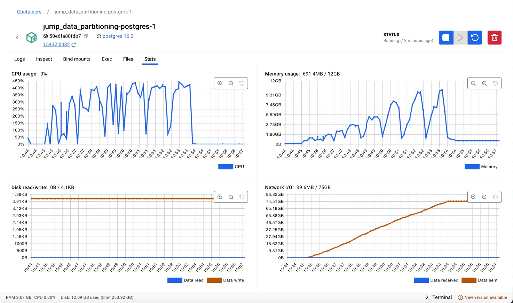

# 1 - Experimento 03 - Particionamento Híbrido (Intervalo + Lista)

## 1.1 - Estratégia de particionamento

O **Particionamento Híbrido** combina duas ou mais técnicas de particionamento de dados para aproveitar as vantagens de diferentes estratégias e mitigar suas limitações. Essa abordagem é utilizada em cenários onde um único tipo de particionamento não atende de forma eficiente os requisitos de desempenho e escalabilidade do sistema.

Essa técnica é especialmente útil em bancos de dados de grande escala, onde o acesso aos dados precisa ser otimizado para diferentes tipos de consultas e operações.

O particionamento híbrido geralmente combina:

* Particionamento por Intervalo (Range Partitioning) + Particionamento por Hash (Hash Partitioning)
* Particionamento por Lista (List Partitioning) + Particionamento por Intervalo (Range Partitioning)
* Outras combinações de estratégias, dependendo das necessidades do sistema

A idéia é dividir os dados em um primeiro nível usando uma estratégia mais abrangente (Intervalo ou Lista) e, dentro de cada partição, aplicar um segundo nível de particionamento para balancear a carga (Hash), por exemplo.

Neste experimento, estamos avaliando a combinação de particionamento por intervalo aplicada a coluna `anoPrimeiroMovimento` no primeiro nível, e o particionamento por lista aplicada a coluna `unidadeID` no segundo nível.

## 1.2 - Preparação

Nesta estapa, iremos preparar a base de dados para o particionamento das tabelas por intervalo.

> Premissa: Esta etapa já foi realizada no `Experimento 00`, caso necessário, repita os passos descritos na respectiva seção.

### 1.2.1 - Definição das técnicas de particionamento

As partições das tabelas de **processos**, **movimentos** e **complementos** serão criadas com dois níveis de particionamento, no primeiro nível será utilizada a técnica de **Particionamento por Intervalo (RANGE)** aplicada a coluna `anoPrimeiroMovimento`, que cria uma nova partição para cada ano. Já no segundo nível será utilizada a técnica de **Particionamento por Lista (LIST)** aplicada a coluna `unidadeID` nas partições do primeiro nível.

### 1.2.2 - Definição da quantidade de partições

Considerando que na base de dados os processos estão distribuídos em 13 anos e em 3 unidades judiciárias, utilizaremos no primeiro nível, 13 partições por intervalo, e no segundo nível 3 partições, sendo uma para cada unidade, no particionamento por lista. 

### 1.2.3 - Criação das tabelas com o Particionamento Híbrido (Intervalo + Lista)

Nesta etapa, iremos descrever os comandos necessários para criação das tabelas de **processos_exp03**, **movimentos_exp03** e **complementos_exp03** com o particionamento híbrido ativado. 

Como descrito anteriormente, iremos primeiramento particionar as tabelas por ano, utilizando a técnica de **Range Partitioning** aplicada a coluna `anoPrimeiroMovimento`. Em seguida, para cada tabela de partição por ano, utilizaremos a técnica de **List Partitioning** aplicada a coluna `unidadeID`, para que tenhamos a distribuição dos dados por ano e por unidade judiciária.

1. O comando abaixo cria as tabelas particionadas:

```sql

----------------------------------------
-- tabela particionada: processos_exp03
----------------------------------------

CREATE SEQUENCE IF NOT EXISTS public."processos_exp03_processoID_seq"
    INCREMENT 1
    START 1
    MINVALUE 1
    MAXVALUE 9223372036854775807
    CACHE 1;

ALTER SEQUENCE public."processos_exp03_processoID_seq"
    OWNER TO postgres;

CREATE TABLE IF NOT EXISTS public.processos_exp03
(
    "processoID" bigint NOT NULL DEFAULT nextval('"processos_exp03_processoID_seq"'::regclass),
    "NPU" character varying COLLATE pg_catalog."default" NOT NULL,
    liminar boolean,
    natureza character varying COLLATE pg_catalog."default",
    "valorCausa" character varying COLLATE pg_catalog."default",
    "nivelSigilo" character varying COLLATE pg_catalog."default",
    competencia character varying COLLATE pg_catalog."default",
    "situacaoMigracao" character varying COLLATE pg_catalog."default",
    "justicaGratuita" boolean,
    "dataAjuizamento" timestamp without time zone,
    assunto integer,
    classe integer,
    "ultimaAtualizacao" timestamp without time zone,
    "ultimoMovimento" bigint,
    "dataPrimeiroMovimento" timestamp without time zone,
    "dataUltimoMovimento" timestamp without time zone,
    "unidadeID" bigint NOT NULL,
    "anoPrimeiroMovimento" integer,
    CONSTRAINT processos_exp03_assunto_fkey FOREIGN KEY (assunto)
        REFERENCES public.assuntos (id) MATCH SIMPLE
        ON UPDATE NO ACTION
        ON DELETE NO ACTION,
    CONSTRAINT processos_exp03_classe_fkey FOREIGN KEY (classe)
        REFERENCES public.classes (id) MATCH SIMPLE
        ON UPDATE NO ACTION
        ON DELETE NO ACTION
) PARTITION BY RANGE ("anoPrimeiroMovimento");

ALTER TABLE IF EXISTS public.processos_exp03
    OWNER to postgres;

ALTER SEQUENCE public."processos_exp03_processoID_seq"
    OWNED BY public.processos_exp03."processoID";

-- partições de 1o nível da tabela: processos_exp03

CREATE TABLE processos_exp03_2013 PARTITION OF processos_exp03
FOR VALUES FROM (2013) TO (2014) PARTITION BY LIST ("unidadeID");
CREATE TABLE processos_exp03_2014 PARTITION OF processos_exp03
FOR VALUES FROM (2014) TO (2015) PARTITION BY LIST ("unidadeID");
CREATE TABLE processos_exp03_2015 PARTITION OF processos_exp03
FOR VALUES FROM (2015) TO (2016) PARTITION BY LIST ("unidadeID");
CREATE TABLE processos_exp03_2016 PARTITION OF processos_exp03
FOR VALUES FROM (2016) TO (2017) PARTITION BY LIST ("unidadeID");
CREATE TABLE processos_exp03_2017 PARTITION OF processos_exp03
FOR VALUES FROM (2017) TO (2018) PARTITION BY LIST ("unidadeID");
CREATE TABLE processos_exp03_2018 PARTITION OF processos_exp03
FOR VALUES FROM (2018) TO (2019) PARTITION BY LIST ("unidadeID");
CREATE TABLE processos_exp03_2019 PARTITION OF processos_exp03
FOR VALUES FROM (2019) TO (2020) PARTITION BY LIST ("unidadeID");
CREATE TABLE processos_exp03_2020 PARTITION OF processos_exp03
FOR VALUES FROM (2020) TO (2021) PARTITION BY LIST ("unidadeID");
CREATE TABLE processos_exp03_2021 PARTITION OF processos_exp03
FOR VALUES FROM (2021) TO (2022) PARTITION BY LIST ("unidadeID");
CREATE TABLE processos_exp03_2022 PARTITION OF processos_exp03
FOR VALUES FROM (2022) TO (2023) PARTITION BY LIST ("unidadeID");
CREATE TABLE processos_exp03_2023 PARTITION OF processos_exp03
FOR VALUES FROM (2023) TO (2024) PARTITION BY LIST ("unidadeID");
CREATE TABLE processos_exp03_2024 PARTITION OF processos_exp03
FOR VALUES FROM (2024) TO (2025) PARTITION BY LIST ("unidadeID");
CREATE TABLE processos_exp03_2025 PARTITION OF processos_exp03
FOR VALUES FROM (2025) TO (2026) PARTITION BY LIST ("unidadeID");

-- partições de 2o nível da tabela: processos_exp03

CREATE TABLE processos_exp03_2013_unid_18006 PARTITION OF processos_exp03_2013 FOR VALUES IN (18006);
CREATE TABLE processos_exp03_2013_unid_18007 PARTITION OF processos_exp03_2013 FOR VALUES IN (18007);
CREATE TABLE processos_exp03_2013_unid_18008 PARTITION OF processos_exp03_2013 FOR VALUES IN (18008);

CREATE TABLE processos_exp03_2014_unid_18006 PARTITION OF processos_exp03_2014 FOR VALUES IN (18006);
CREATE TABLE processos_exp03_2014_unid_18007 PARTITION OF processos_exp03_2014 FOR VALUES IN (18007);
CREATE TABLE processos_exp03_2014_unid_18008 PARTITION OF processos_exp03_2014 FOR VALUES IN (18008);

CREATE TABLE processos_exp03_2015_unid_18006 PARTITION OF processos_exp03_2015 FOR VALUES IN (18006);
CREATE TABLE processos_exp03_2015_unid_18007 PARTITION OF processos_exp03_2015 FOR VALUES IN (18007);
CREATE TABLE processos_exp03_2015_unid_18008 PARTITION OF processos_exp03_2015 FOR VALUES IN (18008);

CREATE TABLE processos_exp03_2016_unid_18006 PARTITION OF processos_exp03_2016 FOR VALUES IN (18006);
CREATE TABLE processos_exp03_2016_unid_18007 PARTITION OF processos_exp03_2016 FOR VALUES IN (18007);
CREATE TABLE processos_exp03_2016_unid_18008 PARTITION OF processos_exp03_2016 FOR VALUES IN (18008);

CREATE TABLE processos_exp03_2017_unid_18006 PARTITION OF processos_exp03_2017 FOR VALUES IN (18006);
CREATE TABLE processos_exp03_2017_unid_18007 PARTITION OF processos_exp03_2017 FOR VALUES IN (18007);
CREATE TABLE processos_exp03_2017_unid_18008 PARTITION OF processos_exp03_2017 FOR VALUES IN (18008);

CREATE TABLE processos_exp03_2018_unid_18006 PARTITION OF processos_exp03_2018 FOR VALUES IN (18006);
CREATE TABLE processos_exp03_2018_unid_18007 PARTITION OF processos_exp03_2018 FOR VALUES IN (18007);
CREATE TABLE processos_exp03_2018_unid_18008 PARTITION OF processos_exp03_2018 FOR VALUES IN (18008);

CREATE TABLE processos_exp03_2019_unid_18006 PARTITION OF processos_exp03_2019 FOR VALUES IN (18006);
CREATE TABLE processos_exp03_2019_unid_18007 PARTITION OF processos_exp03_2019 FOR VALUES IN (18007);
CREATE TABLE processos_exp03_2019_unid_18008 PARTITION OF processos_exp03_2019 FOR VALUES IN (18008);

CREATE TABLE processos_exp03_2020_unid_18006 PARTITION OF processos_exp03_2020 FOR VALUES IN (18006);
CREATE TABLE processos_exp03_2020_unid_18007 PARTITION OF processos_exp03_2020 FOR VALUES IN (18007);
CREATE TABLE processos_exp03_2020_unid_18008 PARTITION OF processos_exp03_2020 FOR VALUES IN (18008);

CREATE TABLE processos_exp03_2021_unid_18006 PARTITION OF processos_exp03_2021 FOR VALUES IN (18006);
CREATE TABLE processos_exp03_2021_unid_18007 PARTITION OF processos_exp03_2021 FOR VALUES IN (18007);
CREATE TABLE processos_exp03_2021_unid_18008 PARTITION OF processos_exp03_2021 FOR VALUES IN (18008);

CREATE TABLE processos_exp03_2022_unid_18006 PARTITION OF processos_exp03_2022 FOR VALUES IN (18006);
CREATE TABLE processos_exp03_2022_unid_18007 PARTITION OF processos_exp03_2022 FOR VALUES IN (18007);
CREATE TABLE processos_exp03_2022_unid_18008 PARTITION OF processos_exp03_2022 FOR VALUES IN (18008);

CREATE TABLE processos_exp03_2023_unid_18006 PARTITION OF processos_exp03_2023 FOR VALUES IN (18006);
CREATE TABLE processos_exp03_2023_unid_18007 PARTITION OF processos_exp03_2023 FOR VALUES IN (18007);
CREATE TABLE processos_exp03_2023_unid_18008 PARTITION OF processos_exp03_2023 FOR VALUES IN (18008);

CREATE TABLE processos_exp03_2024_unid_18006 PARTITION OF processos_exp03_2024 FOR VALUES IN (18006);
CREATE TABLE processos_exp03_2024_unid_18007 PARTITION OF processos_exp03_2024 FOR VALUES IN (18007);
CREATE TABLE processos_exp03_2024_unid_18008 PARTITION OF processos_exp03_2024 FOR VALUES IN (18008);

CREATE TABLE processos_exp03_2025_unid_18006 PARTITION OF processos_exp03_2025 FOR VALUES IN (18006);
CREATE TABLE processos_exp03_2025_unid_18007 PARTITION OF processos_exp03_2025 FOR VALUES IN (18007);
CREATE TABLE processos_exp03_2025_unid_18008 PARTITION OF processos_exp03_2025 FOR VALUES IN (18008);

-- índices da tabela: processos_exp03

CREATE INDEX processos_exp03_idx1 ON public.processos_exp03 ("anoPrimeiroMovimento", "unidadeID");
CREATE INDEX processos_exp03_idx2 ON public.processos_exp03 ("anoPrimeiroMovimento", "unidadeID", "processoID");
CREATE INDEX processos_exp03_idx3 ON public.processos_exp03 ("anoPrimeiroMovimento", "unidadeID", "assunto");
CREATE INDEX processos_exp03_idx4 ON public.processos_exp03 ("anoPrimeiroMovimento", "unidadeID", "classe");
CREATE INDEX processos_exp03_idx5 ON public.processos_exp03 ("anoPrimeiroMovimento", "unidadeID", "processoID", "classe", "assunto");
CREATE INDEX processos_exp03_idx6 ON public.processos_exp03 ("processoID", "anoPrimeiroMovimento", "unidadeID");


CREATE UNIQUE INDEX processos_exp03_unq1 ON public.processos_exp03 ("anoPrimeiroMovimento", "unidadeID", "processoID");


----------------------------------------
-- tabela particionada: movimentos_exp03
----------------------------------------

CREATE SEQUENCE IF NOT EXISTS public."movimentos_exp03_id_seq"
    INCREMENT 1
    START 1
    MINVALUE 1
    MAXVALUE 9223372036854775807
    CACHE 1;

ALTER SEQUENCE public."movimentos_exp03_id_seq"
    OWNER TO postgres;

CREATE TABLE IF NOT EXISTS public.movimentos_exp03
(
    id bigint NOT NULL DEFAULT nextval('movimentos_exp03_id_seq'::regclass),
    "processoID" bigint,
    "NPU" character varying COLLATE pg_catalog."default",
    activity character varying COLLATE pg_catalog."default" NOT NULL,
    duration bigint,
    "dataInicio" timestamp without time zone,
    "dataFinal" timestamp without time zone NOT NULL,
    "usuarioID" bigint,
    "documentoID" bigint,
    "movimentoID" bigint,
    "unidadeID" bigint NOT NULL,
    "anoPrimeiroMovimento" integer,
    CONSTRAINT "movimentos_exp03_movimentoID_fkey" FOREIGN KEY ("movimentoID")
        REFERENCES public.cod_movimentos (id) MATCH SIMPLE
        ON UPDATE NO ACTION
        ON DELETE NO ACTION,
    CONSTRAINT "movimentos_exp03_processoID_fkey" FOREIGN KEY ("anoPrimeiroMovimento", "unidadeID", "processoID")
        REFERENCES public.processos_exp03 ("anoPrimeiroMovimento", "unidadeID", "processoID") MATCH SIMPLE
        ON UPDATE CASCADE
        ON DELETE CASCADE
) PARTITION BY RANGE ("anoPrimeiroMovimento");

ALTER TABLE IF EXISTS public.movimentos_exp03
    OWNER to postgres;

ALTER SEQUENCE public."movimentos_exp03_id_seq"
    OWNED BY public.movimentos_exp03.id;

-- partições de 1o nível da tabela: movimentos_exp03

CREATE TABLE movimentos_exp03_2013 PARTITION OF movimentos_exp03
FOR VALUES FROM (2013) TO (2014) PARTITION BY LIST ("unidadeID");
CREATE TABLE movimentos_exp03_2014 PARTITION OF movimentos_exp03
FOR VALUES FROM (2014) TO (2015) PARTITION BY LIST ("unidadeID");
CREATE TABLE movimentos_exp03_2015 PARTITION OF movimentos_exp03
FOR VALUES FROM (2015) TO (2016) PARTITION BY LIST ("unidadeID");
CREATE TABLE movimentos_exp03_2016 PARTITION OF movimentos_exp03
FOR VALUES FROM (2016) TO (2017) PARTITION BY LIST ("unidadeID");
CREATE TABLE movimentos_exp03_2017 PARTITION OF movimentos_exp03
FOR VALUES FROM (2017) TO (2018) PARTITION BY LIST ("unidadeID");
CREATE TABLE movimentos_exp03_2018 PARTITION OF movimentos_exp03
FOR VALUES FROM (2018) TO (2019) PARTITION BY LIST ("unidadeID");
CREATE TABLE movimentos_exp03_2019 PARTITION OF movimentos_exp03
FOR VALUES FROM (2019) TO (2020) PARTITION BY LIST ("unidadeID");
CREATE TABLE movimentos_exp03_2020 PARTITION OF movimentos_exp03
FOR VALUES FROM (2020) TO (2021) PARTITION BY LIST ("unidadeID");
CREATE TABLE movimentos_exp03_2021 PARTITION OF movimentos_exp03
FOR VALUES FROM (2021) TO (2022) PARTITION BY LIST ("unidadeID");
CREATE TABLE movimentos_exp03_2022 PARTITION OF movimentos_exp03
FOR VALUES FROM (2022) TO (2023) PARTITION BY LIST ("unidadeID");
CREATE TABLE movimentos_exp03_2023 PARTITION OF movimentos_exp03
FOR VALUES FROM (2023) TO (2024) PARTITION BY LIST ("unidadeID");
CREATE TABLE movimentos_exp03_2024 PARTITION OF movimentos_exp03
FOR VALUES FROM (2024) TO (2025) PARTITION BY LIST ("unidadeID");
CREATE TABLE movimentos_exp03_2025 PARTITION OF movimentos_exp03
FOR VALUES FROM (2025) TO (2026) PARTITION BY LIST ("unidadeID");

-- partições de 2o nível da tabela: movimentos_exp03

CREATE TABLE movimentos_exp03_2013_unid_18006 PARTITION OF movimentos_exp03_2013 FOR VALUES IN (18006);
CREATE TABLE movimentos_exp03_2013_unid_18007 PARTITION OF movimentos_exp03_2013 FOR VALUES IN (18007);
CREATE TABLE movimentos_exp03_2013_unid_18008 PARTITION OF movimentos_exp03_2013 FOR VALUES IN (18008);

CREATE TABLE movimentos_exp03_2014_unid_18006 PARTITION OF movimentos_exp03_2014 FOR VALUES IN (18006);
CREATE TABLE movimentos_exp03_2014_unid_18007 PARTITION OF movimentos_exp03_2014 FOR VALUES IN (18007);
CREATE TABLE movimentos_exp03_2014_unid_18008 PARTITION OF movimentos_exp03_2014 FOR VALUES IN (18008);

CREATE TABLE movimentos_exp03_2015_unid_18006 PARTITION OF movimentos_exp03_2015 FOR VALUES IN (18006);
CREATE TABLE movimentos_exp03_2015_unid_18007 PARTITION OF movimentos_exp03_2015 FOR VALUES IN (18007);
CREATE TABLE movimentos_exp03_2015_unid_18008 PARTITION OF movimentos_exp03_2015 FOR VALUES IN (18008);

CREATE TABLE movimentos_exp03_2016_unid_18006 PARTITION OF movimentos_exp03_2016 FOR VALUES IN (18006);
CREATE TABLE movimentos_exp03_2016_unid_18007 PARTITION OF movimentos_exp03_2016 FOR VALUES IN (18007);
CREATE TABLE movimentos_exp03_2016_unid_18008 PARTITION OF movimentos_exp03_2016 FOR VALUES IN (18008);

CREATE TABLE movimentos_exp03_2017_unid_18006 PARTITION OF movimentos_exp03_2017 FOR VALUES IN (18006);
CREATE TABLE movimentos_exp03_2017_unid_18007 PARTITION OF movimentos_exp03_2017 FOR VALUES IN (18007);
CREATE TABLE movimentos_exp03_2017_unid_18008 PARTITION OF movimentos_exp03_2017 FOR VALUES IN (18008);

CREATE TABLE movimentos_exp03_2018_unid_18006 PARTITION OF movimentos_exp03_2018 FOR VALUES IN (18006);
CREATE TABLE movimentos_exp03_2018_unid_18007 PARTITION OF movimentos_exp03_2018 FOR VALUES IN (18007);
CREATE TABLE movimentos_exp03_2018_unid_18008 PARTITION OF movimentos_exp03_2018 FOR VALUES IN (18008);

CREATE TABLE movimentos_exp03_2019_unid_18006 PARTITION OF movimentos_exp03_2019 FOR VALUES IN (18006);
CREATE TABLE movimentos_exp03_2019_unid_18007 PARTITION OF movimentos_exp03_2019 FOR VALUES IN (18007);
CREATE TABLE movimentos_exp03_2019_unid_18008 PARTITION OF movimentos_exp03_2019 FOR VALUES IN (18008);

CREATE TABLE movimentos_exp03_2020_unid_18006 PARTITION OF movimentos_exp03_2020 FOR VALUES IN (18006);
CREATE TABLE movimentos_exp03_2020_unid_18007 PARTITION OF movimentos_exp03_2020 FOR VALUES IN (18007);
CREATE TABLE movimentos_exp03_2020_unid_18008 PARTITION OF movimentos_exp03_2020 FOR VALUES IN (18008);

CREATE TABLE movimentos_exp03_2021_unid_18006 PARTITION OF movimentos_exp03_2021 FOR VALUES IN (18006);
CREATE TABLE movimentos_exp03_2021_unid_18007 PARTITION OF movimentos_exp03_2021 FOR VALUES IN (18007);
CREATE TABLE movimentos_exp03_2021_unid_18008 PARTITION OF movimentos_exp03_2021 FOR VALUES IN (18008);

CREATE TABLE movimentos_exp03_2022_unid_18006 PARTITION OF movimentos_exp03_2022 FOR VALUES IN (18006);
CREATE TABLE movimentos_exp03_2022_unid_18007 PARTITION OF movimentos_exp03_2022 FOR VALUES IN (18007);
CREATE TABLE movimentos_exp03_2022_unid_18008 PARTITION OF movimentos_exp03_2022 FOR VALUES IN (18008);

CREATE TABLE movimentos_exp03_2023_unid_18006 PARTITION OF movimentos_exp03_2023 FOR VALUES IN (18006);
CREATE TABLE movimentos_exp03_2023_unid_18007 PARTITION OF movimentos_exp03_2023 FOR VALUES IN (18007);
CREATE TABLE movimentos_exp03_2023_unid_18008 PARTITION OF movimentos_exp03_2023 FOR VALUES IN (18008);

CREATE TABLE movimentos_exp03_2024_unid_18006 PARTITION OF movimentos_exp03_2024 FOR VALUES IN (18006);
CREATE TABLE movimentos_exp03_2024_unid_18007 PARTITION OF movimentos_exp03_2024 FOR VALUES IN (18007);
CREATE TABLE movimentos_exp03_2024_unid_18008 PARTITION OF movimentos_exp03_2024 FOR VALUES IN (18008);

CREATE TABLE movimentos_exp03_2025_unid_18006 PARTITION OF movimentos_exp03_2025 FOR VALUES IN (18006);
CREATE TABLE movimentos_exp03_2025_unid_18007 PARTITION OF movimentos_exp03_2025 FOR VALUES IN (18007);
CREATE TABLE movimentos_exp03_2025_unid_18008 PARTITION OF movimentos_exp03_2025 FOR VALUES IN (18008);

-- índices da tabela: movimentos_exp03

CREATE INDEX movimentos_exp03_idx1 ON public.movimentos_exp03 ("anoPrimeiroMovimento", "unidadeID");
CREATE INDEX movimentos_exp03_idx2 ON public.movimentos_exp03 ("anoPrimeiroMovimento", "unidadeID", "id");
CREATE INDEX movimentos_exp03_idx3 ON public.movimentos_exp03 ("anoPrimeiroMovimento", "unidadeID", "processoID");
CREATE INDEX movimentos_exp03_idx4 ON public.movimentos_exp03 ("anoPrimeiroMovimento", "unidadeID", "documentoID");
CREATE INDEX movimentos_exp03_idx5 ON public.movimentos_exp03 ("anoPrimeiroMovimento", "unidadeID", "processoID", "id", "dataFinal");

CREATE INDEX movimentos_exp03_idx6 ON public.movimentos_exp03 ("processoID", "unidadeID", "dataFinal") INCLUDE (activity, duration, "movimentoID");
CREATE INDEX movimentos_exp03_idx7 ON public.movimentos_exp03 ("unidadeID", "anoPrimeiroMovimento", "processoID") INCLUDE (activity, duration, "movimentoID");
CREATE INDEX movimentos_exp03_idx8 ON public.movimentos_exp03 ("processoID", "anoPrimeiroMovimento", "unidadeID");
CREATE INDEX movimentos_exp03_idx9 ON public.movimentos_exp03 ("unidadeID", "anoPrimeiroMovimento", "processoID", "dataFinal");
CREATE INDEX movimentos_exp03_idx10 ON public.movimentos_exp03 ("processoID", "dataFinal");


CREATE UNIQUE INDEX movimentos_exp03_unq1 ON public.movimentos_exp03 ("anoPrimeiroMovimento", "unidadeID", "id");


----------------------------------------
-- tabela particionada: complementos_exp03
----------------------------------------

CREATE SEQUENCE IF NOT EXISTS public."complementos_exp03_complementoID_seq"
    INCREMENT 1
    START 1
    MINVALUE 1
    MAXVALUE 9223372036854775807
    CACHE 1;

ALTER SEQUENCE public."complementos_exp03_complementoID_seq"
    OWNER TO postgres;

CREATE TABLE IF NOT EXISTS public.complementos_exp03
(
    "complementoID" bigint NOT NULL DEFAULT nextval('"complementos_exp03_complementoID_seq"'::regclass),
    "movimentoID" bigint,
    tipo character varying COLLATE pg_catalog."default" NOT NULL,
    descricao character varying COLLATE pg_catalog."default" NOT NULL,
    "unidadeID" bigint NOT NULL,
    "anoPrimeiroMovimento" integer,
    CONSTRAINT "complementos_exp03_movimentoID_fkey" FOREIGN KEY ("anoPrimeiroMovimento", "unidadeID", "movimentoID")
        REFERENCES public.movimentos_exp03 ("anoPrimeiroMovimento", "unidadeID", "id") MATCH SIMPLE
        ON UPDATE CASCADE
        ON DELETE CASCADE
) PARTITION BY RANGE ("anoPrimeiroMovimento");

ALTER TABLE IF EXISTS public.complementos_exp03
    OWNER to postgres;

ALTER SEQUENCE public."complementos_exp03_complementoID_seq"
    OWNED BY public.complementos_exp03."complementoID";

-- partições de 1o nível da tabela: complementos_exp03

CREATE TABLE complementos_exp03_2013 PARTITION OF complementos_exp03
FOR VALUES FROM (2013) TO (2014) PARTITION BY LIST ("unidadeID");
CREATE TABLE complementos_exp03_2014 PARTITION OF complementos_exp03
FOR VALUES FROM (2014) TO (2015) PARTITION BY LIST ("unidadeID");
CREATE TABLE complementos_exp03_2015 PARTITION OF complementos_exp03
FOR VALUES FROM (2015) TO (2016) PARTITION BY LIST ("unidadeID");
CREATE TABLE complementos_exp03_2016 PARTITION OF complementos_exp03
FOR VALUES FROM (2016) TO (2017) PARTITION BY LIST ("unidadeID");
CREATE TABLE complementos_exp03_2017 PARTITION OF complementos_exp03
FOR VALUES FROM (2017) TO (2018) PARTITION BY LIST ("unidadeID");
CREATE TABLE complementos_exp03_2018 PARTITION OF complementos_exp03
FOR VALUES FROM (2018) TO (2019) PARTITION BY LIST ("unidadeID");
CREATE TABLE complementos_exp03_2019 PARTITION OF complementos_exp03
FOR VALUES FROM (2019) TO (2020) PARTITION BY LIST ("unidadeID");
CREATE TABLE complementos_exp03_2020 PARTITION OF complementos_exp03
FOR VALUES FROM (2020) TO (2021) PARTITION BY LIST ("unidadeID");
CREATE TABLE complementos_exp03_2021 PARTITION OF complementos_exp03
FOR VALUES FROM (2021) TO (2022) PARTITION BY LIST ("unidadeID");
CREATE TABLE complementos_exp03_2022 PARTITION OF complementos_exp03
FOR VALUES FROM (2022) TO (2023) PARTITION BY LIST ("unidadeID");
CREATE TABLE complementos_exp03_2023 PARTITION OF complementos_exp03
FOR VALUES FROM (2023) TO (2024) PARTITION BY LIST ("unidadeID");
CREATE TABLE complementos_exp03_2024 PARTITION OF complementos_exp03
FOR VALUES FROM (2024) TO (2025) PARTITION BY LIST ("unidadeID");
CREATE TABLE complementos_exp03_2025 PARTITION OF complementos_exp03
FOR VALUES FROM (2025) TO (2026) PARTITION BY LIST ("unidadeID");

-- partições de 2o nível da tabela: complementos_exp03

CREATE TABLE complementos_exp03_2013_unid_18006 PARTITION OF complementos_exp03_2013 FOR VALUES IN (18006);
CREATE TABLE complementos_exp03_2013_unid_18007 PARTITION OF complementos_exp03_2013 FOR VALUES IN (18007);
CREATE TABLE complementos_exp03_2013_unid_18008 PARTITION OF complementos_exp03_2013 FOR VALUES IN (18008);

CREATE TABLE complementos_exp03_2014_unid_18006 PARTITION OF complementos_exp03_2014 FOR VALUES IN (18006);
CREATE TABLE complementos_exp03_2014_unid_18007 PARTITION OF complementos_exp03_2014 FOR VALUES IN (18007);
CREATE TABLE complementos_exp03_2014_unid_18008 PARTITION OF complementos_exp03_2014 FOR VALUES IN (18008);

CREATE TABLE complementos_exp03_2015_unid_18006 PARTITION OF complementos_exp03_2015 FOR VALUES IN (18006);
CREATE TABLE complementos_exp03_2015_unid_18007 PARTITION OF complementos_exp03_2015 FOR VALUES IN (18007);
CREATE TABLE complementos_exp03_2015_unid_18008 PARTITION OF complementos_exp03_2015 FOR VALUES IN (18008);

CREATE TABLE complementos_exp03_2016_unid_18006 PARTITION OF complementos_exp03_2016 FOR VALUES IN (18006);
CREATE TABLE complementos_exp03_2016_unid_18007 PARTITION OF complementos_exp03_2016 FOR VALUES IN (18007);
CREATE TABLE complementos_exp03_2016_unid_18008 PARTITION OF complementos_exp03_2016 FOR VALUES IN (18008);

CREATE TABLE complementos_exp03_2017_unid_18006 PARTITION OF complementos_exp03_2017 FOR VALUES IN (18006);
CREATE TABLE complementos_exp03_2017_unid_18007 PARTITION OF complementos_exp03_2017 FOR VALUES IN (18007);
CREATE TABLE complementos_exp03_2017_unid_18008 PARTITION OF complementos_exp03_2017 FOR VALUES IN (18008);

CREATE TABLE complementos_exp03_2018_unid_18006 PARTITION OF complementos_exp03_2018 FOR VALUES IN (18006);
CREATE TABLE complementos_exp03_2018_unid_18007 PARTITION OF complementos_exp03_2018 FOR VALUES IN (18007);
CREATE TABLE complementos_exp03_2018_unid_18008 PARTITION OF complementos_exp03_2018 FOR VALUES IN (18008);

CREATE TABLE complementos_exp03_2019_unid_18006 PARTITION OF complementos_exp03_2019 FOR VALUES IN (18006);
CREATE TABLE complementos_exp03_2019_unid_18007 PARTITION OF complementos_exp03_2019 FOR VALUES IN (18007);
CREATE TABLE complementos_exp03_2019_unid_18008 PARTITION OF complementos_exp03_2019 FOR VALUES IN (18008);

CREATE TABLE complementos_exp03_2020_unid_18006 PARTITION OF complementos_exp03_2020 FOR VALUES IN (18006);
CREATE TABLE complementos_exp03_2020_unid_18007 PARTITION OF complementos_exp03_2020 FOR VALUES IN (18007);
CREATE TABLE complementos_exp03_2020_unid_18008 PARTITION OF complementos_exp03_2020 FOR VALUES IN (18008);

CREATE TABLE complementos_exp03_2021_unid_18006 PARTITION OF complementos_exp03_2021 FOR VALUES IN (18006);
CREATE TABLE complementos_exp03_2021_unid_18007 PARTITION OF complementos_exp03_2021 FOR VALUES IN (18007);
CREATE TABLE complementos_exp03_2021_unid_18008 PARTITION OF complementos_exp03_2021 FOR VALUES IN (18008);

CREATE TABLE complementos_exp03_2022_unid_18006 PARTITION OF complementos_exp03_2022 FOR VALUES IN (18006);
CREATE TABLE complementos_exp03_2022_unid_18007 PARTITION OF complementos_exp03_2022 FOR VALUES IN (18007);
CREATE TABLE complementos_exp03_2022_unid_18008 PARTITION OF complementos_exp03_2022 FOR VALUES IN (18008);

CREATE TABLE complementos_exp03_2023_unid_18006 PARTITION OF complementos_exp03_2023 FOR VALUES IN (18006);
CREATE TABLE complementos_exp03_2023_unid_18007 PARTITION OF complementos_exp03_2023 FOR VALUES IN (18007);
CREATE TABLE complementos_exp03_2023_unid_18008 PARTITION OF complementos_exp03_2023 FOR VALUES IN (18008);

CREATE TABLE complementos_exp03_2024_unid_18006 PARTITION OF complementos_exp03_2024 FOR VALUES IN (18006);
CREATE TABLE complementos_exp03_2024_unid_18007 PARTITION OF complementos_exp03_2024 FOR VALUES IN (18007);
CREATE TABLE complementos_exp03_2024_unid_18008 PARTITION OF complementos_exp03_2024 FOR VALUES IN (18008);

CREATE TABLE complementos_exp03_2025_unid_18006 PARTITION OF complementos_exp03_2025 FOR VALUES IN (18006);
CREATE TABLE complementos_exp03_2025_unid_18007 PARTITION OF complementos_exp03_2025 FOR VALUES IN (18007);
CREATE TABLE complementos_exp03_2025_unid_18008 PARTITION OF complementos_exp03_2025 FOR VALUES IN (18008);

-- índices da tabela: complementos_exp03

CREATE INDEX complementos_exp03_idx1 ON public.complementos_exp03 ("anoPrimeiroMovimento", "unidadeID");
CREATE INDEX complementos_exp03_idx2 ON public.complementos_exp03 ("anoPrimeiroMovimento", "unidadeID", "complementoID");
CREATE INDEX complementos_exp03_idx3 ON public.complementos_exp03 ("anoPrimeiroMovimento", "unidadeID", "movimentoID") INCLUDE (descricao);
CREATE INDEX complementos_exp03_idx4 ON public.complementos_exp03 ("anoPrimeiroMovimento", "unidadeID", "movimentoID");


CREATE UNIQUE INDEX complementos_exp03_unq1 ON public.complementos_exp03 ("anoPrimeiroMovimento", "unidadeID", "complementoID");

```

### 1.2.3 - Migração de dados

Nessa estapa realizaremos a migração dos dados existentes nas tabelas de origem (não particionadas), para as novas tabelas com particionamento.

> Atenção: Foi necessário aplicar o filtro `"dataPrimeiroMovimento" IS NOT NULL` pois existem registros onde o campo utilizado para particionamento é nulo.

```sql

-- processos_exp03

INSERT INTO public.processos_exp03
SELECT *, EXTRACT(YEAR FROM "dataPrimeiroMovimento") AS "anoPrimeiroMovimento"
	FROM public.processos_18006 WHERE "dataPrimeiroMovimento" IS NOT NULL;

INSERT INTO public.processos_exp03
SELECT *, EXTRACT(YEAR FROM "dataPrimeiroMovimento") AS "anoPrimeiroMovimento"
	FROM public.processos_18007 WHERE "dataPrimeiroMovimento" IS NOT NULL;

INSERT INTO public.processos_exp03
SELECT *, EXTRACT(YEAR FROM "dataPrimeiroMovimento") AS "anoPrimeiroMovimento"
	FROM public.processos_18008 WHERE "dataPrimeiroMovimento" IS NOT NULL;

-- movimentos_exp03

INSERT INTO public.movimentos_exp03
SELECT m.*, EXTRACT(YEAR FROM p."dataPrimeiroMovimento") AS "anoPrimeiroMovimento"
	FROM public.movimentos_18006 m
	INNER JOIN public.processos_18006 p ON p."processoID" = m."processoID";

INSERT INTO public.movimentos_exp03
SELECT m.*, EXTRACT(YEAR FROM p."dataPrimeiroMovimento") AS "anoPrimeiroMovimento"
	FROM public.movimentos_18007 m
	INNER JOIN public.processos_18007 p ON p."processoID" = m."processoID";

INSERT INTO public.movimentos_exp03
SELECT m.*, EXTRACT(YEAR FROM p."dataPrimeiroMovimento") AS "anoPrimeiroMovimento"
	FROM public.movimentos_18008 m
	INNER JOIN public.processos_18008 p ON p."processoID" = m."processoID";

-- complementos_exp03

INSERT INTO public.complementos_exp03
SELECT c.*, m."anoPrimeiroMovimento"
	FROM public.complementos_18006 c
	INNER JOIN public.movimentos_exp03 m ON
		m."unidadeID" = c."unidadeID" AND m.id = c."movimentoID";

INSERT INTO public.complementos_exp03
SELECT c.*, m."anoPrimeiroMovimento"
	FROM public.complementos_18007 c
	INNER JOIN public.movimentos_exp03 m ON
		m."unidadeID" = c."unidadeID" AND m.id = c."movimentoID";

INSERT INTO public.complementos_exp03
SELECT c.*, m."anoPrimeiroMovimento"
	FROM public.complementos_18008 c
	INNER JOIN public.movimentos_exp03 m ON
		m."unidadeID" = c."unidadeID" AND m.id = c."movimentoID";

VACUUM ANALYZE complementos_exp03;
VACUUM ANALYZE movimentos_exp03;
VACUUM ANALYZE processos_exp03;

```

## 1.3 - Consulta SQL de referência

Neste experimento a query de referência foi ajustada para utilizar as tabelas com o respectivo particionamento.

Abaixo está a consulta SQL utilizada:

```sql
SELECT
    p."NPU", 
    p."processoID", 
    p."ultimaAtualizacao",
    c.descricao AS classe, 
    a.descricao AS assunto,
    m.activity, 
    m."dataInicio", 
    m."dataFinal", 
    m."usuarioID",
    m.duration, 
    m."movimentoID", 
    com.descricao AS complemento,
    s."nomeServidor", 
    s."tipoServidor", 
    d.tipo AS documento
FROM 
    processos_exp03 AS p
INNER JOIN
    movimentos_exp03 AS m 
    ON 
	m."unidadeID" = p."unidadeID"
	AND m."anoPrimeiroMovimento" >= p."anoPrimeiroMovimento"
	AND m."processoID" = p."processoID"
INNER JOIN
    classes AS c ON p.classe = c.id
LEFT JOIN
    assuntos AS a ON p.assunto = a.id
LEFT JOIN
    complementos_exp03 AS com 
    ON 
	com."unidadeID" = m."unidadeID" 
	AND com."anoPrimeiroMovimento" >= p."anoPrimeiroMovimento"
	AND com."movimentoID" = m."id" 
LEFT JOIN
    servidores AS s ON s."servidorID" = m."usuarioID"
LEFT JOIN
    documentos AS d ON d."id" = m."documentoID"
WHERE 
    p."unidadeID" = 18006 AND p."anoPrimeiroMovimento" >= 2020
	AND m."unidadeID" = 18006 AND m."anoPrimeiroMovimento" >= 2020
	AND com."unidadeID" = 18006 AND com."anoPrimeiroMovimento" >= 2020
ORDER BY 
    p."processoID", m."dataFinal";
```

## 1.4 - Métricas avaliadas e resultados

A imagem abaixo apresentamos os gráficos da utilização de recursos durante a execução deste experimento. 

Estes gráficos foram coletados a partir do Docker dashboard para o container de execução do banco de dados PostgreSQL.



A tabela abaixo apresenta os resultados consolidados das métricas coletadas durante a execução deste experimento.


> Podemos perceber que a partir do cenário de testes com 55 usuários simultâneos, o banco de dados passou falhar **24,65%** das consultas realizadas.

### 1.4.1 - Tempo de Resposta

A tebela também apresenta as durações da execução em: Menor duração, Maior duração e Duração média, para cada cenário do teste.

Tempo médio no cenário com maior número de usuários e sem falhas: **14004,83 ms**.

### 1.4.2 - Escalabilidade

De acordo com a tabela podemos perceber que e a arquitetura atual permitiu escalar até o cenário com 34 usuários simultâneos, e a partir do cenário com 55 usuários, o banco de dados passou falhar **24,65%** das consultas realizadas.

### 1.4.3 - Equilíbrio de Carga

A carga de execução foi distribuída de forma equilibrada, uma vez que todas as unidades possuem exatamente a mesma quantidade de registros em suas respectivas tabelas.

### 1.4.4 - Taxa de Transferência de Dados

Foi executado o seguinte comando recuperar o plano de execução da query, com as informações sobre a execução.

```sql
EXPLAIN ANALYSE
SELECT
    p."NPU", 
    p."processoID", 
    p."ultimaAtualizacao",
    c.descricao AS classe, 
    a.descricao AS assunto,
    m.activity, 
    m."dataInicio", 
    m."dataFinal", 
    m."usuarioID",
    m.duration, 
    m."movimentoID", 
    com.descricao AS complemento,
    s."nomeServidor", 
    s."tipoServidor", 
    d.tipo AS documento
FROM 
    processos_exp03 AS p
INNER JOIN
    movimentos_exp03 AS m 
    ON 
	m."anoPrimeiroMovimento" = p."anoPrimeiroMovimento"
	AND m."unidadeID" = p."unidadeID"
	AND m."processoID" = p."processoID"
INNER JOIN
    classes AS c ON p.classe = c.id
LEFT JOIN
    assuntos AS a ON p.assunto = a.id
LEFT JOIN
    complementos_exp03 AS com 
    ON 
	com."anoPrimeiroMovimento" = p."anoPrimeiroMovimento"
	AND com."unidadeID" = m."unidadeID" 
	AND com."movimentoID" = m."id" 
LEFT JOIN
    servidores AS s ON s."servidorID" = m."usuarioID"
LEFT JOIN
    documentos AS d ON d."id" = m."documentoID"
WHERE 
    p."anoPrimeiroMovimento" >= 2020 AND p."unidadeID" = 18006 
	AND m."anoPrimeiroMovimento" >= 2020 AND m."unidadeID" = 18006
	AND com."anoPrimeiroMovimento" >= 2020 AND com."unidadeID" = 18006
ORDER BY 
    p."processoID", m."dataFinal";
```

- Taxa: **353.945** registros / **0,603** segundos = **586.973,46** registros por segundo.

### 1.4.5 - Custo de Redistribuição

Nessa abordagem, o custo de redistribuição é baixo para os cenários de novos anos e novas unidades, uma vez que só precisam ser criadas as novas partições na eminência de novos registros para anos e unidades que ainda não estejam particionados.

### 1.4.6 - Eficiência de Consultas

A eficiência pode ser expressa como uma relação entre o tempo de execução, tempo ideal e o número de partições acessadas:

#### Fórmula:


```plaintext
Eficiência (%) = (P_Acessadas / P_Total) * (1 - (T_Query / T_Ideal)) * 100
```

Onde:
- P_Acessadas: Quantidade de partições acessadas.
- P_Total: Total de partições disponíveis.
- T_Query: Tempo total de execução da query (Execution Time no EXPLAIN ANALYZE).
- T_Ideal: Tempo esperado para a melhor execução possível (vamos estabelecer como ideal o tempo de execução limite de **3 segundos**).

Sendo assim, temos:

- P_Acessadas: **18**
- P_Total: **39**
- T_Query: **0,603 segundos**
- T_Ideal: **3 segundos** 

> Eficiência (%) =  (18 / 39) * (1 - (0,603 / 3)) * 100 =>  **36,87%**

Constatamos que nessa estratégia a consulta obteve uma eficiencia **42,2%** maior que a situação atual.

## 1.5 - Considerações

> **Vantagens**  

1️⃣ **Eficiência em Consultas por Ano**  
- Como a primeira partição é por **ano**, qualquer consulta que utilize `anoPrimeiroMovimento` pode fazer *partition pruning*, reduzindo o escopo de busca.  
- **Impacto:** Acessa apenas os dados necessários, melhorando o desempenho das queries históricas.  

2️⃣ **Facilidade na Manutenção e Arquivamento**  
- O modelo de **particionamento por ano** permite uma fácil rotação dos dados antigos, simplificando arquivamento e exclusão de registros.  
- **Impacto:** Reduz custos operacionais e melhora a eficiência do banco ao longo do tempo.  

3️⃣ **Otimização de Consultas por Unidade**  
- Dentro de cada ano, o particionamento por **Lista** segmenta os dados por `unidadeID`, permitindo que consultas direcionadas a uma única unidade evitem acessar dados desnecessários.  
- **Impacto:** Queries filtradas por ano e unidade são extremamente eficientes.  

4️⃣ **Simplicidade na Definição das Partições**  
- O número de subpartições (`unidadeID`) é fixo e conhecido, garantindo uma organização previsível dos dados.  
- **Impacto:** Facilita o gerenciamento do banco de dados em comparação ao **Hash Partitioning**, que pode gerar partições desbalanceadas.  

5️⃣ **Redução de Contenção de Locks**  
- Cada unidade tem sua própria subpartição, permitindo concorrência paralela eficiente.  
- **Impacto:** Melhor desempenho para transações simultâneas em diferentes unidades judiciárias.  

---

> **Desvantagens**  

1️⃣ **Dificuldade para Consultas Sem `anoPrimeiroMovimento`**  
- Se uma query não incluir um filtro por ano, todas as partições serão escaneadas.  
- **Impacto:** Perda de eficiência para buscas que dependem apenas de `unidadeID`.  

2️⃣ **Crescimento Rápido do Número de Partições**  
- Como cada ano tem 3 subpartições (uma por unidade), o total de partições cresce linearmente ao longo do tempo.  
- **Impacto:** Pode gerar dificuldades no gerenciamento e overhead no *query planner* se não for bem projetado.  

3️⃣ **Possível Desbalanceamento de Dados**  
- Se algumas unidades tiverem muito mais processos do que outras, certas partições podem ficar **desproporcionalmente grandes**, reduzindo a eficiência do modelo.  
- **Impacto:** Pode exigir reavaliação da estratégia de particionamento ao longo do tempo.  

4️⃣ **Menor Flexibilidade para Novas Unidades**  
- Se uma nova unidade judiciária for criada, é necessário **alterar a estrutura das partições** para incluí-la.  
- **Impacto:** A inserção de novas unidades pode exigir **redesign do particionamento** e migração de dados.  

5️⃣ **Custos de Manutenção de Índices**  
- Cada partição tem seus próprios índices, aumentando a complexidade na **atualização e manutenção** dos índices globais.  
- **Impacto:** Pode tornar operações como REINDEX mais demoradas em bases de dados muito grandes.  

---

> **Conclusão**  

O particionamento híbrido **(Intervalo + Lista)** é uma ótima estratégia para **consultas que segmentam por ano e unidade**, garantindo eficiência em acessos históricos e simplificação da administração dos dados. No entanto, exige planejamento para **controlar o crescimento das partições** e prever impactos caso novas unidades sejam adicionadas no futuro.  

**💡 Recomendações para otimização:**  
✔ **Monitorar o volume de dados por unidade** para evitar desbalanceamento.  
✔ **Reavaliar a estrutura anualmente** para decidir se novas partições devem ser criadas.  
✔ **Garantir que todas as consultas utilizem `anoPrimeiroMovimento`** para maximizar *partition pruning*.  
✔ **Automatizar a criação de partições futuras** para reduzir o esforço manual de administração.