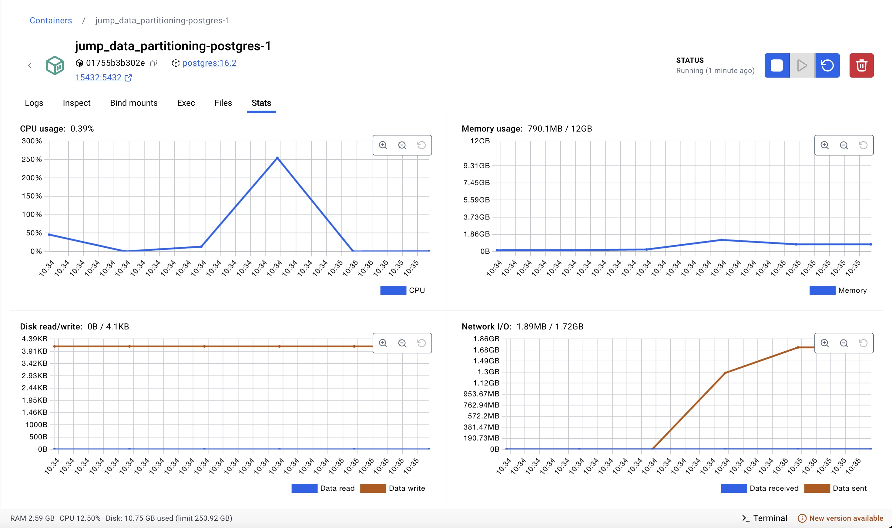
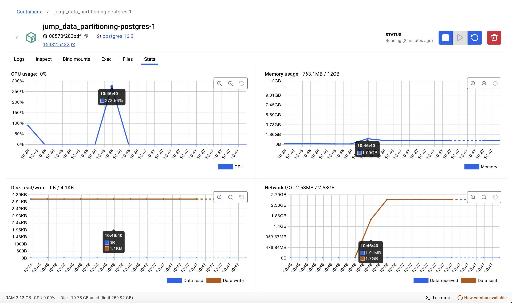
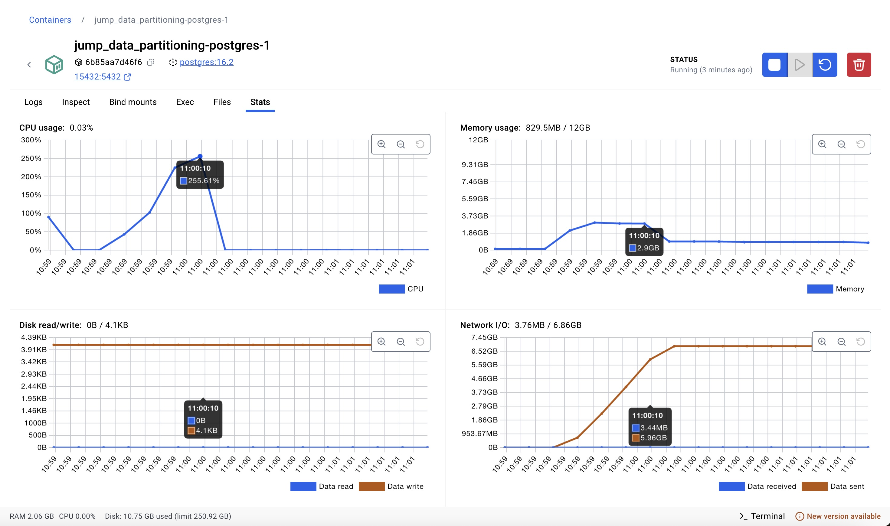
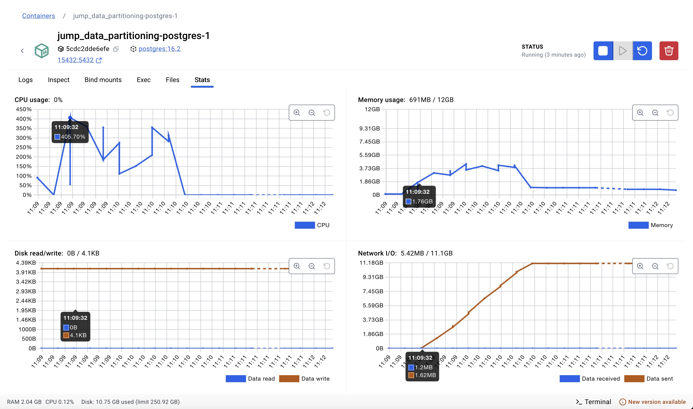
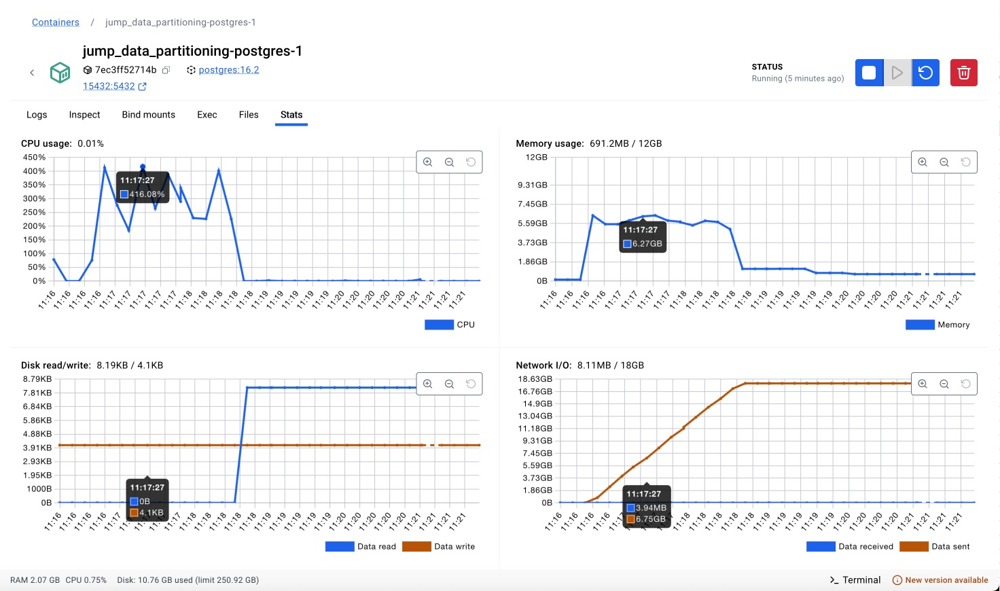
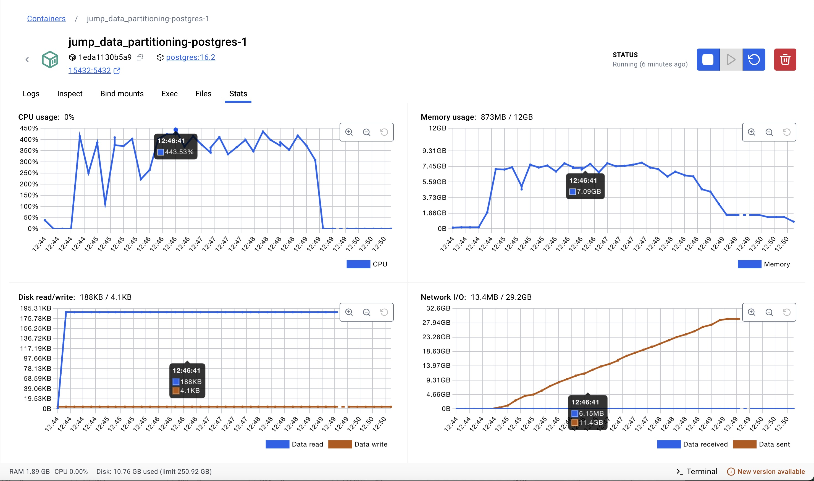
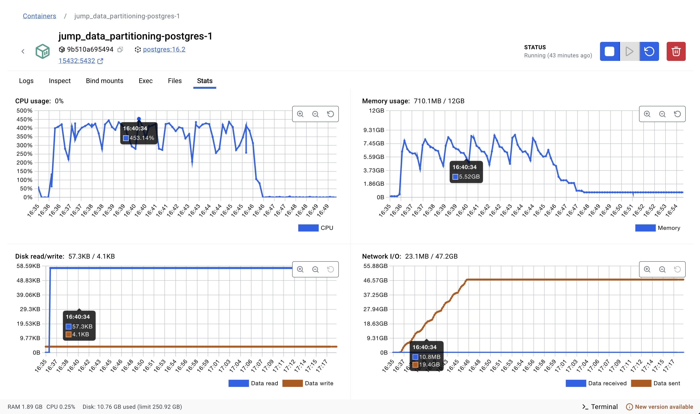

# 1 - Experimento 03 - Particionamento Híbrido

O **Particionamento Híbrido** combina duas ou mais técnicas de particionamento de dados para aproveitar as vantagens de diferentes estratégias e mitigar suas limitações. Essa abordagem é utilizada em cenários onde um único tipo de particionamento não atende de forma eficiente os requisitos de desempenho e escalabilidade do sistema.

Essa técnica é especialmente útil em bancos de dados de grande escala, onde o acesso aos dados precisa ser otimizado para diferentes tipos de consultas e operações.

O particionamento híbrido geralmente combina:

* Particionamento por Intervalo (Range Partitioning) + Particionamento por Hash (Hash Partitioning)
* Particionamento por Valor (List Partitioning) + Particionamento por Intervalo (Range Partitioning)
* Outras combinações de estratégias, dependendo das necessidades do sistema

A idéia é dividir os dados em um primeiro nível usando uma estratégia mais abrangente (range ou list) e, dentro de cada partição, aplicar um segundo nível de particionamento para balancear a carga (hash).

## 1.1 - Preparação

Para avaliar essa estratégia se faz necessário executar alguns procedimentos no banco de dados para que as tabelas tenham suporte ao particionamento de dados por valor, utilizando o método de particionamento LIST implementado pelo PostgreSQL.

Além disso, o modelo de dados atual está armazenando os registros de processos, movimentos e complementos em tabelas separadas por unidade judiciária, ou seja, para cada unidade judiciária existem as respectivas tabelas de processos, movimentos e complementos daquela unidade.

Para avalidar a estratégia de particionamento por valor, iremos unificar as tabelas de processos, movimentos e complementos, de cada unidade em tabelas únicas de processos, movimentos e complementos, adicionando uma coluna que representa a chave de unidade judiciária.

## 1.2 - Definição das técnicas de particionamento

As partições das tabelas de **processos**, **movimentos** e **complementos** serão criadas com dois níveis de particionamento, no primeiro nível será utilizada a técnica de **Particionamento por Intervalo (RANGE)** aplicada a coluna `anoPrimeiroMovimento`, que cria uma nova partição para cada ano. Já no segundo nível será utilizada a técnica de **Particionamento por Valor (LIST)** aplicada a coluna `unidadeID` nas partições do primeiro nível.


## 1.3 - Unificação dos registros nas tabelas particionadas

No experimento 02, já realizamos as etapas de unificação dos registros existentes em tabelas únicas. Portanto, essa etapa será desnecessária neste experimento.

## 1.4 - Criação das tabelas com o particionamento híbrido

Nesta etapa, iremos descrever os comandos necessários para criação das tabelas de **processos**, **movimentos** e **complementos** com o particionamento híbrido ativado. Como descrito anteriormente, iremos primeiramento particionar as tabelas por ano, utilizando a técnica de **Particionamento por Intervalo (RANGE)** aplicada a coluna `anoPrimeiroMovimento`. Em seguida, para cada tabela de partição por ano, utilizaremos a técnica de **Particionamento por Valor (LIST)** aplicada a coluna `unidadeID`, para que tenhamos a distribuição dos dados por ano e por unidade judiciária.


### 1.4.1 Criando as tabelas com Particionamento por Intervalo (RANGE)

O comando abaixo cria seguintes tabelas: **processos_exp03**, **movimentos_exp03** e **complementos_exp03**, com o Particionamento por Intervalo aplicado a coluna `anoPrimeiroMovimento`.:

```sql

----------------------------------------
-- tabela particionada: processos_exp03
----------------------------------------

CREATE SEQUENCE IF NOT EXISTS public."processos_exp03_processoID_seq"
    INCREMENT 1
    START 1
    MINVALUE 1
    MAXVALUE 9223372036854775807
    CACHE 1;

ALTER SEQUENCE public."processos_exp03_processoID_seq"
    OWNER TO postgres;

CREATE TABLE IF NOT EXISTS public.processos_exp03
(
    "processoID" bigint NOT NULL DEFAULT nextval('"processos_exp03_processoID_seq"'::regclass),
    "NPU" character varying COLLATE pg_catalog."default" NOT NULL,
    liminar boolean,
    natureza character varying COLLATE pg_catalog."default",
    "valorCausa" character varying COLLATE pg_catalog."default",
    "nivelSigilo" character varying COLLATE pg_catalog."default",
    competencia character varying COLLATE pg_catalog."default",
    "situacaoMigracao" character varying COLLATE pg_catalog."default",
    "justicaGratuita" boolean,
    "dataAjuizamento" timestamp without time zone,
    assunto integer,
    classe integer,
    "ultimaAtualizacao" timestamp without time zone,
    "ultimoMovimento" bigint,
    "dataPrimeiroMovimento" timestamp without time zone,
    "dataUltimoMovimento" timestamp without time zone,
    "unidadeID" bigint NOT NULL,
    "anoPrimeiroMovimento" integer,
    CONSTRAINT processos_exp03_assunto_fkey FOREIGN KEY (assunto)
        REFERENCES public.assuntos (id) MATCH SIMPLE
        ON UPDATE NO ACTION
        ON DELETE NO ACTION,
    CONSTRAINT processos_exp03_classe_fkey FOREIGN KEY (classe)
        REFERENCES public.classes (id) MATCH SIMPLE
        ON UPDATE NO ACTION
        ON DELETE NO ACTION
) PARTITION BY RANGE ("anoPrimeiroMovimento");

ALTER TABLE IF EXISTS public.processos_exp03
    OWNER to postgres;

ALTER SEQUENCE public."processos_exp03_processoID_seq"
    OWNED BY public.processos_exp03."processoID";

-- partições de 1o nível da tabela: processos_exp03

CREATE TABLE processos_exp03_2013 PARTITION OF processos_exp03
FOR VALUES FROM (2013) TO (2014) PARTITION BY LIST ("unidadeID");
CREATE TABLE processos_exp03_2014 PARTITION OF processos_exp03
FOR VALUES FROM (2014) TO (2015) PARTITION BY LIST ("unidadeID");
CREATE TABLE processos_exp03_2015 PARTITION OF processos_exp03
FOR VALUES FROM (2015) TO (2016) PARTITION BY LIST ("unidadeID");
CREATE TABLE processos_exp03_2016 PARTITION OF processos_exp03
FOR VALUES FROM (2016) TO (2017) PARTITION BY LIST ("unidadeID");
CREATE TABLE processos_exp03_2017 PARTITION OF processos_exp03
FOR VALUES FROM (2017) TO (2018) PARTITION BY LIST ("unidadeID");
CREATE TABLE processos_exp03_2018 PARTITION OF processos_exp03
FOR VALUES FROM (2018) TO (2019) PARTITION BY LIST ("unidadeID");
CREATE TABLE processos_exp03_2019 PARTITION OF processos_exp03
FOR VALUES FROM (2019) TO (2020) PARTITION BY LIST ("unidadeID");
CREATE TABLE processos_exp03_2020 PARTITION OF processos_exp03
FOR VALUES FROM (2020) TO (2021) PARTITION BY LIST ("unidadeID");
CREATE TABLE processos_exp03_2021 PARTITION OF processos_exp03
FOR VALUES FROM (2021) TO (2022) PARTITION BY LIST ("unidadeID");
CREATE TABLE processos_exp03_2022 PARTITION OF processos_exp03
FOR VALUES FROM (2022) TO (2023) PARTITION BY LIST ("unidadeID");
CREATE TABLE processos_exp03_2023 PARTITION OF processos_exp03
FOR VALUES FROM (2023) TO (2024) PARTITION BY LIST ("unidadeID");
CREATE TABLE processos_exp03_2024 PARTITION OF processos_exp03
FOR VALUES FROM (2024) TO (2025) PARTITION BY LIST ("unidadeID");
CREATE TABLE processos_exp03_2025 PARTITION OF processos_exp03
FOR VALUES FROM (2025) TO (2026) PARTITION BY LIST ("unidadeID");

-- partições de 2o nível da tabela: processos_exp03

CREATE TABLE processos_exp03_2013_unid_18006 PARTITION OF processos_exp03_2013 FOR VALUES IN (18006);
CREATE TABLE processos_exp03_2013_unid_18007 PARTITION OF processos_exp03_2013 FOR VALUES IN (18007);
CREATE TABLE processos_exp03_2013_unid_18008 PARTITION OF processos_exp03_2013 FOR VALUES IN (18008);

CREATE TABLE processos_exp03_2014_unid_18006 PARTITION OF processos_exp03_2014 FOR VALUES IN (18006);
CREATE TABLE processos_exp03_2014_unid_18007 PARTITION OF processos_exp03_2014 FOR VALUES IN (18007);
CREATE TABLE processos_exp03_2014_unid_18008 PARTITION OF processos_exp03_2014 FOR VALUES IN (18008);

CREATE TABLE processos_exp03_2015_unid_18006 PARTITION OF processos_exp03_2015 FOR VALUES IN (18006);
CREATE TABLE processos_exp03_2015_unid_18007 PARTITION OF processos_exp03_2015 FOR VALUES IN (18007);
CREATE TABLE processos_exp03_2015_unid_18008 PARTITION OF processos_exp03_2015 FOR VALUES IN (18008);

CREATE TABLE processos_exp03_2016_unid_18006 PARTITION OF processos_exp03_2016 FOR VALUES IN (18006);
CREATE TABLE processos_exp03_2016_unid_18007 PARTITION OF processos_exp03_2016 FOR VALUES IN (18007);
CREATE TABLE processos_exp03_2016_unid_18008 PARTITION OF processos_exp03_2016 FOR VALUES IN (18008);

CREATE TABLE processos_exp03_2017_unid_18006 PARTITION OF processos_exp03_2017 FOR VALUES IN (18006);
CREATE TABLE processos_exp03_2017_unid_18007 PARTITION OF processos_exp03_2017 FOR VALUES IN (18007);
CREATE TABLE processos_exp03_2017_unid_18008 PARTITION OF processos_exp03_2017 FOR VALUES IN (18008);

CREATE TABLE processos_exp03_2018_unid_18006 PARTITION OF processos_exp03_2018 FOR VALUES IN (18006);
CREATE TABLE processos_exp03_2018_unid_18007 PARTITION OF processos_exp03_2018 FOR VALUES IN (18007);
CREATE TABLE processos_exp03_2018_unid_18008 PARTITION OF processos_exp03_2018 FOR VALUES IN (18008);

CREATE TABLE processos_exp03_2019_unid_18006 PARTITION OF processos_exp03_2019 FOR VALUES IN (18006);
CREATE TABLE processos_exp03_2019_unid_18007 PARTITION OF processos_exp03_2019 FOR VALUES IN (18007);
CREATE TABLE processos_exp03_2019_unid_18008 PARTITION OF processos_exp03_2019 FOR VALUES IN (18008);

CREATE TABLE processos_exp03_2020_unid_18006 PARTITION OF processos_exp03_2020 FOR VALUES IN (18006);
CREATE TABLE processos_exp03_2020_unid_18007 PARTITION OF processos_exp03_2020 FOR VALUES IN (18007);
CREATE TABLE processos_exp03_2020_unid_18008 PARTITION OF processos_exp03_2020 FOR VALUES IN (18008);

CREATE TABLE processos_exp03_2021_unid_18006 PARTITION OF processos_exp03_2021 FOR VALUES IN (18006);
CREATE TABLE processos_exp03_2021_unid_18007 PARTITION OF processos_exp03_2021 FOR VALUES IN (18007);
CREATE TABLE processos_exp03_2021_unid_18008 PARTITION OF processos_exp03_2021 FOR VALUES IN (18008);

CREATE TABLE processos_exp03_2022_unid_18006 PARTITION OF processos_exp03_2022 FOR VALUES IN (18006);
CREATE TABLE processos_exp03_2022_unid_18007 PARTITION OF processos_exp03_2022 FOR VALUES IN (18007);
CREATE TABLE processos_exp03_2022_unid_18008 PARTITION OF processos_exp03_2022 FOR VALUES IN (18008);

CREATE TABLE processos_exp03_2023_unid_18006 PARTITION OF processos_exp03_2023 FOR VALUES IN (18006);
CREATE TABLE processos_exp03_2023_unid_18007 PARTITION OF processos_exp03_2023 FOR VALUES IN (18007);
CREATE TABLE processos_exp03_2023_unid_18008 PARTITION OF processos_exp03_2023 FOR VALUES IN (18008);

CREATE TABLE processos_exp03_2024_unid_18006 PARTITION OF processos_exp03_2024 FOR VALUES IN (18006);
CREATE TABLE processos_exp03_2024_unid_18007 PARTITION OF processos_exp03_2024 FOR VALUES IN (18007);
CREATE TABLE processos_exp03_2024_unid_18008 PARTITION OF processos_exp03_2024 FOR VALUES IN (18008);

CREATE TABLE processos_exp03_2025_unid_18006 PARTITION OF processos_exp03_2025 FOR VALUES IN (18006);
CREATE TABLE processos_exp03_2025_unid_18007 PARTITION OF processos_exp03_2025 FOR VALUES IN (18007);
CREATE TABLE processos_exp03_2025_unid_18008 PARTITION OF processos_exp03_2025 FOR VALUES IN (18008);

-- índices da tabela: processos_exp03

CREATE INDEX processos_exp03_idx1 ON public.processos_exp03 ("anoPrimeiroMovimento", "unidadeID");
CREATE INDEX processos_exp03_idx2 ON public.processos_exp03 ("anoPrimeiroMovimento", "unidadeID", "processoID");
CREATE INDEX processos_exp03_idx3 ON public.processos_exp03 ("anoPrimeiroMovimento", "unidadeID", "assunto");
CREATE INDEX processos_exp03_idx4 ON public.processos_exp03 ("anoPrimeiroMovimento", "unidadeID", "classe");
CREATE INDEX processos_exp03_idx5 ON public.processos_exp03 ("anoPrimeiroMovimento", "unidadeID", "processoID", "classe", "assunto");


CREATE UNIQUE INDEX processos_exp03_unq1 ON public.processos_exp03 ("anoPrimeiroMovimento", "unidadeID", "processoID");


----------------------------------------
-- tabela particionada: movimentos_exp03
----------------------------------------

CREATE SEQUENCE IF NOT EXISTS public."movimentos_exp03_id_seq"
    INCREMENT 1
    START 1
    MINVALUE 1
    MAXVALUE 9223372036854775807
    CACHE 1;

ALTER SEQUENCE public."movimentos_exp03_id_seq"
    OWNER TO postgres;

CREATE TABLE IF NOT EXISTS public.movimentos_exp03
(
    id bigint NOT NULL DEFAULT nextval('movimentos_exp03_id_seq'::regclass),
    "processoID" bigint,
    "NPU" character varying COLLATE pg_catalog."default",
    activity character varying COLLATE pg_catalog."default" NOT NULL,
    duration bigint,
    "dataInicio" timestamp without time zone,
    "dataFinal" timestamp without time zone NOT NULL,
    "usuarioID" bigint,
    "documentoID" bigint,
    "movimentoID" bigint,
    "unidadeID" bigint NOT NULL,
    "anoPrimeiroMovimento" integer,
    CONSTRAINT "movimentos_exp03_movimentoID_fkey" FOREIGN KEY ("movimentoID")
        REFERENCES public.cod_movimentos (id) MATCH SIMPLE
        ON UPDATE NO ACTION
        ON DELETE NO ACTION,
    CONSTRAINT "movimentos_exp03_processoID_fkey" FOREIGN KEY ("anoPrimeiroMovimento", "unidadeID", "processoID")
        REFERENCES public.processos_exp03 ("anoPrimeiroMovimento", "unidadeID", "processoID") MATCH SIMPLE
        ON UPDATE CASCADE
        ON DELETE CASCADE
) PARTITION BY RANGE ("anoPrimeiroMovimento");

ALTER TABLE IF EXISTS public.movimentos_exp03
    OWNER to postgres;

ALTER SEQUENCE public."movimentos_exp03_id_seq"
    OWNED BY public.movimentos_exp03.id;

-- partições de 1o nível da tabela: movimentos_exp03

CREATE TABLE movimentos_exp03_2013 PARTITION OF movimentos_exp03
FOR VALUES FROM (2013) TO (2014) PARTITION BY LIST ("unidadeID");
CREATE TABLE movimentos_exp03_2014 PARTITION OF movimentos_exp03
FOR VALUES FROM (2014) TO (2015) PARTITION BY LIST ("unidadeID");
CREATE TABLE movimentos_exp03_2015 PARTITION OF movimentos_exp03
FOR VALUES FROM (2015) TO (2016) PARTITION BY LIST ("unidadeID");
CREATE TABLE movimentos_exp03_2016 PARTITION OF movimentos_exp03
FOR VALUES FROM (2016) TO (2017) PARTITION BY LIST ("unidadeID");
CREATE TABLE movimentos_exp03_2017 PARTITION OF movimentos_exp03
FOR VALUES FROM (2017) TO (2018) PARTITION BY LIST ("unidadeID");
CREATE TABLE movimentos_exp03_2018 PARTITION OF movimentos_exp03
FOR VALUES FROM (2018) TO (2019) PARTITION BY LIST ("unidadeID");
CREATE TABLE movimentos_exp03_2019 PARTITION OF movimentos_exp03
FOR VALUES FROM (2019) TO (2020) PARTITION BY LIST ("unidadeID");
CREATE TABLE movimentos_exp03_2020 PARTITION OF movimentos_exp03
FOR VALUES FROM (2020) TO (2021) PARTITION BY LIST ("unidadeID");
CREATE TABLE movimentos_exp03_2021 PARTITION OF movimentos_exp03
FOR VALUES FROM (2021) TO (2022) PARTITION BY LIST ("unidadeID");
CREATE TABLE movimentos_exp03_2022 PARTITION OF movimentos_exp03
FOR VALUES FROM (2022) TO (2023) PARTITION BY LIST ("unidadeID");
CREATE TABLE movimentos_exp03_2023 PARTITION OF movimentos_exp03
FOR VALUES FROM (2023) TO (2024) PARTITION BY LIST ("unidadeID");
CREATE TABLE movimentos_exp03_2024 PARTITION OF movimentos_exp03
FOR VALUES FROM (2024) TO (2025) PARTITION BY LIST ("unidadeID");
CREATE TABLE movimentos_exp03_2025 PARTITION OF movimentos_exp03
FOR VALUES FROM (2025) TO (2026) PARTITION BY LIST ("unidadeID");

-- partições de 2o nível da tabela: movimentos_exp03

CREATE TABLE movimentos_exp03_2013_unid_18006 PARTITION OF movimentos_exp03_2013 FOR VALUES IN (18006);
CREATE TABLE movimentos_exp03_2013_unid_18007 PARTITION OF movimentos_exp03_2013 FOR VALUES IN (18007);
CREATE TABLE movimentos_exp03_2013_unid_18008 PARTITION OF movimentos_exp03_2013 FOR VALUES IN (18008);

CREATE TABLE movimentos_exp03_2014_unid_18006 PARTITION OF movimentos_exp03_2014 FOR VALUES IN (18006);
CREATE TABLE movimentos_exp03_2014_unid_18007 PARTITION OF movimentos_exp03_2014 FOR VALUES IN (18007);
CREATE TABLE movimentos_exp03_2014_unid_18008 PARTITION OF movimentos_exp03_2014 FOR VALUES IN (18008);

CREATE TABLE movimentos_exp03_2015_unid_18006 PARTITION OF movimentos_exp03_2015 FOR VALUES IN (18006);
CREATE TABLE movimentos_exp03_2015_unid_18007 PARTITION OF movimentos_exp03_2015 FOR VALUES IN (18007);
CREATE TABLE movimentos_exp03_2015_unid_18008 PARTITION OF movimentos_exp03_2015 FOR VALUES IN (18008);

CREATE TABLE movimentos_exp03_2016_unid_18006 PARTITION OF movimentos_exp03_2016 FOR VALUES IN (18006);
CREATE TABLE movimentos_exp03_2016_unid_18007 PARTITION OF movimentos_exp03_2016 FOR VALUES IN (18007);
CREATE TABLE movimentos_exp03_2016_unid_18008 PARTITION OF movimentos_exp03_2016 FOR VALUES IN (18008);

CREATE TABLE movimentos_exp03_2017_unid_18006 PARTITION OF movimentos_exp03_2017 FOR VALUES IN (18006);
CREATE TABLE movimentos_exp03_2017_unid_18007 PARTITION OF movimentos_exp03_2017 FOR VALUES IN (18007);
CREATE TABLE movimentos_exp03_2017_unid_18008 PARTITION OF movimentos_exp03_2017 FOR VALUES IN (18008);

CREATE TABLE movimentos_exp03_2018_unid_18006 PARTITION OF movimentos_exp03_2018 FOR VALUES IN (18006);
CREATE TABLE movimentos_exp03_2018_unid_18007 PARTITION OF movimentos_exp03_2018 FOR VALUES IN (18007);
CREATE TABLE movimentos_exp03_2018_unid_18008 PARTITION OF movimentos_exp03_2018 FOR VALUES IN (18008);

CREATE TABLE movimentos_exp03_2019_unid_18006 PARTITION OF movimentos_exp03_2019 FOR VALUES IN (18006);
CREATE TABLE movimentos_exp03_2019_unid_18007 PARTITION OF movimentos_exp03_2019 FOR VALUES IN (18007);
CREATE TABLE movimentos_exp03_2019_unid_18008 PARTITION OF movimentos_exp03_2019 FOR VALUES IN (18008);

CREATE TABLE movimentos_exp03_2020_unid_18006 PARTITION OF movimentos_exp03_2020 FOR VALUES IN (18006);
CREATE TABLE movimentos_exp03_2020_unid_18007 PARTITION OF movimentos_exp03_2020 FOR VALUES IN (18007);
CREATE TABLE movimentos_exp03_2020_unid_18008 PARTITION OF movimentos_exp03_2020 FOR VALUES IN (18008);

CREATE TABLE movimentos_exp03_2021_unid_18006 PARTITION OF movimentos_exp03_2021 FOR VALUES IN (18006);
CREATE TABLE movimentos_exp03_2021_unid_18007 PARTITION OF movimentos_exp03_2021 FOR VALUES IN (18007);
CREATE TABLE movimentos_exp03_2021_unid_18008 PARTITION OF movimentos_exp03_2021 FOR VALUES IN (18008);

CREATE TABLE movimentos_exp03_2022_unid_18006 PARTITION OF movimentos_exp03_2022 FOR VALUES IN (18006);
CREATE TABLE movimentos_exp03_2022_unid_18007 PARTITION OF movimentos_exp03_2022 FOR VALUES IN (18007);
CREATE TABLE movimentos_exp03_2022_unid_18008 PARTITION OF movimentos_exp03_2022 FOR VALUES IN (18008);

CREATE TABLE movimentos_exp03_2023_unid_18006 PARTITION OF movimentos_exp03_2023 FOR VALUES IN (18006);
CREATE TABLE movimentos_exp03_2023_unid_18007 PARTITION OF movimentos_exp03_2023 FOR VALUES IN (18007);
CREATE TABLE movimentos_exp03_2023_unid_18008 PARTITION OF movimentos_exp03_2023 FOR VALUES IN (18008);

CREATE TABLE movimentos_exp03_2024_unid_18006 PARTITION OF movimentos_exp03_2024 FOR VALUES IN (18006);
CREATE TABLE movimentos_exp03_2024_unid_18007 PARTITION OF movimentos_exp03_2024 FOR VALUES IN (18007);
CREATE TABLE movimentos_exp03_2024_unid_18008 PARTITION OF movimentos_exp03_2024 FOR VALUES IN (18008);

CREATE TABLE movimentos_exp03_2025_unid_18006 PARTITION OF movimentos_exp03_2025 FOR VALUES IN (18006);
CREATE TABLE movimentos_exp03_2025_unid_18007 PARTITION OF movimentos_exp03_2025 FOR VALUES IN (18007);
CREATE TABLE movimentos_exp03_2025_unid_18008 PARTITION OF movimentos_exp03_2025 FOR VALUES IN (18008);

-- índices da tabela: movimentos_exp03

CREATE INDEX movimentos_exp03_idx1 ON public.movimentos_exp03 ("anoPrimeiroMovimento", "unidadeID");
CREATE INDEX movimentos_exp03_idx2 ON public.movimentos_exp03 ("anoPrimeiroMovimento", "unidadeID", "id");
CREATE INDEX movimentos_exp03_idx3 ON public.movimentos_exp03 ("anoPrimeiroMovimento", "unidadeID", "processoID");
CREATE INDEX movimentos_exp03_idx4 ON public.movimentos_exp03 ("anoPrimeiroMovimento", "unidadeID", "documentoID");
CREATE INDEX movimentos_exp03_idx5 ON public.movimentos_exp03 ("anoPrimeiroMovimento", "unidadeID", "processoID", "id", "dataFinal");


CREATE UNIQUE INDEX movimentos_exp03_unq1 ON public.movimentos_exp03 ("anoPrimeiroMovimento", "unidadeID", "id");


----------------------------------------
-- tabela particionada: complementos_exp03
----------------------------------------

CREATE SEQUENCE IF NOT EXISTS public."complementos_exp03_complementoID_seq"
    INCREMENT 1
    START 1
    MINVALUE 1
    MAXVALUE 9223372036854775807
    CACHE 1;

ALTER SEQUENCE public."complementos_exp03_complementoID_seq"
    OWNER TO postgres;

CREATE TABLE IF NOT EXISTS public.complementos_exp03
(
    "complementoID" bigint NOT NULL DEFAULT nextval('"complementos_exp03_complementoID_seq"'::regclass),
    "movimentoID" bigint,
    tipo character varying COLLATE pg_catalog."default" NOT NULL,
    descricao character varying COLLATE pg_catalog."default" NOT NULL,
    "unidadeID" bigint NOT NULL,
    "anoPrimeiroMovimento" integer,
    CONSTRAINT "complementos_exp03_movimentoID_fkey" FOREIGN KEY ("anoPrimeiroMovimento", "unidadeID", "movimentoID")
        REFERENCES public.movimentos_exp03 ("anoPrimeiroMovimento", "unidadeID", "id") MATCH SIMPLE
        ON UPDATE CASCADE
        ON DELETE CASCADE
) PARTITION BY RANGE ("anoPrimeiroMovimento");

ALTER TABLE IF EXISTS public.complementos_exp03
    OWNER to postgres;

ALTER SEQUENCE public."complementos_exp03_complementoID_seq"
    OWNED BY public.complementos_exp03."complementoID";

-- partições de 1o nível da tabela: complementos_exp03

CREATE TABLE complementos_exp03_2013 PARTITION OF complementos_exp03
FOR VALUES FROM (2013) TO (2014) PARTITION BY LIST ("unidadeID");
CREATE TABLE complementos_exp03_2014 PARTITION OF complementos_exp03
FOR VALUES FROM (2014) TO (2015) PARTITION BY LIST ("unidadeID");
CREATE TABLE complementos_exp03_2015 PARTITION OF complementos_exp03
FOR VALUES FROM (2015) TO (2016) PARTITION BY LIST ("unidadeID");
CREATE TABLE complementos_exp03_2016 PARTITION OF complementos_exp03
FOR VALUES FROM (2016) TO (2017) PARTITION BY LIST ("unidadeID");
CREATE TABLE complementos_exp03_2017 PARTITION OF complementos_exp03
FOR VALUES FROM (2017) TO (2018) PARTITION BY LIST ("unidadeID");
CREATE TABLE complementos_exp03_2018 PARTITION OF complementos_exp03
FOR VALUES FROM (2018) TO (2019) PARTITION BY LIST ("unidadeID");
CREATE TABLE complementos_exp03_2019 PARTITION OF complementos_exp03
FOR VALUES FROM (2019) TO (2020) PARTITION BY LIST ("unidadeID");
CREATE TABLE complementos_exp03_2020 PARTITION OF complementos_exp03
FOR VALUES FROM (2020) TO (2021) PARTITION BY LIST ("unidadeID");
CREATE TABLE complementos_exp03_2021 PARTITION OF complementos_exp03
FOR VALUES FROM (2021) TO (2022) PARTITION BY LIST ("unidadeID");
CREATE TABLE complementos_exp03_2022 PARTITION OF complementos_exp03
FOR VALUES FROM (2022) TO (2023) PARTITION BY LIST ("unidadeID");
CREATE TABLE complementos_exp03_2023 PARTITION OF complementos_exp03
FOR VALUES FROM (2023) TO (2024) PARTITION BY LIST ("unidadeID");
CREATE TABLE complementos_exp03_2024 PARTITION OF complementos_exp03
FOR VALUES FROM (2024) TO (2025) PARTITION BY LIST ("unidadeID");
CREATE TABLE complementos_exp03_2025 PARTITION OF complementos_exp03
FOR VALUES FROM (2025) TO (2026) PARTITION BY LIST ("unidadeID");

-- partições de 2o nível da tabela: complementos_exp03

CREATE TABLE complementos_exp03_2013_unid_18006 PARTITION OF complementos_exp03_2013 FOR VALUES IN (18006);
CREATE TABLE complementos_exp03_2013_unid_18007 PARTITION OF complementos_exp03_2013 FOR VALUES IN (18007);
CREATE TABLE complementos_exp03_2013_unid_18008 PARTITION OF complementos_exp03_2013 FOR VALUES IN (18008);

CREATE TABLE complementos_exp03_2014_unid_18006 PARTITION OF complementos_exp03_2014 FOR VALUES IN (18006);
CREATE TABLE complementos_exp03_2014_unid_18007 PARTITION OF complementos_exp03_2014 FOR VALUES IN (18007);
CREATE TABLE complementos_exp03_2014_unid_18008 PARTITION OF complementos_exp03_2014 FOR VALUES IN (18008);

CREATE TABLE complementos_exp03_2015_unid_18006 PARTITION OF complementos_exp03_2015 FOR VALUES IN (18006);
CREATE TABLE complementos_exp03_2015_unid_18007 PARTITION OF complementos_exp03_2015 FOR VALUES IN (18007);
CREATE TABLE complementos_exp03_2015_unid_18008 PARTITION OF complementos_exp03_2015 FOR VALUES IN (18008);

CREATE TABLE complementos_exp03_2016_unid_18006 PARTITION OF complementos_exp03_2016 FOR VALUES IN (18006);
CREATE TABLE complementos_exp03_2016_unid_18007 PARTITION OF complementos_exp03_2016 FOR VALUES IN (18007);
CREATE TABLE complementos_exp03_2016_unid_18008 PARTITION OF complementos_exp03_2016 FOR VALUES IN (18008);

CREATE TABLE complementos_exp03_2017_unid_18006 PARTITION OF complementos_exp03_2017 FOR VALUES IN (18006);
CREATE TABLE complementos_exp03_2017_unid_18007 PARTITION OF complementos_exp03_2017 FOR VALUES IN (18007);
CREATE TABLE complementos_exp03_2017_unid_18008 PARTITION OF complementos_exp03_2017 FOR VALUES IN (18008);

CREATE TABLE complementos_exp03_2018_unid_18006 PARTITION OF complementos_exp03_2018 FOR VALUES IN (18006);
CREATE TABLE complementos_exp03_2018_unid_18007 PARTITION OF complementos_exp03_2018 FOR VALUES IN (18007);
CREATE TABLE complementos_exp03_2018_unid_18008 PARTITION OF complementos_exp03_2018 FOR VALUES IN (18008);

CREATE TABLE complementos_exp03_2019_unid_18006 PARTITION OF complementos_exp03_2019 FOR VALUES IN (18006);
CREATE TABLE complementos_exp03_2019_unid_18007 PARTITION OF complementos_exp03_2019 FOR VALUES IN (18007);
CREATE TABLE complementos_exp03_2019_unid_18008 PARTITION OF complementos_exp03_2019 FOR VALUES IN (18008);

CREATE TABLE complementos_exp03_2020_unid_18006 PARTITION OF complementos_exp03_2020 FOR VALUES IN (18006);
CREATE TABLE complementos_exp03_2020_unid_18007 PARTITION OF complementos_exp03_2020 FOR VALUES IN (18007);
CREATE TABLE complementos_exp03_2020_unid_18008 PARTITION OF complementos_exp03_2020 FOR VALUES IN (18008);

CREATE TABLE complementos_exp03_2021_unid_18006 PARTITION OF complementos_exp03_2021 FOR VALUES IN (18006);
CREATE TABLE complementos_exp03_2021_unid_18007 PARTITION OF complementos_exp03_2021 FOR VALUES IN (18007);
CREATE TABLE complementos_exp03_2021_unid_18008 PARTITION OF complementos_exp03_2021 FOR VALUES IN (18008);

CREATE TABLE complementos_exp03_2022_unid_18006 PARTITION OF complementos_exp03_2022 FOR VALUES IN (18006);
CREATE TABLE complementos_exp03_2022_unid_18007 PARTITION OF complementos_exp03_2022 FOR VALUES IN (18007);
CREATE TABLE complementos_exp03_2022_unid_18008 PARTITION OF complementos_exp03_2022 FOR VALUES IN (18008);

CREATE TABLE complementos_exp03_2023_unid_18006 PARTITION OF complementos_exp03_2023 FOR VALUES IN (18006);
CREATE TABLE complementos_exp03_2023_unid_18007 PARTITION OF complementos_exp03_2023 FOR VALUES IN (18007);
CREATE TABLE complementos_exp03_2023_unid_18008 PARTITION OF complementos_exp03_2023 FOR VALUES IN (18008);

CREATE TABLE complementos_exp03_2024_unid_18006 PARTITION OF complementos_exp03_2024 FOR VALUES IN (18006);
CREATE TABLE complementos_exp03_2024_unid_18007 PARTITION OF complementos_exp03_2024 FOR VALUES IN (18007);
CREATE TABLE complementos_exp03_2024_unid_18008 PARTITION OF complementos_exp03_2024 FOR VALUES IN (18008);

CREATE TABLE complementos_exp03_2025_unid_18006 PARTITION OF complementos_exp03_2025 FOR VALUES IN (18006);
CREATE TABLE complementos_exp03_2025_unid_18007 PARTITION OF complementos_exp03_2025 FOR VALUES IN (18007);
CREATE TABLE complementos_exp03_2025_unid_18008 PARTITION OF complementos_exp03_2025 FOR VALUES IN (18008);

-- índices da tabela: complementos_exp03

CREATE INDEX complementos_exp03_idx1 ON public.complementos_exp03 ("anoPrimeiroMovimento", "unidadeID");
CREATE INDEX complementos_exp03_idx2 ON public.complementos_exp03 ("anoPrimeiroMovimento", "unidadeID", "complementoID");
CREATE INDEX complementos_exp03_idx3 ON public.complementos_exp03 ("anoPrimeiroMovimento", "unidadeID", "movimentoID") INCLUDE (descricao);

CREATE UNIQUE INDEX complementos_exp03_unq1 ON public.complementos_exp03 ("anoPrimeiroMovimento", "unidadeID", "complementoID");

```
## 1.5 - Migração dos dados existentes, da tabela original (não particionada) para tabela particionada.

Nessa estapa realizaremos a migração dos dados existentes na tabela de origem `processos_18006`, para a tabela particionada `processos_exp03`.

> Atenção: Foi necessário aplicar o filtro `"dataPrimeiroMovimento" IS NOT NULL` pois existem registros onde o campo utilizado para particionamento é nulo.

```sql

-- processos_exp03

INSERT INTO public.processos_exp03
SELECT *, EXTRACT(YEAR FROM "dataPrimeiroMovimento") AS "anoPrimeiroMovimento"
	FROM public.processos_18006 WHERE "dataPrimeiroMovimento" IS NOT NULL;

INSERT INTO public.processos_exp03
SELECT *, EXTRACT(YEAR FROM "dataPrimeiroMovimento") AS "anoPrimeiroMovimento"
	FROM public.processos_18007 WHERE "dataPrimeiroMovimento" IS NOT NULL;

INSERT INTO public.processos_exp03
SELECT *, EXTRACT(YEAR FROM "dataPrimeiroMovimento") AS "anoPrimeiroMovimento"
	FROM public.processos_18008 WHERE "dataPrimeiroMovimento" IS NOT NULL;

-- movimentos_exp03

INSERT INTO public.movimentos_exp03
SELECT m.*, EXTRACT(YEAR FROM p."dataPrimeiroMovimento") AS "anoPrimeiroMovimento"
	FROM public.movimentos_18006 m
	INNER JOIN public.processos_18006 p ON p."processoID" = m."processoID";

INSERT INTO public.movimentos_exp03
SELECT m.*, EXTRACT(YEAR FROM p."dataPrimeiroMovimento") AS "anoPrimeiroMovimento"
	FROM public.movimentos_18007 m
	INNER JOIN public.processos_18007 p ON p."processoID" = m."processoID";

INSERT INTO public.movimentos_exp03
SELECT m.*, EXTRACT(YEAR FROM p."dataPrimeiroMovimento") AS "anoPrimeiroMovimento"
	FROM public.movimentos_18008 m
	INNER JOIN public.processos_18008 p ON p."processoID" = m."processoID";

-- complementos_exp03

INSERT INTO public.complementos_exp03
SELECT c.*, m."anoPrimeiroMovimento"
	FROM public.complementos_18006 c
	INNER JOIN public.movimentos_exp03 m ON
		m."unidadeID" = c."unidadeID" AND m.id = c."movimentoID";

INSERT INTO public.complementos_exp03
SELECT c.*, m."anoPrimeiroMovimento"
	FROM public.complementos_18007 c
	INNER JOIN public.movimentos_exp03 m ON
		m."unidadeID" = c."unidadeID" AND m.id = c."movimentoID";

INSERT INTO public.complementos_exp03
SELECT c.*, m."anoPrimeiroMovimento"
	FROM public.complementos_18008 c
	INNER JOIN public.movimentos_exp03 m ON
		m."unidadeID" = c."unidadeID" AND m.id = c."movimentoID";

```

## 1.6 - Ambiente de testes

### 1.6.1 - Equipamento Host

- MacBook Pro
- Apple M2 Max
- 32 GB
- SSD 1TB

### 1.6.2 - Execução em containers

Será utilizado o Docker como ferramenta de virtualização em containers para execução do servidor de banco de dados Postgres.

- Docker: version 27.4.0, build bde2b89
- Docker Compose: version v2.31.0-desktop.2

### 1.6.3 - Banco de dados

Utilizamos Postgres: version 16.2, que é o banco de dados utilizado pelo JuMP.

#### Configurações

> 01 instância de container

```yaml
services:
  postgres:
    image: postgres:16.2
    shm_size: "4g"
    deploy:
      resources:
        limits:
          cpus: "4.0"
          memory: "12g"
        reservations:
          cpus: "2.0"
          memory: "6g"
```

## 1.6 - Simulação da carga

Para simulação de cargas de execução utilizaremos a ferramenta JMeter para criar um plano de testes que possibile simular diferentes cenários de cargas dos usuários utilizando a aplicação.

Os cenários do plano de teste segue uma sequencia fibonaci para determinar a quantidade de threads (usuários simulâneos) em cada cenário, sendo que cada thread (usuário) executa 10 requisições sequenciais de disparo da query no banco de dados.

- [Apache JMeter: version 5.6.3](https://jmeter.apache.org/index.html)

### 1.6.1 Query

Para avaliar essa estratégia será utilizada a seguinte consulta SQL de referêcia:

```sql
SELECT
    p."NPU", 
    p."processoID", 
    p."ultimaAtualizacao",
    c.descricao AS classe, 
    a.descricao AS assunto,
    m.activity, 
    m."dataInicio", 
    m."dataFinal", 
    m."usuarioID",
    m.duration, 
    m."movimentoID", 
    com.descricao AS complemento,
    s."nomeServidor", 
    s."tipoServidor", 
    d.tipo AS documento
FROM 
    processos_exp03 AS p
INNER JOIN
    movimentos_exp03 AS m 
    ON 
	m."unidadeID" = p."unidadeID"
	AND m."anoPrimeiroMovimento" >= p."anoPrimeiroMovimento"
	AND m."processoID" = p."processoID"
INNER JOIN
    classes AS c ON p.classe = c.id
LEFT JOIN
    assuntos AS a ON p.assunto = a.id
LEFT JOIN
    complementos_exp03 AS com 
    ON 
	com."unidadeID" = m."unidadeID" 
	AND com."anoPrimeiroMovimento" >= p."anoPrimeiroMovimento"
	AND com."movimentoID" = m."id" 
LEFT JOIN
    servidores AS s ON s."servidorID" = m."usuarioID"
LEFT JOIN
    documentos AS d ON d."id" = m."documentoID"
WHERE 
    p."unidadeID" = 18006 AND p."anoPrimeiroMovimento" >= 2020
	AND m."unidadeID" = 18006 AND m."anoPrimeiroMovimento" >= 2020
	AND com."unidadeID" = 18006 AND com."anoPrimeiroMovimento" >= 2020
ORDER BY 
    p."processoID", m."dataFinal";
```

## 1.7 - Métricas avaliadas e resultados

### 1.7.1 - Tempo de Processamento

| # Threads (Usuários em paralelo) | # Requests / Thread | # Repetições | Falhas (Timeout) | Duração média | Duração mínima | Duração máxima | Duração mediana |
| -------------------------------- | ------------------- | ------------ | ---------------- | ------------- | -------------- | -------------- | --------------- |
| 1                                | 10                  | 10           |                0 |     1511,3 ms |      1247,0 ms |      2084,0 ms |       1443,5 ms |
| 2                                | 10                  | 20           |                0 |     1977,6 ms |      1622,0 ms |      3049,0 ms |       1823,5 ms |
| 3                                | 10                  | 30           |                0 |     2413,6 ms |      1753,0 ms |      3620,0 ms |       2270,5 ms |
| 5                                | 10                  | 50           |                0 |     3696,9 ms |      1236,0 ms |      6091,0 ms |       3643,5 ms |
| 8                                | 10                  | 80           |                0 |     5477,3 ms |      2349,0 ms |      8380,0 ms |       5266,0 ms |
| 13                               | 10                  | 130          |                0 |     8542,6 ms |      1342,0 ms |     13769,0 ms |       8536,5 ms |
| 21                               | 10                  | 210          |                0 |    14307,7 ms |      2142,0 ms |     31022,0 ms |      13942,5 ms |
| 34                               | 10                  | 340          |                0 |    23898,4 ms |      1436,0 ms |     54789,0 ms |      23041,0 ms |
| 55                               | 10                  | 550          |              277 |    24086,6 ms |       959,0 ms |     69352,0 ms |      24094,0 ms |

Constatamos que a partir do cenário com 55 threads simultâneas a estratégia utilizada começou a apresentar falhas, um total de 277 casos (50.36%). Que representa um aumento de 37,27% na quantidade de falhas. Porém, uma diferença é que os erros ocorridos neste experimento não foram por motivo de exceder o tempo máximo de execução das consultas, mas foi relacionado ao uso concorrente de memória no acesso simultâneo as partições. O que não significa que esta estrategia tenha sido pior que a anterior, mas apenas que a limitação do teste em 3 unidades faz com que a concorrência seja maior nas mesmas partições. Portanto, esta estratégia se mostra mais eficiente em relação as demais pois permitirá uma maior escalabilidade em uma base real e acesso real de usuários em diferentes unidades.


### 1.7.2 - Utilização de Recursos

| # Threads (Em paralelo) | # Requests/Thread | # Repetições | Uso de CPU | Uso de RAM | Disk (read) | Disk (write) | Network I/O (received) | Network I/O (sent) |
| ----------------------- | ----------------- | ------------ | ---------- | ---------- | ----------- | ------------ | ---------------------- | ------------------ |
| 1                       | 10                | 10           | 167,14 %   |  896,20 MB |        0 KB |         0 KB |                3,06 MB |          863,00 MB |
| 2                       | 10                | 20           | 358,92 %   |    1,27 GB |        0 KB |         0 KB |                2,71 MB |            1,72 GB |
| 3                       | 10                | 30           | 406,48 %   |    1,78 GB |        0 KB |         0 KB |                2,42 MB |            2,58 GB |
| 5                       | 10                | 50           | 417,98 %   |    2,16 GB |        0 KB |         0 KB |                3,28 MB |            4,29 GB |
| 8                       | 10                | 80           | 413,07 %   |    2,99 GB |        0 KB |         0 KB |                5,95 MB |            6,87 GB |
| 13                      | 10                | 130          | 436,21 %   |    3,65 GB |        0 KB |         0 KB |               10,20 MB |           11,20 GB |
| 21                      | 10                | 210          | 416,34 %   |    5,77 GB |        0 KB |         0 KB |               37,60 MB |           18,10 GB |
| 34                      | 10                | 340          | 436,92 %   |    7,38 GB |        0 KB |         0 KB |               22,30 MB |           29,20 GB |
| 55                      | 10                | 550          | 446,23 %   |    8,88 GB |        0 KB |         0 KB |               18,40 MB |           23,00 GB |

Abaixo, estão os screenshots das estatísticas coletadas para cada cenário executado:

#### 1 Thread


#### 2 Threads



#### 3 Threads



#### 5 Threads


#### 8 Threads



#### 13 Threads



#### 21 Threads



#### 34 Threads



#### 55 Threads



A partir deste cenário, com 55 usuários simultâneos, começamos a evidenciar erros de execução nas consultas ao banco de dados.

### 1.7.3 - Escalabilidade

Para essa métrica, implementamos uma aplicação em Java utilizando Spring Boot, que publica um endpoint REST responsável por executar a query de referência, realizar a leitura do ResultSet, capturando o timestamp inicial e final da execução para cálculo da duração.

Utilizamos a ferramenta JMeter para criar um plano de testes que possibilitou simular a carga de usuários simultâneos utilizando a aplicação.

Conforme apresentado na tabela `1.7.1 - Tempo de Processamento`, constatamos que a partir do cenário com 55 threads simultâneas a estratégia utilizada não permitiu escalar o banco de dados para atender o crescimento da demanda, conforme a execução dos testes, uma vez que com o aumento de usuários em paralelo, a execução da query passou a superar o limite máximo de 180.000 ms (3 minutos).

### 1.7.4 - Equilíbrio de Carga

Não se aplica.

### 1.7.5 - Taxa de Transferência de Dados (Throughput)

- Comando para ativar o rastreamento de tempos de entrada/saída (I/O) em operações realizadas pelo banco de dados.

```sql
EXPLAIN ANALYSE
SELECT
    p."NPU", 
    p."processoID", 
    p."ultimaAtualizacao",
    c.descricao AS classe, 
    a.descricao AS assunto,
    m.activity, 
    m."dataInicio", 
    m."dataFinal", 
    m."usuarioID",
    m.duration, 
    m."movimentoID", 
    com.descricao AS complemento,
    s."nomeServidor", 
    s."tipoServidor", 
    d.tipo AS documento
FROM 
    processos_exp03 AS p
INNER JOIN
    movimentos_exp03 AS m 
    ON 
	m."anoPrimeiroMovimento" = p."anoPrimeiroMovimento"
	AND m."unidadeID" = p."unidadeID"
	AND m."processoID" = p."processoID"
INNER JOIN
    classes AS c ON p.classe = c.id
LEFT JOIN
    assuntos AS a ON p.assunto = a.id
LEFT JOIN
    complementos_exp03 AS com 
    ON 
	com."anoPrimeiroMovimento" = p."anoPrimeiroMovimento"
	AND com."unidadeID" = m."unidadeID" 
	AND com."movimentoID" = m."id" 
LEFT JOIN
    servidores AS s ON s."servidorID" = m."usuarioID"
LEFT JOIN
    documentos AS d ON d."id" = m."documentoID"
WHERE 
    p."anoPrimeiroMovimento" >= 2020 AND p."unidadeID" = 18006 
	AND m."anoPrimeiroMovimento" >= 2020 AND m."unidadeID" = 18006
	AND com."anoPrimeiroMovimento" >= 2020 AND com."unidadeID" = 18006
ORDER BY 
    p."processoID", m."dataFinal";
```

- Taxa: **353.945 registros** / **6.04 segundos** = **58600.16 registros por segundo**

### 1.7.6 - Custo de Redistribuição

Não se aplica.

### 1.7.7 - Eficiência de Consultas

A eficiência pode ser expressa como uma relação entre o tempo de execução e o número de partições acessadas:

#### Fórmula:


```plaintext
Eficiência (%) = (1 - (P_Acessadas / P_Total)) * (1 - (T_Query / T_Ideal)) * 100
```

Onde:
- P_Acessadas: Quantidade de partições acessadas.
- P_Total: Total de partições disponíveis.
- T_Query: Tempo total de execução da query (Execution Time no EXPLAIN ANALYZE).
- T_Ideal: Tempo esperado para a melhor execução possível (vamos estabelecer como ideal o tempo de execução na arquitetura atual = 10 segundos).

Sendo assim, temos:

- P_Acessadas: **18**
- P_Total: **117**
- T_Query: **0.464 segundos**
- T_Ideal: **10 segundos** 

> Eficiência (%) =  (1 - (18 / 117)) * (1 - (0,464 / 10)) * 100 => (1 - (0,153846153846154)) * (1 - (0,0464)) * 100 = **80,68%**

Nesta arquitetura, a consulta foi **80,68%** mais eficiente do que na arquitetura atual, e **48,87%** mais eficiente que a estratégia de particionamento por hash.


### 1.7.8 - Consistência de Dados

Essa métrica não se aplica a essa estratégia, uma vez que não existe movimentação de dados, seja no próprio host ou em hosts distintos.

### 1.7.9 - Capacidade de Adaptação

Essa métrica não se aplica a essa estratégia, uma vez que ela não realiza mudanças ou ajustes dinâmicamente.

### 1.7.10 - Custo Operacional

Não foi avaliado o custo operacional pois se trata da estratégia atualmente implementada.

## 1.8 - Considerações

> Vantagens:

1️⃣ Melhor Organização e Gerenciamento de Dados
- Permite dividir os dados em camadas lógicas bem definidas.
- Cada partição contém um subconjunto mais gerenciável de registros, reduzindo a sobrecarga ao acessar os dados.

2️⃣ Melhor Performance para Consultas Específicas
- Se a maioria das consultas filtra pelos dois critérios (anoPrimeiroMovimento e unidadeID), o planner do PostgreSQL pode eliminar grandes partes da tabela rapidamente.
- O partition pruning permite que apenas as partições relevantes sejam acessadas, reduzindo I/O e tempo de execução.

3️⃣ Manutenção Facilitada
- Como os dados são divididos em faixas de tempo (RANGE), é possível arquivar ou remover dados antigos facilmente sem impactar registros mais recentes.
- Cada partição de unidade (LIST) permite fazer operações de manutenção mais rápidas, como VACUUM e REINDEX, sem bloquear toda a tabela.

4️⃣ Melhor Distribuição de Carga
- Distribuir os dados entre múltiplas partições melhora a concorrência e evita contention (disputas de locks) ao acessar registros diferentes.
- Isso é útil em bancos de dados OLTP onde muitas transações ocorrem simultaneamente.

5️⃣ Permite Escalabilidade Horizontal
- O particionamento híbrido pode ser expandido facilmente conforme a necessidade da aplicação.
Exemplo: se um novo ano for adicionado (RANGE), basta criar uma nova partição sem afetar os anos anteriores.

> Desvantagens:

1️⃣ Complexidade na Gerência de Partições
- Requer planejamento cuidadoso para definir corretamente os critérios de particionamento.
- Se o número de unidades (LIST) crescer muito dentro de um ano, pode ser necessário reorganizar as partições.

2️⃣ Custo Alto para Redistribuir Dados
- Se novos valores de particionamento forem adicionados, pode ser necessário migrar dados existentes para novas partições.
- Em RANGE, adicionar uma partição para um novo ano é fácil, mas em LIST, redistribuir registros pode ser caro.

3️⃣ Dificuldade em Consultas Que Não Usam as Chaves de Particionamento
- Se uma consulta não filtra por anoPrimeiroMovimento ou unidadeID, o PostgreSQL pode ter que varrer todas as partições.

> Exemplo problemático:
```sql
SELECT * FROM processos_exp03 WHERE "processoID" = 123456;
```
> → Sem filtro por anoPrimeiroMovimento ou unidadeID, a query pode escanear todas as partições.

4️⃣ Índices e Foreign Keys Podem Ser Problemáticos
- Cada partição precisa de índices próprios, aumentando o consumo de armazenamento.
- Foreign Keys não são diretamente suportadas em tabelas particionadas, o que pode dificultar integridade referencial.

5️⃣ Gerenciamento de Carga Pode Ser Desbalanceado
- Se a distribuição dos dados não for bem planejada, algumas partições podem ficar desproporcionalmente grandes.
- Exemplo: Se um unidadeID específico recebe muito mais registros que os outros, pode ocorrer desbalanceamento de carga, prejudicando consultas e operações de manutenção.