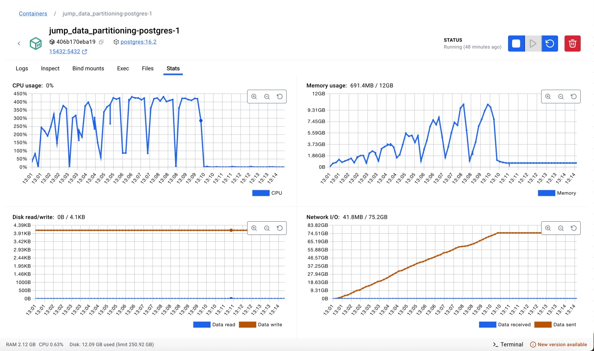
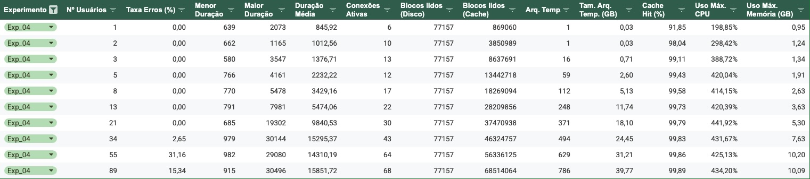
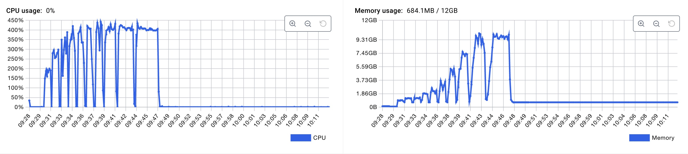

# 1 - Experimento 04 - Particionamento Híbrido (Intervalo + Hash)

## 1.1 - Estratégia de particionamento

Neste experimento, estamos avaliando a combinação de particionamento por intervalo aplicada a coluna `anoPrimeiroMovimento` no primeiro nível, e particionamento por Hash aplicada a coluna `unidadeID` no segundo nível.

## 1.2 - Preparação

Nesta estapa, iremos preparar a base de dados para o particionamento das tabelas por intervalo.

> Premissa: Esta etapa já foi realizada no `Experimento 00`, caso necessário, repita os passos descritos na respectiva seção.

### 1.2.1 - Definição das técnicas de particionamento

As partições das tabelas de **processos**, **movimentos** e **complementos** serão criadas com dois níveis de particionamento, no primeiro nível será utilizada a técnica de **Particionamento por Intervalo (Range Partitioning)** aplicada a coluna `anoPrimeiroMovimento`, que cria uma nova partição para cada ano. Já no segundo nível será utilizada a técnica de **Particionamento por Hash (Hash Partitioning)** aplicada a coluna `unidadeID` nas partições do primeiro nível.

### 1.2.2 - Definição da quantidade de partições

Considerando que na base de dados os processos estão distribuídos em 13 anos e em 3 unidades judiciárias, utilizaremos no primeiro nível, 13 partições por intervalo, e no segundo nível 3 partições, sendo uma para cada unidade, no particionamento por hash. 

### 1.2.3 - Criação das tabelas com o Particionamento Híbrido (Intervalo + Hash)

Nesta etapa, iremos descrever os comandos necessários para criação das tabelas de **processos_exp04**, **movimentos_exp04** e **complementos_exp04** com o particionamento híbrido ativado. 

Como descrito anteriormente, iremos primeiramento particionar as tabelas por ano, utilizando a técnica de **Range Partitioning** aplicada a coluna `anoPrimeiroMovimento`. Em seguida, para cada tabela de partição por ano, utilizaremos a técnica de **Hash Partitioning** aplicada a coluna `unidadeID`, para que tenhamos a distribuição dos dados por ano e por unidade judiciária.

1. O comando abaixo cria as tabelas particionadas:

```sql

----------------------------------------
-- tabela particionada: processos_exp04
----------------------------------------

CREATE SEQUENCE IF NOT EXISTS public."processos_exp04_processoID_seq"
    INCREMENT 1
    START 1
    MINVALUE 1
    MAXVALUE 9223372036854775807
    CACHE 1;

ALTER SEQUENCE public."processos_exp04_processoID_seq"
    OWNER TO postgres;

CREATE TABLE IF NOT EXISTS public.processos_exp04
(
    "processoID" bigint NOT NULL DEFAULT nextval('"processos_exp04_processoID_seq"'::regclass),
    "NPU" character varying COLLATE pg_catalog."default" NOT NULL,
    liminar boolean,
    natureza character varying COLLATE pg_catalog."default",
    "valorCausa" character varying COLLATE pg_catalog."default",
    "nivelSigilo" character varying COLLATE pg_catalog."default",
    competencia character varying COLLATE pg_catalog."default",
    "situacaoMigracao" character varying COLLATE pg_catalog."default",
    "justicaGratuita" boolean,
    "dataAjuizamento" timestamp without time zone,
    assunto integer,
    classe integer,
    "ultimaAtualizacao" timestamp without time zone,
    "ultimoMovimento" bigint,
    "dataPrimeiroMovimento" timestamp without time zone,
    "dataUltimoMovimento" timestamp without time zone,
    "unidadeID" bigint NOT NULL,
    "anoPrimeiroMovimento" integer,
    CONSTRAINT processos_exp04_assunto_fkey FOREIGN KEY (assunto)
        REFERENCES public.assuntos (id) MATCH SIMPLE
        ON UPDATE NO ACTION
        ON DELETE NO ACTION,
    CONSTRAINT processos_exp04_classe_fkey FOREIGN KEY (classe)
        REFERENCES public.classes (id) MATCH SIMPLE
        ON UPDATE NO ACTION
        ON DELETE NO ACTION
) PARTITION BY RANGE ("anoPrimeiroMovimento");

ALTER TABLE IF EXISTS public.processos_exp04
    OWNER to postgres;

ALTER SEQUENCE public."processos_exp04_processoID_seq"
    OWNED BY public.processos_exp04."processoID";

-- partições de 1o nível da tabela: processos_exp04

CREATE TABLE processos_exp04_2013 PARTITION OF processos_exp04
FOR VALUES FROM (2013) TO (2014) PARTITION BY HASH ("unidadeID");
CREATE TABLE processos_exp04_2014 PARTITION OF processos_exp04
FOR VALUES FROM (2014) TO (2015) PARTITION BY HASH ("unidadeID");
CREATE TABLE processos_exp04_2015 PARTITION OF processos_exp04
FOR VALUES FROM (2015) TO (2016) PARTITION BY HASH ("unidadeID");
CREATE TABLE processos_exp04_2016 PARTITION OF processos_exp04
FOR VALUES FROM (2016) TO (2017) PARTITION BY HASH ("unidadeID");
CREATE TABLE processos_exp04_2017 PARTITION OF processos_exp04
FOR VALUES FROM (2017) TO (2018) PARTITION BY HASH ("unidadeID");
CREATE TABLE processos_exp04_2018 PARTITION OF processos_exp04
FOR VALUES FROM (2018) TO (2019) PARTITION BY HASH ("unidadeID");
CREATE TABLE processos_exp04_2019 PARTITION OF processos_exp04
FOR VALUES FROM (2019) TO (2020) PARTITION BY HASH ("unidadeID");
CREATE TABLE processos_exp04_2020 PARTITION OF processos_exp04
FOR VALUES FROM (2020) TO (2021) PARTITION BY HASH ("unidadeID");
CREATE TABLE processos_exp04_2021 PARTITION OF processos_exp04
FOR VALUES FROM (2021) TO (2022) PARTITION BY HASH ("unidadeID");
CREATE TABLE processos_exp04_2022 PARTITION OF processos_exp04
FOR VALUES FROM (2022) TO (2023) PARTITION BY HASH ("unidadeID");
CREATE TABLE processos_exp04_2023 PARTITION OF processos_exp04
FOR VALUES FROM (2023) TO (2024) PARTITION BY HASH ("unidadeID");
CREATE TABLE processos_exp04_2024 PARTITION OF processos_exp04
FOR VALUES FROM (2024) TO (2025) PARTITION BY HASH ("unidadeID");
CREATE TABLE processos_exp04_2025 PARTITION OF processos_exp04
FOR VALUES FROM (2025) TO (2026) PARTITION BY HASH ("unidadeID");

-- partições de 2o nível da tabela: processos_exp04

CREATE TABLE processos_exp04_2013_1 PARTITION OF processos_exp04_2013 FOR VALUES WITH (MODULUS 3, REMAINDER 0);
CREATE TABLE processos_exp04_2013_2 PARTITION OF processos_exp04_2013 FOR VALUES WITH (MODULUS 3, REMAINDER 1);
CREATE TABLE processos_exp04_2013_3 PARTITION OF processos_exp04_2013 FOR VALUES WITH (MODULUS 3, REMAINDER 2);

CREATE TABLE processos_exp04_2014_1 PARTITION OF processos_exp04_2014 FOR VALUES WITH (MODULUS 3, REMAINDER 0);
CREATE TABLE processos_exp04_2014_2 PARTITION OF processos_exp04_2014 FOR VALUES WITH (MODULUS 3, REMAINDER 1);
CREATE TABLE processos_exp04_2014_3 PARTITION OF processos_exp04_2014 FOR VALUES WITH (MODULUS 3, REMAINDER 2);

CREATE TABLE processos_exp04_2015_1 PARTITION OF processos_exp04_2015 FOR VALUES WITH (MODULUS 3, REMAINDER 0);
CREATE TABLE processos_exp04_2015_2 PARTITION OF processos_exp04_2015 FOR VALUES WITH (MODULUS 3, REMAINDER 1);
CREATE TABLE processos_exp04_2015_3 PARTITION OF processos_exp04_2015 FOR VALUES WITH (MODULUS 3, REMAINDER 2);

CREATE TABLE processos_exp04_2016_1 PARTITION OF processos_exp04_2016 FOR VALUES WITH (MODULUS 3, REMAINDER 0);
CREATE TABLE processos_exp04_2016_2 PARTITION OF processos_exp04_2016 FOR VALUES WITH (MODULUS 3, REMAINDER 1);
CREATE TABLE processos_exp04_2016_3 PARTITION OF processos_exp04_2016 FOR VALUES WITH (MODULUS 3, REMAINDER 2);

CREATE TABLE processos_exp04_2017_1 PARTITION OF processos_exp04_2017 FOR VALUES WITH (MODULUS 3, REMAINDER 0);
CREATE TABLE processos_exp04_2017_2 PARTITION OF processos_exp04_2017 FOR VALUES WITH (MODULUS 3, REMAINDER 1);
CREATE TABLE processos_exp04_2017_3 PARTITION OF processos_exp04_2017 FOR VALUES WITH (MODULUS 3, REMAINDER 2);

CREATE TABLE processos_exp04_2018_1 PARTITION OF processos_exp04_2018 FOR VALUES WITH (MODULUS 3, REMAINDER 0);
CREATE TABLE processos_exp04_2018_2 PARTITION OF processos_exp04_2018 FOR VALUES WITH (MODULUS 3, REMAINDER 1);
CREATE TABLE processos_exp04_2018_3 PARTITION OF processos_exp04_2018 FOR VALUES WITH (MODULUS 3, REMAINDER 2);

CREATE TABLE processos_exp04_2019_1 PARTITION OF processos_exp04_2019 FOR VALUES WITH (MODULUS 3, REMAINDER 0);
CREATE TABLE processos_exp04_2019_2 PARTITION OF processos_exp04_2019 FOR VALUES WITH (MODULUS 3, REMAINDER 1);
CREATE TABLE processos_exp04_2019_3 PARTITION OF processos_exp04_2019 FOR VALUES WITH (MODULUS 3, REMAINDER 2);

CREATE TABLE processos_exp04_2020_1 PARTITION OF processos_exp04_2020 FOR VALUES WITH (MODULUS 3, REMAINDER 0);
CREATE TABLE processos_exp04_2020_2 PARTITION OF processos_exp04_2020 FOR VALUES WITH (MODULUS 3, REMAINDER 1);
CREATE TABLE processos_exp04_2020_3 PARTITION OF processos_exp04_2020 FOR VALUES WITH (MODULUS 3, REMAINDER 2);

CREATE TABLE processos_exp04_2021_1 PARTITION OF processos_exp04_2021 FOR VALUES WITH (MODULUS 3, REMAINDER 0);
CREATE TABLE processos_exp04_2021_2 PARTITION OF processos_exp04_2021 FOR VALUES WITH (MODULUS 3, REMAINDER 1);
CREATE TABLE processos_exp04_2021_3 PARTITION OF processos_exp04_2021 FOR VALUES WITH (MODULUS 3, REMAINDER 2);

CREATE TABLE processos_exp04_2022_1 PARTITION OF processos_exp04_2022 FOR VALUES WITH (MODULUS 3, REMAINDER 0);
CREATE TABLE processos_exp04_2022_2 PARTITION OF processos_exp04_2022 FOR VALUES WITH (MODULUS 3, REMAINDER 1);
CREATE TABLE processos_exp04_2022_3 PARTITION OF processos_exp04_2022 FOR VALUES WITH (MODULUS 3, REMAINDER 2);

CREATE TABLE processos_exp04_2023_1 PARTITION OF processos_exp04_2023 FOR VALUES WITH (MODULUS 3, REMAINDER 0);
CREATE TABLE processos_exp04_2023_2 PARTITION OF processos_exp04_2023 FOR VALUES WITH (MODULUS 3, REMAINDER 1);
CREATE TABLE processos_exp04_2023_3 PARTITION OF processos_exp04_2023 FOR VALUES WITH (MODULUS 3, REMAINDER 2);

CREATE TABLE processos_exp04_2024_1 PARTITION OF processos_exp04_2024 FOR VALUES WITH (MODULUS 3, REMAINDER 0);
CREATE TABLE processos_exp04_2024_2 PARTITION OF processos_exp04_2024 FOR VALUES WITH (MODULUS 3, REMAINDER 1);
CREATE TABLE processos_exp04_2024_3 PARTITION OF processos_exp04_2024 FOR VALUES WITH (MODULUS 3, REMAINDER 2);

CREATE TABLE processos_exp04_2025_1 PARTITION OF processos_exp04_2025 FOR VALUES WITH (MODULUS 3, REMAINDER 0);
CREATE TABLE processos_exp04_2025_2 PARTITION OF processos_exp04_2025 FOR VALUES WITH (MODULUS 3, REMAINDER 1);
CREATE TABLE processos_exp04_2025_3 PARTITION OF processos_exp04_2025 FOR VALUES WITH (MODULUS 3, REMAINDER 2);

-- índices da tabela: processos_exp04

CREATE INDEX processos_exp04_idx1 ON public.processos_exp04 ("anoPrimeiroMovimento", "unidadeID");
CREATE INDEX processos_exp04_idx2 ON public.processos_exp04 ("anoPrimeiroMovimento", "unidadeID", "processoID");
CREATE INDEX processos_exp04_idx3 ON public.processos_exp04 ("anoPrimeiroMovimento", "unidadeID", "assunto");
CREATE INDEX processos_exp04_idx4 ON public.processos_exp04 ("anoPrimeiroMovimento", "unidadeID", "classe");
CREATE INDEX processos_exp04_idx5 ON public.processos_exp04 ("anoPrimeiroMovimento", "unidadeID", "processoID", "classe", "assunto");
CREATE INDEX processos_exp04_idx6 ON public.processos_exp04 ("processoID", "anoPrimeiroMovimento", "unidadeID");


CREATE UNIQUE INDEX processos_exp04_unq1 ON public.processos_exp04 ("anoPrimeiroMovimento", "unidadeID", "processoID");


----------------------------------------
-- tabela particionada: movimentos_exp04
----------------------------------------

CREATE SEQUENCE IF NOT EXISTS public."movimentos_exp04_id_seq"
    INCREMENT 1
    START 1
    MINVALUE 1
    MAXVALUE 9223372036854775807
    CACHE 1;

ALTER SEQUENCE public."movimentos_exp04_id_seq"
    OWNER TO postgres;

CREATE TABLE IF NOT EXISTS public.movimentos_exp04
(
    id bigint NOT NULL DEFAULT nextval('movimentos_exp04_id_seq'::regclass),
    "processoID" bigint,
    "NPU" character varying COLLATE pg_catalog."default",
    activity character varying COLLATE pg_catalog."default" NOT NULL,
    duration bigint,
    "dataInicio" timestamp without time zone,
    "dataFinal" timestamp without time zone NOT NULL,
    "usuarioID" bigint,
    "documentoID" bigint,
    "movimentoID" bigint,
    "unidadeID" bigint NOT NULL,
    "anoPrimeiroMovimento" integer,
    CONSTRAINT "movimentos_exp04_movimentoID_fkey" FOREIGN KEY ("movimentoID")
        REFERENCES public.cod_movimentos (id) MATCH SIMPLE
        ON UPDATE NO ACTION
        ON DELETE NO ACTION,
    CONSTRAINT "movimentos_exp04_processoID_fkey" FOREIGN KEY ("anoPrimeiroMovimento", "unidadeID", "processoID")
        REFERENCES public.processos_exp04 ("anoPrimeiroMovimento", "unidadeID", "processoID") MATCH SIMPLE
        ON UPDATE CASCADE
        ON DELETE CASCADE
) PARTITION BY RANGE ("anoPrimeiroMovimento");

ALTER TABLE IF EXISTS public.movimentos_exp04
    OWNER to postgres;

ALTER SEQUENCE public."movimentos_exp04_id_seq"
    OWNED BY public.movimentos_exp04.id;

-- partições de 1o nível da tabela: movimentos_exp04

CREATE TABLE movimentos_exp04_2013 PARTITION OF movimentos_exp04
FOR VALUES FROM (2013) TO (2014) PARTITION BY HASH ("unidadeID");
CREATE TABLE movimentos_exp04_2014 PARTITION OF movimentos_exp04
FOR VALUES FROM (2014) TO (2015) PARTITION BY HASH ("unidadeID");
CREATE TABLE movimentos_exp04_2015 PARTITION OF movimentos_exp04
FOR VALUES FROM (2015) TO (2016) PARTITION BY HASH ("unidadeID");
CREATE TABLE movimentos_exp04_2016 PARTITION OF movimentos_exp04
FOR VALUES FROM (2016) TO (2017) PARTITION BY HASH ("unidadeID");
CREATE TABLE movimentos_exp04_2017 PARTITION OF movimentos_exp04
FOR VALUES FROM (2017) TO (2018) PARTITION BY HASH ("unidadeID");
CREATE TABLE movimentos_exp04_2018 PARTITION OF movimentos_exp04
FOR VALUES FROM (2018) TO (2019) PARTITION BY HASH ("unidadeID");
CREATE TABLE movimentos_exp04_2019 PARTITION OF movimentos_exp04
FOR VALUES FROM (2019) TO (2020) PARTITION BY HASH ("unidadeID");
CREATE TABLE movimentos_exp04_2020 PARTITION OF movimentos_exp04
FOR VALUES FROM (2020) TO (2021) PARTITION BY HASH ("unidadeID");
CREATE TABLE movimentos_exp04_2021 PARTITION OF movimentos_exp04
FOR VALUES FROM (2021) TO (2022) PARTITION BY HASH ("unidadeID");
CREATE TABLE movimentos_exp04_2022 PARTITION OF movimentos_exp04
FOR VALUES FROM (2022) TO (2023) PARTITION BY HASH ("unidadeID");
CREATE TABLE movimentos_exp04_2023 PARTITION OF movimentos_exp04
FOR VALUES FROM (2023) TO (2024) PARTITION BY HASH ("unidadeID");
CREATE TABLE movimentos_exp04_2024 PARTITION OF movimentos_exp04
FOR VALUES FROM (2024) TO (2025) PARTITION BY HASH ("unidadeID");
CREATE TABLE movimentos_exp04_2025 PARTITION OF movimentos_exp04
FOR VALUES FROM (2025) TO (2026) PARTITION BY HASH ("unidadeID");

-- partições de 2o nível da tabela: movimentos_exp04

CREATE TABLE movimentos_exp04_2013_1 PARTITION OF movimentos_exp04_2013 FOR VALUES WITH (MODULUS 3, REMAINDER 0);
CREATE TABLE movimentos_exp04_2013_2 PARTITION OF movimentos_exp04_2013 FOR VALUES WITH (MODULUS 3, REMAINDER 1);
CREATE TABLE movimentos_exp04_2013_3 PARTITION OF movimentos_exp04_2013 FOR VALUES WITH (MODULUS 3, REMAINDER 2);

CREATE TABLE movimentos_exp04_2014_1 PARTITION OF movimentos_exp04_2014 FOR VALUES WITH (MODULUS 3, REMAINDER 0);
CREATE TABLE movimentos_exp04_2014_2 PARTITION OF movimentos_exp04_2014 FOR VALUES WITH (MODULUS 3, REMAINDER 1);
CREATE TABLE movimentos_exp04_2014_3 PARTITION OF movimentos_exp04_2014 FOR VALUES WITH (MODULUS 3, REMAINDER 2);

CREATE TABLE movimentos_exp04_2015_1 PARTITION OF movimentos_exp04_2015 FOR VALUES WITH (MODULUS 3, REMAINDER 0);
CREATE TABLE movimentos_exp04_2015_2 PARTITION OF movimentos_exp04_2015 FOR VALUES WITH (MODULUS 3, REMAINDER 1);
CREATE TABLE movimentos_exp04_2015_3 PARTITION OF movimentos_exp04_2015 FOR VALUES WITH (MODULUS 3, REMAINDER 2);

CREATE TABLE movimentos_exp04_2016_1 PARTITION OF movimentos_exp04_2016 FOR VALUES WITH (MODULUS 3, REMAINDER 0);
CREATE TABLE movimentos_exp04_2016_2 PARTITION OF movimentos_exp04_2016 FOR VALUES WITH (MODULUS 3, REMAINDER 1);
CREATE TABLE movimentos_exp04_2016_3 PARTITION OF movimentos_exp04_2016 FOR VALUES WITH (MODULUS 3, REMAINDER 2);

CREATE TABLE movimentos_exp04_2017_1 PARTITION OF movimentos_exp04_2017 FOR VALUES WITH (MODULUS 3, REMAINDER 0);
CREATE TABLE movimentos_exp04_2017_2 PARTITION OF movimentos_exp04_2017 FOR VALUES WITH (MODULUS 3, REMAINDER 1);
CREATE TABLE movimentos_exp04_2017_3 PARTITION OF movimentos_exp04_2017 FOR VALUES WITH (MODULUS 3, REMAINDER 2);

CREATE TABLE movimentos_exp04_2018_1 PARTITION OF movimentos_exp04_2018 FOR VALUES WITH (MODULUS 3, REMAINDER 0);
CREATE TABLE movimentos_exp04_2018_2 PARTITION OF movimentos_exp04_2018 FOR VALUES WITH (MODULUS 3, REMAINDER 1);
CREATE TABLE movimentos_exp04_2018_3 PARTITION OF movimentos_exp04_2018 FOR VALUES WITH (MODULUS 3, REMAINDER 2);

CREATE TABLE movimentos_exp04_2019_1 PARTITION OF movimentos_exp04_2019 FOR VALUES WITH (MODULUS 3, REMAINDER 0);
CREATE TABLE movimentos_exp04_2019_2 PARTITION OF movimentos_exp04_2019 FOR VALUES WITH (MODULUS 3, REMAINDER 1);
CREATE TABLE movimentos_exp04_2019_3 PARTITION OF movimentos_exp04_2019 FOR VALUES WITH (MODULUS 3, REMAINDER 2);

CREATE TABLE movimentos_exp04_2020_1 PARTITION OF movimentos_exp04_2020 FOR VALUES WITH (MODULUS 3, REMAINDER 0);
CREATE TABLE movimentos_exp04_2020_2 PARTITION OF movimentos_exp04_2020 FOR VALUES WITH (MODULUS 3, REMAINDER 1);
CREATE TABLE movimentos_exp04_2020_3 PARTITION OF movimentos_exp04_2020 FOR VALUES WITH (MODULUS 3, REMAINDER 2);

CREATE TABLE movimentos_exp04_2021_1 PARTITION OF movimentos_exp04_2021 FOR VALUES WITH (MODULUS 3, REMAINDER 0);
CREATE TABLE movimentos_exp04_2021_2 PARTITION OF movimentos_exp04_2021 FOR VALUES WITH (MODULUS 3, REMAINDER 1);
CREATE TABLE movimentos_exp04_2021_3 PARTITION OF movimentos_exp04_2021 FOR VALUES WITH (MODULUS 3, REMAINDER 2);

CREATE TABLE movimentos_exp04_2022_1 PARTITION OF movimentos_exp04_2022 FOR VALUES WITH (MODULUS 3, REMAINDER 0);
CREATE TABLE movimentos_exp04_2022_2 PARTITION OF movimentos_exp04_2022 FOR VALUES WITH (MODULUS 3, REMAINDER 1);
CREATE TABLE movimentos_exp04_2022_3 PARTITION OF movimentos_exp04_2022 FOR VALUES WITH (MODULUS 3, REMAINDER 2);

CREATE TABLE movimentos_exp04_2023_1 PARTITION OF movimentos_exp04_2023 FOR VALUES WITH (MODULUS 3, REMAINDER 0);
CREATE TABLE movimentos_exp04_2023_2 PARTITION OF movimentos_exp04_2023 FOR VALUES WITH (MODULUS 3, REMAINDER 1);
CREATE TABLE movimentos_exp04_2023_3 PARTITION OF movimentos_exp04_2023 FOR VALUES WITH (MODULUS 3, REMAINDER 2);

CREATE TABLE movimentos_exp04_2024_1 PARTITION OF movimentos_exp04_2024 FOR VALUES WITH (MODULUS 3, REMAINDER 0);
CREATE TABLE movimentos_exp04_2024_2 PARTITION OF movimentos_exp04_2024 FOR VALUES WITH (MODULUS 3, REMAINDER 1);
CREATE TABLE movimentos_exp04_2024_3 PARTITION OF movimentos_exp04_2024 FOR VALUES WITH (MODULUS 3, REMAINDER 2);

CREATE TABLE movimentos_exp04_2025_1 PARTITION OF movimentos_exp04_2025 FOR VALUES WITH (MODULUS 3, REMAINDER 0);
CREATE TABLE movimentos_exp04_2025_2 PARTITION OF movimentos_exp04_2025 FOR VALUES WITH (MODULUS 3, REMAINDER 1);
CREATE TABLE movimentos_exp04_2025_3 PARTITION OF movimentos_exp04_2025 FOR VALUES WITH (MODULUS 3, REMAINDER 2);

-- índices da tabela: movimentos_exp04

CREATE INDEX movimentos_exp04_idx1 ON public.movimentos_exp04 ("anoPrimeiroMovimento", "unidadeID");
CREATE INDEX movimentos_exp04_idx2 ON public.movimentos_exp04 ("anoPrimeiroMovimento", "unidadeID", "id");
CREATE INDEX movimentos_exp04_idx3 ON public.movimentos_exp04 ("anoPrimeiroMovimento", "unidadeID", "processoID");
CREATE INDEX movimentos_exp04_idx4 ON public.movimentos_exp04 ("anoPrimeiroMovimento", "unidadeID", "documentoID");
CREATE INDEX movimentos_exp04_idx5 ON public.movimentos_exp04 ("anoPrimeiroMovimento", "unidadeID", "processoID", "id", "dataFinal");

CREATE INDEX movimentos_exp04_idx6 ON public.movimentos_exp04 ("processoID", "unidadeID", "dataFinal") INCLUDE (activity, duration, "movimentoID");
CREATE INDEX movimentos_exp04_idx7 ON public.movimentos_exp04 ("unidadeID", "anoPrimeiroMovimento", "processoID") INCLUDE (activity, duration, "movimentoID");
CREATE INDEX movimentos_exp04_idx8 ON public.movimentos_exp04 ("processoID", "anoPrimeiroMovimento", "unidadeID");
CREATE INDEX movimentos_exp04_idx9 ON public.movimentos_exp04 ("unidadeID", "anoPrimeiroMovimento", "processoID", "dataFinal");
CREATE INDEX movimentos_exp04_idx10 ON public.movimentos_exp04 ("processoID", "dataFinal");


CREATE UNIQUE INDEX movimentos_exp04_unq1 ON public.movimentos_exp04 ("anoPrimeiroMovimento", "unidadeID", "id");


----------------------------------------
-- tabela particionada: complementos_exp04
----------------------------------------

CREATE SEQUENCE IF NOT EXISTS public."complementos_exp04_complementoID_seq"
    INCREMENT 1
    START 1
    MINVALUE 1
    MAXVALUE 9223372036854775807
    CACHE 1;

ALTER SEQUENCE public."complementos_exp04_complementoID_seq"
    OWNER TO postgres;

CREATE TABLE IF NOT EXISTS public.complementos_exp04
(
    "complementoID" bigint NOT NULL DEFAULT nextval('"complementos_exp04_complementoID_seq"'::regclass),
    "movimentoID" bigint,
    tipo character varying COLLATE pg_catalog."default" NOT NULL,
    descricao character varying COLLATE pg_catalog."default" NOT NULL,
    "unidadeID" bigint NOT NULL,
    "anoPrimeiroMovimento" integer,
    CONSTRAINT "complementos_exp04_movimentoID_fkey" FOREIGN KEY ("anoPrimeiroMovimento", "unidadeID", "movimentoID")
        REFERENCES public.movimentos_exp04 ("anoPrimeiroMovimento", "unidadeID", "id") MATCH SIMPLE
        ON UPDATE CASCADE
        ON DELETE CASCADE
) PARTITION BY RANGE ("anoPrimeiroMovimento");

ALTER TABLE IF EXISTS public.complementos_exp04
    OWNER to postgres;

ALTER SEQUENCE public."complementos_exp04_complementoID_seq"
    OWNED BY public.complementos_exp04."complementoID";

-- partições de 1o nível da tabela: complementos_exp04

CREATE TABLE complementos_exp04_2013 PARTITION OF complementos_exp04
FOR VALUES FROM (2013) TO (2014) PARTITION BY HASH ("unidadeID");
CREATE TABLE complementos_exp04_2014 PARTITION OF complementos_exp04
FOR VALUES FROM (2014) TO (2015) PARTITION BY HASH ("unidadeID");
CREATE TABLE complementos_exp04_2015 PARTITION OF complementos_exp04
FOR VALUES FROM (2015) TO (2016) PARTITION BY HASH ("unidadeID");
CREATE TABLE complementos_exp04_2016 PARTITION OF complementos_exp04
FOR VALUES FROM (2016) TO (2017) PARTITION BY HASH ("unidadeID");
CREATE TABLE complementos_exp04_2017 PARTITION OF complementos_exp04
FOR VALUES FROM (2017) TO (2018) PARTITION BY HASH ("unidadeID");
CREATE TABLE complementos_exp04_2018 PARTITION OF complementos_exp04
FOR VALUES FROM (2018) TO (2019) PARTITION BY HASH ("unidadeID");
CREATE TABLE complementos_exp04_2019 PARTITION OF complementos_exp04
FOR VALUES FROM (2019) TO (2020) PARTITION BY HASH ("unidadeID");
CREATE TABLE complementos_exp04_2020 PARTITION OF complementos_exp04
FOR VALUES FROM (2020) TO (2021) PARTITION BY HASH ("unidadeID");
CREATE TABLE complementos_exp04_2021 PARTITION OF complementos_exp04
FOR VALUES FROM (2021) TO (2022) PARTITION BY HASH ("unidadeID");
CREATE TABLE complementos_exp04_2022 PARTITION OF complementos_exp04
FOR VALUES FROM (2022) TO (2023) PARTITION BY HASH ("unidadeID");
CREATE TABLE complementos_exp04_2023 PARTITION OF complementos_exp04
FOR VALUES FROM (2023) TO (2024) PARTITION BY HASH ("unidadeID");
CREATE TABLE complementos_exp04_2024 PARTITION OF complementos_exp04
FOR VALUES FROM (2024) TO (2025) PARTITION BY HASH ("unidadeID");
CREATE TABLE complementos_exp04_2025 PARTITION OF complementos_exp04
FOR VALUES FROM (2025) TO (2026) PARTITION BY HASH ("unidadeID");

-- partições de 2o nível da tabela: complementos_exp04

CREATE TABLE complementos_exp04_2013_1 PARTITION OF complementos_exp04_2013 FOR VALUES WITH (MODULUS 3, REMAINDER 0);
CREATE TABLE complementos_exp04_2013_2 PARTITION OF complementos_exp04_2013 FOR VALUES WITH (MODULUS 3, REMAINDER 1);
CREATE TABLE complementos_exp04_2013_3 PARTITION OF complementos_exp04_2013 FOR VALUES WITH (MODULUS 3, REMAINDER 2);

CREATE TABLE complementos_exp04_2014_1 PARTITION OF complementos_exp04_2014 FOR VALUES WITH (MODULUS 3, REMAINDER 0);
CREATE TABLE complementos_exp04_2014_2 PARTITION OF complementos_exp04_2014 FOR VALUES WITH (MODULUS 3, REMAINDER 1);
CREATE TABLE complementos_exp04_2014_3 PARTITION OF complementos_exp04_2014 FOR VALUES WITH (MODULUS 3, REMAINDER 2);

CREATE TABLE complementos_exp04_2015_1 PARTITION OF complementos_exp04_2015 FOR VALUES WITH (MODULUS 3, REMAINDER 0);
CREATE TABLE complementos_exp04_2015_2 PARTITION OF complementos_exp04_2015 FOR VALUES WITH (MODULUS 3, REMAINDER 1);
CREATE TABLE complementos_exp04_2015_3 PARTITION OF complementos_exp04_2015 FOR VALUES WITH (MODULUS 3, REMAINDER 2);

CREATE TABLE complementos_exp04_2016_1 PARTITION OF complementos_exp04_2016 FOR VALUES WITH (MODULUS 3, REMAINDER 0);
CREATE TABLE complementos_exp04_2016_2 PARTITION OF complementos_exp04_2016 FOR VALUES WITH (MODULUS 3, REMAINDER 1);
CREATE TABLE complementos_exp04_2016_3 PARTITION OF complementos_exp04_2016 FOR VALUES WITH (MODULUS 3, REMAINDER 2);

CREATE TABLE complementos_exp04_2017_1 PARTITION OF complementos_exp04_2017 FOR VALUES WITH (MODULUS 3, REMAINDER 0);
CREATE TABLE complementos_exp04_2017_2 PARTITION OF complementos_exp04_2017 FOR VALUES WITH (MODULUS 3, REMAINDER 1);
CREATE TABLE complementos_exp04_2017_3 PARTITION OF complementos_exp04_2017 FOR VALUES WITH (MODULUS 3, REMAINDER 2);

CREATE TABLE complementos_exp04_2018_1 PARTITION OF complementos_exp04_2018 FOR VALUES WITH (MODULUS 3, REMAINDER 0);
CREATE TABLE complementos_exp04_2018_2 PARTITION OF complementos_exp04_2018 FOR VALUES WITH (MODULUS 3, REMAINDER 1);
CREATE TABLE complementos_exp04_2018_3 PARTITION OF complementos_exp04_2018 FOR VALUES WITH (MODULUS 3, REMAINDER 2);

CREATE TABLE complementos_exp04_2019_1 PARTITION OF complementos_exp04_2019 FOR VALUES WITH (MODULUS 3, REMAINDER 0);
CREATE TABLE complementos_exp04_2019_2 PARTITION OF complementos_exp04_2019 FOR VALUES WITH (MODULUS 3, REMAINDER 1);
CREATE TABLE complementos_exp04_2019_3 PARTITION OF complementos_exp04_2019 FOR VALUES WITH (MODULUS 3, REMAINDER 2);

CREATE TABLE complementos_exp04_2020_1 PARTITION OF complementos_exp04_2020 FOR VALUES WITH (MODULUS 3, REMAINDER 0);
CREATE TABLE complementos_exp04_2020_2 PARTITION OF complementos_exp04_2020 FOR VALUES WITH (MODULUS 3, REMAINDER 1);
CREATE TABLE complementos_exp04_2020_3 PARTITION OF complementos_exp04_2020 FOR VALUES WITH (MODULUS 3, REMAINDER 2);

CREATE TABLE complementos_exp04_2021_1 PARTITION OF complementos_exp04_2021 FOR VALUES WITH (MODULUS 3, REMAINDER 0);
CREATE TABLE complementos_exp04_2021_2 PARTITION OF complementos_exp04_2021 FOR VALUES WITH (MODULUS 3, REMAINDER 1);
CREATE TABLE complementos_exp04_2021_3 PARTITION OF complementos_exp04_2021 FOR VALUES WITH (MODULUS 3, REMAINDER 2);

CREATE TABLE complementos_exp04_2022_1 PARTITION OF complementos_exp04_2022 FOR VALUES WITH (MODULUS 3, REMAINDER 0);
CREATE TABLE complementos_exp04_2022_2 PARTITION OF complementos_exp04_2022 FOR VALUES WITH (MODULUS 3, REMAINDER 1);
CREATE TABLE complementos_exp04_2022_3 PARTITION OF complementos_exp04_2022 FOR VALUES WITH (MODULUS 3, REMAINDER 2);

CREATE TABLE complementos_exp04_2023_1 PARTITION OF complementos_exp04_2023 FOR VALUES WITH (MODULUS 3, REMAINDER 0);
CREATE TABLE complementos_exp04_2023_2 PARTITION OF complementos_exp04_2023 FOR VALUES WITH (MODULUS 3, REMAINDER 1);
CREATE TABLE complementos_exp04_2023_3 PARTITION OF complementos_exp04_2023 FOR VALUES WITH (MODULUS 3, REMAINDER 2);

CREATE TABLE complementos_exp04_2024_1 PARTITION OF complementos_exp04_2024 FOR VALUES WITH (MODULUS 3, REMAINDER 0);
CREATE TABLE complementos_exp04_2024_2 PARTITION OF complementos_exp04_2024 FOR VALUES WITH (MODULUS 3, REMAINDER 1);
CREATE TABLE complementos_exp04_2024_3 PARTITION OF complementos_exp04_2024 FOR VALUES WITH (MODULUS 3, REMAINDER 2);

CREATE TABLE complementos_exp04_2025_1 PARTITION OF complementos_exp04_2025 FOR VALUES WITH (MODULUS 3, REMAINDER 0);
CREATE TABLE complementos_exp04_2025_2 PARTITION OF complementos_exp04_2025 FOR VALUES WITH (MODULUS 3, REMAINDER 1);
CREATE TABLE complementos_exp04_2025_3 PARTITION OF complementos_exp04_2025 FOR VALUES WITH (MODULUS 3, REMAINDER 2);

-- índices da tabela: complementos_exp04

CREATE INDEX complementos_exp04_idx1 ON public.complementos_exp04 ("anoPrimeiroMovimento", "unidadeID");
CREATE INDEX complementos_exp04_idx2 ON public.complementos_exp04 ("anoPrimeiroMovimento", "unidadeID", "complementoID");
CREATE INDEX complementos_exp04_idx3 ON public.complementos_exp04 ("anoPrimeiroMovimento", "unidadeID", "movimentoID") INCLUDE (descricao);
CREATE INDEX complementos_exp04_idx4 ON public.complementos_exp04 ("anoPrimeiroMovimento", "unidadeID", "movimentoID");


CREATE UNIQUE INDEX complementos_exp04_unq1 ON public.complementos_exp04 ("anoPrimeiroMovimento", "unidadeID", "complementoID");

```

### 1.2.3 - Migração de dados

Nessa estapa realizaremos a migração dos dados existentes nas tabelas de origem (não particionadas), para as novas tabelas com particionamento.

> Atenção: Foi necessário aplicar o filtro `"dataPrimeiroMovimento" IS NOT NULL` pois existem registros onde o campo utilizado para particionamento é nulo.

```sql

-- processos_exp04

INSERT INTO public.processos_exp04
SELECT *, EXTRACT(YEAR FROM "dataPrimeiroMovimento") AS "anoPrimeiroMovimento"
	FROM public.processos_18006 WHERE "dataPrimeiroMovimento" IS NOT NULL;

INSERT INTO public.processos_exp04
SELECT *, EXTRACT(YEAR FROM "dataPrimeiroMovimento") AS "anoPrimeiroMovimento"
	FROM public.processos_18007 WHERE "dataPrimeiroMovimento" IS NOT NULL;

INSERT INTO public.processos_exp04
SELECT *, EXTRACT(YEAR FROM "dataPrimeiroMovimento") AS "anoPrimeiroMovimento"
	FROM public.processos_18008 WHERE "dataPrimeiroMovimento" IS NOT NULL;

-- movimentos_exp04

INSERT INTO public.movimentos_exp04
SELECT m.*, EXTRACT(YEAR FROM p."dataPrimeiroMovimento") AS "anoPrimeiroMovimento"
	FROM public.movimentos_18006 m
	INNER JOIN public.processos_18006 p ON p."processoID" = m."processoID";

INSERT INTO public.movimentos_exp04
SELECT m.*, EXTRACT(YEAR FROM p."dataPrimeiroMovimento") AS "anoPrimeiroMovimento"
	FROM public.movimentos_18007 m
	INNER JOIN public.processos_18007 p ON p."processoID" = m."processoID";

INSERT INTO public.movimentos_exp04
SELECT m.*, EXTRACT(YEAR FROM p."dataPrimeiroMovimento") AS "anoPrimeiroMovimento"
	FROM public.movimentos_18008 m
	INNER JOIN public.processos_18008 p ON p."processoID" = m."processoID";

-- complementos_exp04

INSERT INTO public.complementos_exp04
SELECT c.*, m."anoPrimeiroMovimento"
	FROM public.complementos_18006 c
	INNER JOIN public.movimentos_exp04 m ON
		m."unidadeID" = c."unidadeID" AND m.id = c."movimentoID";

INSERT INTO public.complementos_exp04
SELECT c.*, m."anoPrimeiroMovimento"
	FROM public.complementos_18007 c
	INNER JOIN public.movimentos_exp04 m ON
		m."unidadeID" = c."unidadeID" AND m.id = c."movimentoID";

INSERT INTO public.complementos_exp04
SELECT c.*, m."anoPrimeiroMovimento"
	FROM public.complementos_18008 c
	INNER JOIN public.movimentos_exp04 m ON
		m."unidadeID" = c."unidadeID" AND m.id = c."movimentoID";

VACUUM ANALYZE complementos_exp04;
VACUUM ANALYZE movimentos_exp04;
VACUUM ANALYZE processos_exp04;

```

## 1.3 - Consulta SQL de referência

Neste experimento a query de referência foi ajustada para utilizar as tabelas com o respectivo particionamento.

Abaixo está a consulta SQL utilizada:

```sql
SELECT
    p."NPU", 
    p."processoID", 
    p."ultimaAtualizacao",
    c.descricao AS classe, 
    a.descricao AS assunto,
    m.activity, 
    m."dataInicio", 
    m."dataFinal", 
    m."usuarioID",
    m.duration, 
    m."movimentoID", 
    com.descricao AS complemento,
    s."nomeServidor", 
    s."tipoServidor", 
    d.tipo AS documento
FROM 
    processos_exp04 AS p
INNER JOIN
    movimentos_exp04 AS m 
    ON 
	m."unidadeID" = p."unidadeID"
	AND m."anoPrimeiroMovimento" >= p."anoPrimeiroMovimento"
	AND m."processoID" = p."processoID"
INNER JOIN
    classes AS c ON p.classe = c.id
LEFT JOIN
    assuntos AS a ON p.assunto = a.id
LEFT JOIN
    complementos_exp04 AS com 
    ON 
	com."unidadeID" = m."unidadeID" 
	AND com."anoPrimeiroMovimento" >= p."anoPrimeiroMovimento"
	AND com."movimentoID" = m."id" 
LEFT JOIN
    servidores AS s ON s."servidorID" = m."usuarioID"
LEFT JOIN
    documentos AS d ON d."id" = m."documentoID"
WHERE 
    p."unidadeID" = 18006 AND p."anoPrimeiroMovimento" >= 2020
	AND m."unidadeID" = 18006 AND m."anoPrimeiroMovimento" >= 2020
	AND com."unidadeID" = 18006 AND com."anoPrimeiroMovimento" >= 2020
ORDER BY 
    p."processoID", m."dataFinal";
```


## 1.4 - Métricas avaliadas e resultados

A imagem abaixo apresentamos os gráficos da utilização de recursos durante a execução deste experimento. 

Estes gráficos foram coletados a partir do Docker dashboard para o container de execução do banco de dados PostgreSQL.



A tabela abaixo apresenta os resultados consolidados das métricas coletadas durante a execução deste experimento.



> Podemos perceber que a partir do cenário de testes com 34 usuários simultâneos, o banco de dados passou falhar **2,65%** das consultas realizadas.

### 1.4.1 - Tempo de Resposta

A execução da consulta SQL de forma isolada levou: **0,779** segundos.

A tabela anterior apresenta o tempo de resposta mínimo, máximo e médio, para cada um dos cenários de teste que simulam a carga crescente de usuários.

### 1.4.2 - Utilização de Recursos

A imagem abaixo apresenta os gráficos de consumo de CPU e Memória, durante a execução dos cenários de teste.



### 1.4.3 - Escalabilidade

De acordo com a tabela podemos perceber que e a arquitetura atual permitiu escalar até o cenário com 21 usuários simultâneos, e a partir do cenário com 34 usuários, o banco de dados passou falhar **2,65%** das consultas realizadas.

### 1.4.4 - Equilíbrio de Carga

Taxa de uso das partições (%) =  (13 / 39) * 100 = **33,33%**

### 1.4.5 - Taxa de Transferência de Dados

Taxa: **353.945** registros / **0,779** segundos = **454.358,15** registros por segundo.

### 1.4.6 - Custo de Redistribuição

Nessa abordagem, o custo de redistribuição é ALTO devido ao uso do Particionamento por Hash no segundo nível.

### 1.4.7 - Eficiência de Consultas

Temos:

- P_Acessadas: **13**
- P_Total: **39**
- T_Query: **0.779 segundos**
- T_Ideal: **3 segundos** 

> Eficiência (%) =  (13 / 39) * (1 - (0,779 / 3)) * 100 => **24,67%**

Constatamos que nessa estratégia a consulta obteve uma eficiencia **30,00%** maior que a situação atual.

## 1.5 - Considerações

> **Vantagens**  

1️⃣ **Eficiência na Recuperação de Dados por Ano**  
- Consultas que filtram por `anoPrimeiroMovimento` (exemplo: recuperação de processos de um ano específico) acessam apenas a partição correspondente, reduzindo o volume de dados lidos.  
- **Impacto:** Redução do tempo de execução de queries históricas e melhora no desempenho de índices.  

2️⃣ **Distribuição Uniforme das Partições por Unidade**  
- Dentro de cada partição anual, os dados são distribuídos entre subpartições pelo **Hash de `unidadeID`**, garantindo um balanceamento automático da carga.  
- **Impacto:** Evita hotspots e melhora a paralelização das consultas.  

3️⃣ **Facilidade na Manutenção e Arquivamento**  
- A criação de novas partições anuais permite fácil arquivamento ou descarte de dados antigos sem impactar a performance das consultas ativas.  
- **Impacto:** Estratégias de *data retention* e *partition pruning* tornam-se mais simples e eficientes.  

4️⃣ **Melhor Uso de Índices**  
- A segmentação por ano reduz o tamanho dos índices que precisam ser acessados em cada consulta.  
- O particionamento por **Hash** dentro do ano pode evitar que índices fiquem excessivamente grandes.  
- **Impacto:** Menos leituras no disco e maior eficiência em pesquisas por unidade.  

5️⃣ **Aumento do Desempenho em Workloads Concomitantes**  
- O **Hash Partitioning** permite que operações concorrentes sejam distribuídas entre várias partições menores, reduzindo contenção de bloqueios.  
- **Impacto:** Melhor escalabilidade para cenários com múltiplas transações simultâneas.  

---

> **Desvantagens**  

1️⃣ **Complexidade na Configuração e Gerenciamento**  
- Requer a definição cuidadosa dos tamanhos das partições e da quantidade de buckets no hash para evitar desperdício de espaço ou fragmentação de dados.  
- **Impacto:** Mais difícil de administrar do que um particionamento simples (*apenas Range ou apenas Hash*).  

2️⃣ **Overhead nas Consultas que Não Usam Filtros Efetivos**  
- Se uma consulta não filtrar `anoPrimeiroMovimento`, todas as partições precisarão ser escaneadas.  
- **Impacto:** Pode levar a perda de desempenho quando queries não são bem escritas.  

3️⃣ **Dificuldade na Estimativa do Número Ideal de Partições Hash**  
- O particionamento **Hash** pode ter **desequilíbrio** se o número de unidades (`unidadeID`) for menor que a quantidade de buckets.  
- **Impacto:** Algumas partições podem ficar sobrecarregadas, reduzindo os benefícios esperados.  

4️⃣ **Maior Custo para Manutenção de Índices**  
- Cada partição precisa manter seus próprios índices, o que pode aumentar o tempo de reconstrução e consumo de armazenamento.  
- **Impacto:** Custos extras de manutenção para bancos de dados com alto volume de inserções.  

5️⃣ **Risco de Ineficiência para Consultas em Faixas de Unidades**  
- Como os dados de `unidadeID` são espalhados pelo hash, consultas que buscam intervalos de unidades (exemplo: *todas as unidades de um município*) podem não se beneficiar do *partition pruning*.  
- **Impacto:** Consultas que não utilizam exatamente o valor de `unidadeID` podem ter desempenho reduzido.  

---

> **Conclusão**  

O particionamento híbrido **(Range + Hash)** é uma excelente estratégia quando há necessidade de **consulta eficiente por ano** e, ao mesmo tempo, **distribuição uniforme dos registros entre unidades**. No entanto, ele **exige planejamento** para definir corretamente a granularidade das partições e evitar cenários onde consultas possam degradar a performance.  

**💡 Recomendações para otimização:**  
- Ajustar o **número de buckets no hash** para evitar subpartições desnecessárias.  
- Garantir que **consultas sempre utilizem `anoPrimeiroMovimento`** para maximizar *partition pruning*.  
- Monitorar estatísticas de acesso para avaliar se alguma partição está sobrecarregada.  
- Implementar **estratégias de particionamento dinâmico**, permitindo reequilíbrio conforme o crescimento dos dados.